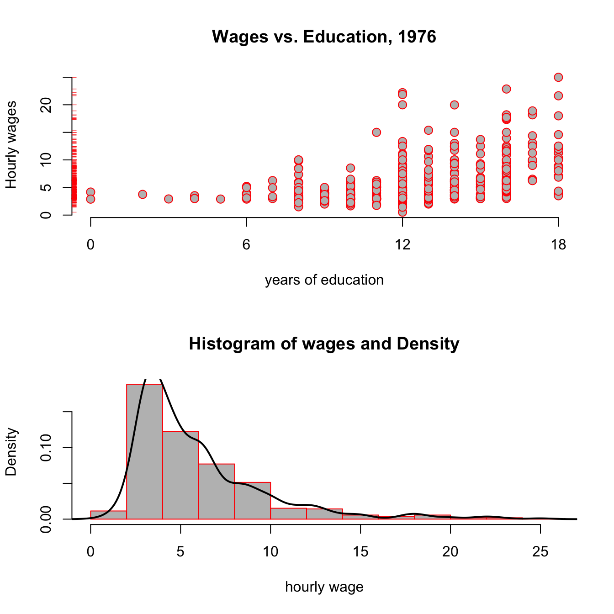

---
output:
  pdf_document: default
  html_document: default
---
# Linear Regression {#linreg}

In this chapter we will learn an additional way how one can represent the relationship between *outcome*, or *dependent* variable variable $y$ and an *explanatory* or *independent* variable $x$. We will refer throughout to the graphical representation of a collection of independent observations on $x$ and $y$, i.e., a *dataset*. 

## How are `x` and `y` related?
    
### Data on Cars

We will look at the built-in `cars` dataset. Let's get a view of this by just typing `View(cars)` in Rstudio. You can see something like this:


```
##   speed dist
## 1     4    2
## 2     4   10
## 3     7    4
## 4     7   22
## 5     8   16
## 6     9   10
```

We have a `data.frame` with two columns: `speed` and `dist`. Type `help(cars)` to find out more about the dataset. There you could read that

>The data give the speed of cars (mph) and the distances taken to stop (ft).

It's good practice to know the extent of a dataset. You could just type 


```r
dim(cars)
```

```
## [1] 50  2
```

to find out that we have 50 rows and 2 columns. A central question that we want to ask now is the following:

### How are `speed` and `dist` related?

The simplest way to start is to plot the data. Remembering that we view each row of a data.frame as an observation, we could just label one axis of a graph `speed`, and the other one `dist`, and go through our table above row by row. We just have to read off the x/y coordinates and mark them in the graph. In `R`:


```r
plot(dist ~ speed, data = cars,
     xlab = "Speed (in Miles Per Hour)",
     ylab = "Stopping Distance (in Feet)",
     main = "Stopping Distance vs Speed",
     pch  = 20,
     cex  = 2,
     col  = "red")
```


Here, each dot represents one observation. In this case, one particular measurement `speed` and `dist` for a car. Now, again: 


<div class="note">
<p>How are <code>speed</code> and <code>dist</code> related? How could one best <em>summarize</em> this relationship?</p>
</div>

<br>
One thing we could do, is draw a straight line through this scatterplot, like so:


```r
plot(dist ~ speed, data = cars,
     xlab = "Speed (in Miles Per Hour)",
     ylab = "Stopping Distance (in Feet)",
     main = "Stopping Distance vs Speed",
     pch  = 20,
     cex  = 2,
     col  = "red")
abline(a = 60,b = 0,lw=3)
```


Now that doesn't seem a particularly *good* way to summarize the relationship. Clearly, a *better* line would be not be flat, but have a *slope*, i.e. go upwards:


That is slightly better. However, the line seems at too high a level - the point at which it crosses the y-axis is called the *intercept*; and it's too high. We just learned how to represent a *line*, i.e. with two numbers called *intercept* and *slope*. Let's write down a simple formula which represents a line where some outcome $z$ is related to a variable $x$:

\begin{equation}
z = b_0 + b_1 x (\#eq:bline)
\end{equation}

Here $b_0$ represents the value of the intercept (i.e. $z$ when $x=0$), and $b_1$ is the value of the slope. The question for us is now: How to choose the number $b_0$ and $b_1$ such that the result is the **good** line?

### Choosing the Best Line


In order to be able to reason about good or bad line, we need to denote the *output* of equation \@ref(eq:bline). We call the value $\hat{y}_i$ the *predicted value* for obseration $i$, after having chosen some particular values $b_0$ and $b_1$:

\begin{equation}
\hat{y}_i = b_0 + b_1 x_i (\#eq:abline-pred)
\end{equation}

In general it is likely that we won't be able to choose $b_0$ and $b_1$ in such as way as to provide a perfect prediction, i.e. one where $\hat{y}_i = y_i$ for all $i$. That is, we expect to make an *error* in our prediction $\hat{y}_i$, so let's denote this value $e_i$. If we acknowlegdge that we will make errors, let's at least make them as small as possible! Exactly this is going to be our task now.

Suppose we have the following set of 9 observations on `x` and `y`, and we put the *best* straight line into it, that we can think of. It would look like this: 

<div class="figure" style="text-align: center">

<p class="caption">(\#fig:line-arrows)The best line and its errors</p>
</div>

Here, the red arrows indicate the **distance** between the prediction (i.e. the black line) to each data point, in other words, each arrow is a particular $e_i$. An upward pointing arrow indicates a positive value of a particular $e_i$, and vice versa for downward pointing arrows. The erros are also called *residuals*, which comes from the way can write the equation for this relationship between two particular values $(y_i,x_i)$ belonging to observation $i$:

\begin{equation}
y_i = b_0 + b_1 x_i + e_i (\#eq:abline)
\end{equation}

You realize of course that $\hat{y}_i = y_i - e_i$, which just means that our prediction is the observed value $y_i$ minus any error $e_i$ we make. In other words, $e_i$ is what is left to be explained on top of the line $b_0 + b_1 x_i$, hence, it's a residual to explain $y_i$. Here are $y,\hat{y}$ and the resulting $e$ which are plotted in figure \@ref(fig:line-arrows):


   x        y      y_hat    error 
-------  -------  -------  -------
 0.00     2.09     2.57     -0.48 
 1.25     2.79     3.41     -0.62 
 2.50     6.49     4.25     2.24  
 3.75     1.71     5.10     -3.39 
 5.00     9.89     5.94     3.95  
 6.25     7.62     6.78     0.83  
 7.50     4.86     7.63     -2.77 
 8.75     7.38     8.47     -1.09 
 10.00    10.63    9.31     1.32  

If our line was a **perfect fit** to the data, all $e_i = 0$, and the column `error` would display `0` for each row - there would be no errors at all. (All points in figure \@ref(fig:line-arrows) would perfectly line up on a straight line). 

Now, back to our claim that this particular line is the *best* line. What exactly characterizes this best line? We now come back to what we said above - *how to make the errors as small as possible*? Keeping in mind that each residual $e_i$ is $y_i - \hat{y}_i$, we have the following minization problem to solve:

\begin{align}
e_i & = y_i - \hat{y}_i = y_i - \underbrace{\left(b_0 + b_1 x_i\right)}_\text{prediction}\\
e_1^2 + \dots + e_N^2 &= \sum_{i=1}^N e_i^2 \equiv \text{SSR}(b_0,b_1) \\
(b_0,b_1) &= \arg \min_{\text{int},\text{slope}} \sum_{i=1}^N \left[y_i - \left(\text{int} + \text{slope } x_i\right)\right]^2 (\#eq:ols-min)
\end{align}

<div class="warning">
<p>The best line chooses <span class="math inline">\(b_0\)</span> and <span class="math inline">\(b_1\)</span> so as to minimize the sum of <strong>squared residuals</strong> (SSR).</p>
</div>

<br>
Wait a moment, why *squared* residuals? This is easy to understand: suppose that instead, we wanted to just make the *sum* of the arrows in figure \@ref(fig:line-arrows) as small as possible (that is, no squares). Choosing our line to make this number small would not give a particularly good representation of the data -- given that errors of opposite sign and equal magnitude offset, we could have very long arrows (but of opposite signs), and a poor resulting line. Squaring each error avoids this (because now negative errors get positive values!)

<div class="figure" style="text-align: center">

<p class="caption">(\#fig:line-squares)The best line and its SQUARED errors</p>
</div>

We illustrate this in figure \@ref(fig:line-squares). This is the same data as in figure \@ref(fig:line-arrows), but instead of arrows of length $e_i$ for each observation $i$, now we draw a square with side $e_i$, i.e. an area of $e_i^2$. We have two apps for you at this point, one where you have to try and find the best line by choosing $b_0$ and $b_1$, only focusing on the sum of errors (and not their square), and a second one focusing on squared errors:


```r
library(ScPoApps)
launchApp("reg_simple_arrows")
launchApp("reg_simple") # with squared errors
launchApp("SSR_cone") # visualize the minimzation problem from above!
```

Most of our `apps` have an associated `about` document, which gives extra information and explanations. After you have looked at all three apps, we invite you thus to have a look at the associated explainers by typing


```r
aboutApp("reg_simple_arrows")
aboutApp("reg_simple") 
aboutApp("SSR_cone") 
```

## Ordinary Least Squares (OLS) Estimator{#OLS}

The method to compute (or *estimate*) $b_0$ and $b_1$ we illustrated above is called *Ordinary Least Squares*, or OLS. $b_0$ and $b_1$ are therefore also often called the *OLS coefficients*. By solving problem \@ref(eq:ols-min) one can derive an explicit formula for them:

\begin{equation}
b_1 = \frac{cov(x,y)}{var(x)},  (\#eq:beta1hat)
\end{equation}

i.e. the estimate of the slope coefficient is the covariance between $x$ and $y$ divided by the variance of $x$, both computed from our sample of data. With $b_1$ in hand, we can get the estimate for the intercept as

\begin{equation}
b_0 = \bar{y} - b_1 \bar{x}.  (\#eq:beta0hat)
\end{equation}

where $\bar{z}$ denotes the sample mean of variable $z$. The interpretation of the OLS slope coefficient $b_1$ is as follows. Given a line as in $y = b_0 + b_1 x$,

* $b_1 = \frac{d y}{d x}$ measures the change in $y$ resulting from a one unit change in $x$
* For example, if $y$ is wage and $x$ is years of education, $b_1$ would measure the effect of an additional year of education on wages.

There is an alternative representation for the OLS slope coefficient which relates to the *correlation coefficient* $r$. Remember from section \@ref(summarize-two) that $r = \frac{cov(x,y)}{s_x s_y}$, where $s_z$ is the standard deviation of variable $z$. With this in hand, we can derive the OLS slope coefficient as

\begin{align}
b_1 &= \frac{cov(x,y)}{var(x)}\\
    &= \frac{cov(x,y)}{s_x s_x} \\
    &= r\frac{s_y}{s_x} (\#eq:beta1-r)
\end{align}
    In other words, the slope coefficient is equal to the correlation coefficient $r$ times the ratio of standard deviations of $y$ and $x$.

### Linear Regression without Regressor

There are several important special cases for the linear regression introduced above. Let's start with the most obvious one: What is the meaning of running a regression *without any regressor*, i.e. without a $x$? Our line becomes very simple. Instead of \@ref(eq:bline), we get

\begin{equation}
y = b_0. (\#eq:b0line)
\end{equation}

This means that our minization problem in \@ref(eq:ols-min) *also* becomes very simple: We only have to choose $b_0$! We have 

$$
b_0 = \arg\min_{\text{int}} \sum_{i=1}^N \left[y_i - \text{int}\right]^2,
$$
which is a quadratic equation with a unique optimum such that 
$$
b_0 = \frac{1}{N} \sum_{i=1}^N y_i = \overline{y}.
$$

<div class="tip">
<p>Least Squares <strong>without regressor</strong> <span class="math inline">\(x\)</span> estimates the sample mean of the outcome variable <span class="math inline">\(y\)</span>, i.e. it produces <span class="math inline">\(\overline{y}\)</span>.</p>
</div>


### Regression without an Intercept

We follow the same logic here, just that we miss another bit from our initial equation and the minimisation problem in \@ref(eq:ols-min) now becomes:

\begin{align}
b_1 &= \arg\min_{\text{slope}} \sum_{i=1}^N \left[y_i - \text{slope } x_i \right]^2\\
\mapsto b_1 &= \frac{\frac{1}{N}\sum_{i=1}^N x_i y_i}{\frac{1}{N}\sum_{i=1}^N x_i^2} = \frac{\bar{x} \bar{y}}{\overline{x^2}} (\#eq:b1line)
\end{align}

<div class="tip">
<p>Least Squares <strong>without intercept</strong> (i.e. with <span class="math inline">\(b_0=0\)</span>) is a line that passes through the origin.</p>
</div>
<br>

In this case we only get to choose the slope $b_1$ of this anchored line.^[ This slope is related to the angle between vectors $\mathbf{a} = (\overline{x},\overline{y})$, and $\mathbf{b} = (\overline{x},0)$. Hence, it's related to the [scalar projection](https://en.wikipedia.org/wiki/Scalar_projection) of $\mathbf{a}$ on $\mathbf{b}$.] You should now try out both of those restrictions on our linear model by spending some time with 


```r
launchApp("reg_constrained")
```

### Centering A Regression

By *centering* or *demeaning* a regression, we mean to substract from both $y$ and $x$ their respective averages to obtain $\tilde{y}_i = y_i - \bar{y}$ and $\tilde{x}_i = x_i - \bar{x}$. We then run a regression *without intercept* as above. That is, we use $\tilde{x}_i,\tilde{y}_i$ instead of $x_i,y_i$ in \@ref(eq:b1line) to obtain our slope estimate $b_1$:

\begin{align}
b_1 &= \frac{\frac{1}{N}\sum_{i=1}^N \tilde{x}_i \tilde{y}_i}{\frac{1}{N}\sum_{i=1}^N \tilde{x}_i^2}\\
    &= \frac{\frac{1}{N}\sum_{i=1}^N (x_i - \bar{x}) (y_i - \bar{y})}{\frac{1}{N}\sum_{i=1}^N (x_i - \bar{x})^2} \\
    &= \frac{cov(x,y)}{var(x)}
    (\#eq:bline-centered)
\end{align}

This last expression is *identical* to the one in \@ref(eq:beta1hat)! It's the standard OLS estimate for the slope coefficient. We note the following: 

<div class="tip">
<p>Adding a constant to a regression produces the same result as centering all variables and estimating without intercept. So, unless all variables are centered, <strong>always</strong> include an intercept in the regression.</p>
</div>
<br>
To get a better feel for what is going on here, you can try this out now by yourself by typing:


```r
launchApp("demeaned_reg")
```

### Standardizing A Regression {#reg-standard}

*Standardizing* a variable $z$ means to demean as above, but in addition to divide the demeaned value by its own standard deviation. Similarly to what we did above for *centering*, we define transformed variables $\breve{y}_i = \frac{y_i-\bar{y}}{\sigma_y}$ and $\breve{x}_i = \frac{x_i-\bar{x}}{\sigma_x}$ where $\sigma_z$ is the standard deviation of variable $z$. From here on, you should by now be used to what comes next! As above, we use $\breve{x}_i,\breve{y}_i$ instead of $x_i,y_i$ in \@ref(eq:b1line) to this time obtain:

\begin{align}
b_1 &= \frac{\frac{1}{N}\sum_{i=1}^N \breve{x}_i \breve{y}_i}{\frac{1}{N}\sum_{i=1}^N \breve{x}_i^2}\\
    &= \frac{\frac{1}{N}\sum_{i=1}^N \frac{x_i - \bar{x}}{\sigma_x} \frac{y_i - \bar{y}}{\sigma_y}}{\frac{1}{N}\sum_{i=1}^N \left(\frac{x_i - \bar{x}}{\sigma_x}\right)^2} \\
    &= \frac{Cov(x,y)}{\sigma_x \sigma_y} \\
    &= Corr(x,y)  (\#eq:bline-standardized)
\end{align}

<div class="tip">
<p>After we standardize both <span class="math inline">\(y\)</span> and <span class="math inline">\(x\)</span>, the slope coefficient <span class="math inline">\(b_1\)</span> in the regression without intercept is equal to the <strong>correlation coefficient</strong>.</p>
</div>
<br>
And also for this case we have a practical application for you. Just type this and play around with the app for a little while!


```r
launchApp("reg_standardized")
```


## Predictions and Residuals {#pred-resids}

Now we want to ask how our residuals $e_i$ relate to the prediction $\hat{y_i}$. Let us first think about the average of all predictions $\hat{y_i}$, i.e. the number $\frac{1}{N} \sum_{i=1}^N \hat{y_i}$. Let's just take \@ref(eq:abline-pred) and plug this into this average, so that we get

\begin{align}
\frac{1}{N} \sum_{i=1}^N \hat{y_i} &= \frac{1}{N} \sum_{i=1}^N b_0 + b_1 x_i \\
&= b_0 + b_1  \frac{1}{N} \sum_{i=1}^N x_i \\
&= b_0 + b_1  \bar{x} \\
\end{align}

But that last line is just equal to the formula for the OLS intercept \@ref(eq:beta0hat), $b_0 = \bar{y} - b_1 \bar{x}$! That means of course that

$$
\frac{1}{N} \sum_{i=1}^N \hat{y_i}  = b_0 + b_1  \bar{x} = \bar{y}
$$
in other words:

<div class="tip">
<p>The average of our predictions <span class="math inline">\(\hat{y_i}\)</span> is identically equal to the mean of the outcome <span class="math inline">\(y\)</span>. This implies that the average of the residuals is equal to zero.</p>
</div>
<br>
Related to this result, we can show that the prediction $\hat{y}$ and the residuals are *uncorrelated*, something that is often called **orthogonality** between $\hat{y}_i$ and $e_i$. We would write this as

\begin{align}
Cov(\hat{y},e) &=\frac{1}{N} \sum_{i=1}^N (\hat{y}_i-\bar{y})(e_i-\bar{e}) =   \frac{1}{N} \sum_{i=1}^N (\hat{y}_i-\bar{y})e_i \\
&=  \frac{1}{N} \sum_{i=1}^N \hat{y}_i e_i-\bar{y} \frac{1}{N} \sum_{i=1}^N e_i = 0
\end{align}

It's useful to bring back the sample data which generate figure \@ref(fig:line-arrows) at this point in order to verify these claims:


```
##       y y_hat error
## 1  2.09  2.57 -0.48
## 2  2.79  3.41 -0.62
## 3  6.49  4.25  2.24
## 4  1.71  5.10 -3.39
## 5  9.89  5.94  3.95
## 6  7.62  6.78  0.83
## 7  4.86  7.63 -2.77
## 8  7.38  8.47 -1.09
## 9 10.63  9.31  1.32
```

Let's check that these claims are true in this sample of data. We want that

1. The average of $\hat{y}_i$ to be the same as the mean of $y$
2. The average of the errors should be zero.
3. Prediction and errors should be uncorrelated.


```r
# 1.
all.equal(mean(ss$error), 0)
```

```
## [1] TRUE
```

```r
# 2.
all.equal(mean(ss$y_hat), mean(ss$y))
```

```
## [1] TRUE
```

```r
# 3.
all.equal(cov(ss$error,ss$y_hat), 0)
```

```
## [1] TRUE
```

So indeed we can confirm this result with our test dataset. Great! 

## Correlation, Covariance and Linearity

It is important to keep in mind that Correlation and Covariance relate to a *linear* relationship between `x` and `y`. Given how the regression line is estimated by OLS (see just above), you can see that the regression line inherits this property from the Covariance. 
A famous exercise by Francis Anscombe (1973) illustrates this by constructing 4 different datasets which all have identical **linear** statistics: mean, variance, correlation and regression line *are identical*. However, the usefulness of the statistics to describe the relationship in the data is not clear.


The important lesson from this example is the following:

<div class="warning">
<p>Always <strong>visually inspect</strong> your data, and don’t rely exclusively on summary statistics like <em>mean, variance, correlation and regression line</em>. All of those assume a <strong>linear</strong> relationship between the variables in your data.</p>
</div>
<br>
The mission of Anscombe has been continued recently. As a result of this we can have a look at the `datasauRus` package, which pursues Anscbombe's idea through a multitude of funny data sets, all with the same linear statistics. Don't just compute the covariance, or you might actually end up looking at a Dinosaur! What? Type this to find out:


```r
launchApp("datasaurus")
aboutApp("datasaurus")
```


### Non-Linear Relationships in Data

Suppose our data now looks like this:


Putting our previous *best line* defined in equation \@ref(eq:abline) as $y = b_0 + b_1 x + e$, we get something like this:

<div class="figure" style="text-align: center">

<p class="caption">(\#fig:non-line-cars-ols)Best line with non-linear data?</p>
</div>

Somehow when looking at \@ref(fig:non-line-cars-ols) one is not totally convinced that the straight line is a good summary of this relationship. For values $x\in[50,120]$ the line seems to low, then again too high, and it completely misses the right boundary. It's easy to address this shortcoming by including *higher order terms* of an explanatory variable. We would modify \@ref(eq:abline) to read now

\begin{equation}
y_i = b_0 + b_1 x_i + b_2 x_i^2 + e_i (\#eq:abline2)
\end{equation}

This is a special case of *multiple regression*, which we will talk about in chapter \@ref(multiple-reg). You can see that there are *multiple* slope coefficients. For now, let's just see how this performs:

<div class="figure" style="text-align: center">

<p class="caption">(\#fig:non-line-cars-ols2)Better line with non-linear data!</p>
</div>

## Analysing $Var(y)$

Analysis of Variance (ANOVA) refers to a method to decompose variation in one variable as a function of several others. We can use this idea on our outcome $y$. Suppose we wanted to know the variance of $y$, keeping in mind that, by definition, $y_i = \hat{y}_i + e_i$. We would write

\begin{align}
Var(y) &= Var(\hat{y} + e)\\
 &= Var(\hat{y}) + Var(e) + 2 Cov(\hat{y},e)\\
 &= Var(\hat{y}) + Var(e) (\#eq:anova)
\end{align}

We have seen above in \@ref(pred-resids) that the covariance between prediction $\hat{y}$ and error $e$ is zero, that's why we have $Cov(\hat{y},e)=0$ in \@ref(eq:anova).
What this tells us in words is that we can decompose the variance in the observed outcome $y$ into a part that relates to variance as *explained by the model* and a part that comes from unexplained variation. Finally, we know the definition of *variance*, and can thus write down the respective formulae for each part:

* $Var(y) = \frac{1}{N}\sum_{i=1}^N (y_i - \bar{y})^2$
* $Var(\hat{y}) = \frac{1}{N}\sum_{i=1}^N (\hat{y_i} - \bar{y})^2$, because the mean of $\hat{y}$ is $\bar{y}$ as we know. Finally,
* $Var(e) = \frac{1}{N}\sum_{i=1}^N e_i^2$, because the mean of $e$ is zero.

We can thus formulate how the total variation in outcome $y$ is aportioned between model and unexplained variation:

<div class="tip">
<p>The total variation in outcome <span class="math inline">\(y\)</span> (often called SST, or <em>total sum of squares</em>) is equal to the sum of explained squares (SSE) plus the sum of residuals (SSR). We have thus <strong>SST = SSE + SSR</strong>.</p>
</div>


## Assessing the *Goodness of Fit*

In our setup, there exists a convenient measure for how good a particular statistical model fits the data. It is called $R^2$ (*R squared*), also called the *coefficient of determination*. We make use of the just introduced decomposition of variance, and write the formula as

\begin{equation}
R^2 = \frac{\text{variance explained}}{\text{total variance}} = \frac{SSE}{SST} = 1 - \frac{SSR}{SST}\in[0,1]  (\#eq:Rsquared)
\end{equation}

It is easy to see that a *good fit* is one where the sum of *explained* squares (SSE) is large relativ to the total variation (SST). In such a case, we observe an $R^2$ close to one. In the opposite case, we will see an $R^2$ close to zero. Notice that a small $R^2$ does not imply that the model is useless, just that it explains a small fraction of the observed variation.


## An Example: A Log Wage Equation

Let's consider the following example concerning wage data collected in the 1976 Current Population Survey in the USA.^[This example is close to the vignette of the [wooldridge](https://cloud.r-project.org/web/packages/wooldridge/index.html) package, whose author I hereby thank for the excellent work.] We want to investigate the relationship between average hourly earnings, and years of education. Let's start with a plot:


```r
data("wage1", package = "wooldridge")   # load data

# a function that returns a plot
plotfun <- function(wage1,log=FALSE,rug = TRUE){
    y = wage1$wage
    if (log){
        y = log(wage1$wage)
    }
    plot(y = y,
       x = wage1$educ, 
       col = "red", pch = 21, bg = "grey",     
       cex=1.25, xaxt="n", frame = FALSE,      # set default x-axis to none
       main = ifelse(log,"log(Wages) vs. Education, 1976","Wages vs. Education, 1976"),
       xlab = "years of education", 
       ylab = ifelse(log,"Log Hourly wages","Hourly wages"))
    axis(side = 1, at = c(0,6,12,18))         # add custom ticks to x axis
    if (rug) rug(wage1$wage, side=2, col="red")        # add `rug` to y axis
}

par(mfcol = c(2,1))  # set up a plot with 2 panels
# plot 1: standard scatter plot
plotfun(wage1)

# plot 2: add a panel with histogram+density
hist(wage1$wage,prob = TRUE, col = "grey", border = "red", 
     main = "Histogram of wages and Density",xlab = "hourly wage")
lines(density(wage1$wage), col = "black", lw = 2)
```

<div class="figure">

<p class="caption">(\#fig:wooldridge-wages)Wages vs Education from the wooldridge dataset wage1.</p>
</div>


Looking at the top panel of figure \@ref(fig:wooldridge-wages), you notice two things: From the red ticks on the y axis, you see that wages are very concentrated at around 5 USD per hour, with fewer and fewer observations at higher rates; and second, that it seems that the hourly wage seems to increase with higher education levels. The bottom panel reinforces the first point, showing that the estimated pdf (probability density function) shown as a black line has a very long right tail: there are always fewer and fewer, but always larger and larger values of hourly wage in the data.

<div class="warning">
<p>You have seen this shape of a distribution in the tutorial for chapter 2 already! Do you remember the name of this particular shape of a distribution? (why not type <code>ScPoEconometrics::runTutorial('chapter2')</code>) to check?</p>
</div>
<br>

Let's run a first regression on this data to generate some intution:

\begin{equation}
\text{wage}_i = b_0 + b_1 \text{educ}_i + e_i (\#eq:wage)
\end{equation}

We use the `lm` function for this purpose as follows:


```r
hourly_wage <- lm(formula = wage ~ educ, data = wage1)
```

and we can add the resulting regression line to our above plot:


```r
plotfun(wage1)
abline(hourly_wage, col = 'black', lw = 2) # add regression line
```

<div class="figure">

<p class="caption">(\#fig:wooldridge-wages2)Wages vs Education from the wooldridge dataset wage1, with regression</p>
</div>

The `hourly_wage` object contains the results of this estimation. We can get a summary of those results with the `summary` method:


```r
summary(hourly_wage)
```

```
## 
## Call:
## lm(formula = wage ~ educ, data = wage1)
## 
## Residuals:
##     Min      1Q  Median      3Q     Max 
## -5.3396 -2.1501 -0.9674  1.1921 16.6085 
## 
## Coefficients:
##             Estimate Std. Error t value Pr(>|t|)    
## (Intercept) -0.90485    0.68497  -1.321    0.187    
## educ         0.54136    0.05325  10.167   <2e-16 ***
## ---
## Signif. codes:  0 '***' 0.001 '**' 0.01 '*' 0.05 '.' 0.1 ' ' 1
## 
## Residual standard error: 3.378 on 524 degrees of freedom
## Multiple R-squared:  0.1648,	Adjusted R-squared:  0.1632 
## F-statistic: 103.4 on 1 and 524 DF,  p-value: < 2.2e-16
```

The main interpretation of this table can be read off the column labelled *Estimate*, reporting estimated coefficients $b_0,b_1$:

1. With zero year of education, the hourly wage is about -0.9 dollars per hour (row named `(Intercept)`)
1. Each additional year of education increase hourly wage by 54 cents. (row named `educ`)
1. For example, for 15 years of education, we predict roughly -0.9 + 0.541 * 15 = 7.215 dollars/h.

## Scaling Regressions

<div class="tip">
<p>Regression estimates (<span class="math inline">\(b_0, b_1\)</span>) are in the scale <em>of the data</em>. The actual <em>value</em> of the estimates will vary, if we change the scale of the data. The overall fit of the model to the data would <em>not</em> change, however, so that the <span class="math inline">\(R^2\)</span> statistic would be constant.</p>
</div>
<br>

Suppose we wanted to use the above estimates to report the effect of years of education on *annual* wages instead of *hourly* ones. Let's assume we have full-time workers, 7h per day, 5 days per week, 45 weeks per year. Calling this factor $\delta = 7 \times 5 \times 45 = 1575$, we have that $x$ dollars per hour imply $x \times \delta = x \times 1575$ dollars per year. 

What would be the effect of using $\tilde{y} = wage \times 1575$ instead of $y = wage$ as outcome variable on our regression coefficients $b_0$ and $b_1$? Well, let's try!


<table style="text-align:center"><caption><strong>Effect of Scaling on Coefficients</strong></caption>
<tr><td colspan="3" style="border-bottom: 1px solid black"></td></tr><tr><td style="text-align:left"></td><td colspan="2"><em>Dependent variable:</em></td></tr>
<tr><td></td><td colspan="2" style="border-bottom: 1px solid black"></td></tr>
<tr><td style="text-align:left"></td><td>wage</td><td>annual_wage</td></tr>
<tr><td style="text-align:left"></td><td>(1)</td><td>(2)</td></tr>
<tr><td colspan="3" style="border-bottom: 1px solid black"></td></tr><tr><td style="text-align:left">educ</td><td>0.541<sup>***</sup></td><td>852.641<sup>***</sup></td></tr>
<tr><td style="text-align:left"></td><td>(0.053)</td><td>(83.866)</td></tr>
<tr><td style="text-align:left"></td><td></td><td></td></tr>
<tr><td style="text-align:left">Constant</td><td>-0.905</td><td>-1,425.141</td></tr>
<tr><td style="text-align:left"></td><td>(0.685)</td><td>(1,078.824)</td></tr>
<tr><td style="text-align:left"></td><td></td><td></td></tr>
<tr><td colspan="3" style="border-bottom: 1px solid black"></td></tr><tr><td style="text-align:left">Observations</td><td>526</td><td>526</td></tr>
<tr><td style="text-align:left">R<sup>2</sup></td><td>0.165</td><td>0.165</td></tr>
<tr><td style="text-align:left">Adjusted R<sup>2</sup></td><td>0.163</td><td>0.163</td></tr>
<tr><td style="text-align:left">Residual Std. Error (df = 524)</td><td>3.378</td><td>5,320.963</td></tr>
<tr><td style="text-align:left">F Statistic (df = 1; 524)</td><td>103.363<sup>***</sup></td><td>103.363<sup>***</sup></td></tr>
<tr><td colspan="3" style="border-bottom: 1px solid black"></td></tr><tr><td style="text-align:left"><em>Note:</em></td><td colspan="2" style="text-align:right"><sup>*</sup>p<0.1; <sup>**</sup>p<0.05; <sup>***</sup>p<0.01</td></tr>
</table>

Let's call the coefficients in the column labelled (1) as $b_0$ and $b_1$, and let's call the ones in column (2) $b_0^*$ and $b_1^*$. In column (1) we see that another year increaeses hourly wage by 0.54 dollars, as before.  In column (2), the corresponding number is 852.64, i.e. another year of education will increase *annual* wages by 852.64 dollars, on average. Notice however, that $b_0 \times \delta = -0.9 \times 1575 = -1425.14 = b_0^*$ and that $b_1 \times \delta = 0.54 \times 1575 = 852.64 = b_1^*$, that is we just had to multiply both coefficients by the scaling factor applied to original outcome $y$ to obtain our new coefficients $b_0^*$ and $b_1^*$! Also, observe that the $R^2$s of both regressions are identical! So, really, we did not have to run the regression in column (2) at all to make this change: multiplying all coefficients through by $\delta$ is enough in this case. We keep the identically same fit to the data. 

Rescaling the regressors $x$ is slightly different, but it's easy to work out *how* different, given the linear nature of the covariance operator, which is part of the OLS estimator. Suppose we rescale $x$ by the number $c$. Then, using the OLS formula in \@ref(eq:beta1hat), we see that we get new slope coefficient $b_1^*$ via

\begin{align} 
b_1^* &= \frac{Cov(cx,y)}{Var(cx)} \\ 
      &= \frac{cCov(x,y)}{c^2 Var(x)} \\
      &= \frac{1}{c} b_1.
\end{align}

As for the intercept, and by using \@ref(eq:beta0hat)
\begin{align} 
b_0^* &= \bar{y} -             b_1^* \frac{1}{N}\sum_{i=1}^N c \cdot x_i \\ 
      &= \bar{y} -             b_1^* \frac{c}{N}\sum_{i=1}^N x_i  \\
      &= \bar{y} - \frac{1}{c} b_1 c * \bar{x}  \\
      &= \bar{y} -  b_1 * \bar{x}  \\
      &= b_0
\end{align}

That is, we change the slope by the *inverse* of the scaling factor applied to regressor $x$, but the intercept is unaffected from this. You should play around for a while with our rescaling app to get a feeling for this:


```r
library(ScPoApps)
launchApp('Rescale')
```

## A Particular Rescaling: The $\log$ Transform

The natural logarithm is a particularly important transformation that we often encounter in economics. Why would we transform a variable with the $\log$ function to start with?

1. Several important economic variables (like wages, city size, firm size, etc) are approximately *log-normally* distributed. By transforming them with the $\log$, we obtain an approximately *normally* distributed variable, which has desirable properties for our regression.
1. Applying the $\log$ reduces the impact of outliers.
1. The transformation allows for a convenient interpretation in terms of *percentage changes* of the outcome variable.

Let's investigate this issue in our running example by transforming the wage data above. Look back at the bottom panel of figure \@ref(fig:wooldridge-wages): Of course you saw immediately that this looked a lot like a log-normal distribution, so point 1. above applies. We modify the left hand side of equation \@ref(eq:wage):

\begin{equation}
\log(\text{wage}_i) = b_0 + b_1 \text{educ}_i + e_i (\#eq:log-wage)
\end{equation}

Let's use the `update` function to modify our previous regression model:


```r
log_hourly_wage = update(hourly_wage, log(wage) ~ ., data = wage1)
```

The `update` function takes an existing `lm` object, like `hourly_wage` here, and updates the `formula`. Here the `.` on the right hand side means *leave unchanged* (so the RHS stays unchanged). How do our pictures change?


```r
par(mfrow = c(1,2))

plotfun(wage1,rug = FALSE)
abline(hourly_wage, col = 'black', lw = 2) # add regression line

plotfun(wage1,log = TRUE, rug = FALSE)
abline(log_hourly_wage, col = 'black', lw = 2) # add regression line
```


```r
par(mfrow = c(1,1))
```

It *looks as if* the regression line has the same slope, but beware of the different scales of the y-axis! You can clearly see that all y-values have been compressed by the log transformation. The log case behaves differently from our *scaling by a constant number* case above because it is a *nonlinear* function. Let's compare the output between both models:


<table style="text-align:center"><caption><strong>Log Transformed Equation</strong></caption>
<tr><td colspan="3" style="border-bottom: 1px solid black"></td></tr><tr><td style="text-align:left"></td><td colspan="2"><em>Dependent variable:</em></td></tr>
<tr><td></td><td colspan="2" style="border-bottom: 1px solid black"></td></tr>
<tr><td style="text-align:left"></td><td>wage</td><td>log(wage)</td></tr>
<tr><td style="text-align:left"></td><td>(1)</td><td>(2)</td></tr>
<tr><td colspan="3" style="border-bottom: 1px solid black"></td></tr><tr><td style="text-align:left">educ</td><td>0.541<sup>***</sup></td><td>0.083<sup>***</sup></td></tr>
<tr><td style="text-align:left"></td><td>(0.053)</td><td>(0.008)</td></tr>
<tr><td style="text-align:left"></td><td></td><td></td></tr>
<tr><td style="text-align:left">Constant</td><td>-0.905</td><td>0.584<sup>***</sup></td></tr>
<tr><td style="text-align:left"></td><td>(0.685)</td><td>(0.097)</td></tr>
<tr><td style="text-align:left"></td><td></td><td></td></tr>
<tr><td colspan="3" style="border-bottom: 1px solid black"></td></tr><tr><td style="text-align:left">Observations</td><td>526</td><td>526</td></tr>
<tr><td style="text-align:left">R<sup>2</sup></td><td>0.165</td><td>0.186</td></tr>
<tr><td style="text-align:left">Adjusted R<sup>2</sup></td><td>0.163</td><td>0.184</td></tr>
<tr><td style="text-align:left">Residual Std. Error (df = 524)</td><td>3.378</td><td>0.480</td></tr>
<tr><td style="text-align:left">F Statistic (df = 1; 524)</td><td>103.363<sup>***</sup></td><td>119.582<sup>***</sup></td></tr>
<tr><td colspan="3" style="border-bottom: 1px solid black"></td></tr><tr><td style="text-align:left"><em>Note:</em></td><td colspan="2" style="text-align:right"><sup>*</sup>p<0.1; <sup>**</sup>p<0.05; <sup>***</sup>p<0.01</td></tr>
</table>

The interpretation of the transformed model in column (2) is now the following: 

<div class="note">
<p>We call a regression of the form <span class="math inline">\(\log(y) = b_0 + b_1 x + u\)</span> a <em>log-level</em> specification, because we regressed the log of a variable on the level (i.e not the log!) of another variable. Here, the impact of increasing <span class="math inline">\(x\)</span> by one unit is to increase <span class="math inline">\(y\)</span> by <span class="math inline">\(100 \times b_1\)</span> <strong>percent</strong>. In our example: an additional year of education will increase hourly wages by 8.3%. Notice that this is very different from saying <em>…increases log hourly wages by 8.3%</em>, which is wrong.</p>
</div>
<br>

Notice that the $R^2$ slightly improved, so have a better fit to the data. This is due the fact that the log compressed large outlier values. Whether we apply the $log$ to left or right-hand side variables makes a difference, as outlined in this important table:

<center><caption> (\#tab:loglog) Common Regression Specifications </caption></center>
Specification | Outcome Var | Regressor | Interpretation of $b_1$ | Comment
:------------:|:------------:|:------------:|:------------:|:------------:
Level-level | y | x | $\Delta y = b_1 \Delta x$ | Standard
Level-log | y | $\log(x)$ | $\Delta y = \frac{b_1}{100} \Delta x$ | less frequent
Log-level | $\log(y)$  | x | $\% \Delta y = (100 b_1) \Delta$ x | Semi-elasticity
Log-Log  | $\log(y)$  | $\log(x)$ | $\% \Delta y = \% \Delta$ b_1 x | Elasticity

You may remember from your introductory micro course what the definition of the *elasticity* of $y$ with respect to $x$ is: This number tells us by how many percent $y$ will change, if we change $x$ by one percent. Let's look at another example from the `wooldridge` package of datasets, this time concerning CEO salaries and their relationship with company sales.


```r
data("ceosal1", package = "wooldridge")  
par(mfrow = c(1,2))
plot(salary ~ sales, data = ceosal1, main = "Sales vs Salaries",xaxt = "n",frame = FALSE)
axis(1, at = c(0,40000, 80000))
rug(ceosal1$salary,side = 2)
rug(ceosal1$sales,side = 1)
plot(log(salary) ~ log(sales), data = ceosal1, main = "Log(Sales) vs Log(Salaries)")
```

<div class="figure">

<p class="caption">(\#fig:ceo-sal)The effect of log-transforming highly skewed data.</p>
</div>

In the left panel of figure \@ref(fig:ceo-sal) you clearly see that both `sales` and `salary` have very long right tails, as indicated by the rug plots on either axis. As a consequence, the points are clustered in the bottom left corner of the plot. We suspect a positive relationship, but it's hard to see. Contrast this with the right panel, where both axis have been log transformed: the points are nicely spread out, clearly spelling out a positive correlation. Let's see what this gives in a regression model!

$$
\text{logsalary} = 4.82 + 0.26(\text{logsales}) + \epsilon
$$

Refering back at table \@ref(tab:loglog), here we have a log-log specification. Therefore we interpret this regression as follows: 

<div class="tip">
<p>In a log-log equation, the slope coefficient <span class="math inline">\(b_1\)</span> is the <em>elasticity of <span class="math inline">\(y\)</span> with respect to changes in <span class="math inline">\(x\)</span></em>. Here: A 1% increase in sales is associated to a 0.26% increase in CEO salaries. Note, again, that there is no <em>log</em> in this statement.</p>
</div>
