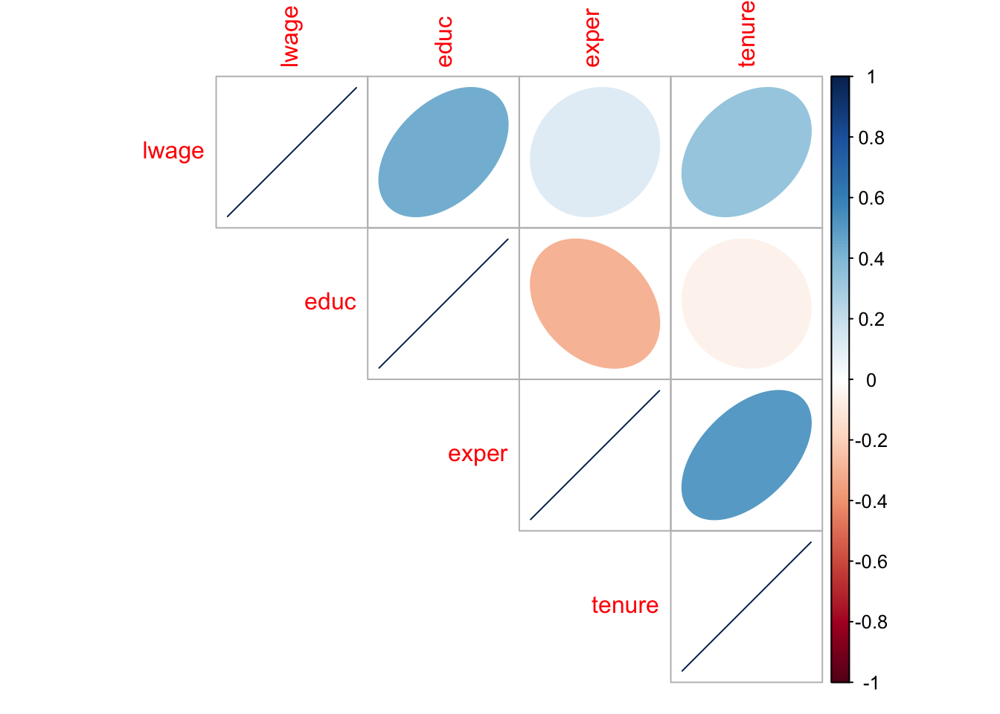

# Multiple Regression {#multiple-reg}


We can extend the discussion from chapter \@ref(linreg) to more than one explanatory variable. For example, suppose that instead of only $x$ we now had $x_1$ and $x_2$ in order to explain $y$. Everything we've learned for the single variable case applies here as well. Instead of a regression *line*, we now get a regression *plane*, i.e. an object representable in 3 dimenions: $(x_1,x_2,y)$.
As an example, suppose we wanted to explain how many *miles per gallon* (`mpg`) a car can travel as a function of its *horse power* (`hp`) and its *weight* (`wt`). In other words we want to estimate the equation

\begin{equation}
mpg_i = b_0 + b_1 hp_i + b_2 wt_i + e_i (\#eq:abline2d)
\end{equation}

on our built-in dataset of cars (`mtcars`):


```r
head(subset(mtcars, select = c(mpg,hp,wt)))
```

```
##                    mpg  hp    wt
## Mazda RX4         21.0 110 2.620
## Mazda RX4 Wag     21.0 110 2.875
## Datsun 710        22.8  93 2.320
## Hornet 4 Drive    21.4 110 3.215
## Hornet Sportabout 18.7 175 3.440
## Valiant           18.1 105 3.460
```

How do you think `hp` and `wt` will influence how many miles per gallon of gasoline each of those cars can travel? In other words, what do you expect the signs of $b_1$ and $b_2$ to be? 


With two explanatory variables as here, it is still possible to visualize the regression plane, so let's start with this as an answer. The OLS regression plane through this dataset looks like in figure \@ref(fig:plane3D-reg):

<div class="figure" style="text-align: center">
<!--html_preserve--><div id="htmlwidget-d5e869ca701a1679ed1a" style="width:672px;height:480px;" class="plotly html-widget"></div>
<script type="application/json" data-for="htmlwidget-d5e869ca701a1679ed1a">{"x":{"visdat":{"292a23b96fdf":["function () ","plotlyVisDat"]},"cur_data":"292a23b96fdf","attrs":{"292a23b96fdf":{"colors":"grey","alpha_stroke":1,"sizes":[10,100],"spans":[1,20],"x":{},"y":{},"z":{},"type":"scatter3d","mode":"markers","name":"data","opacity":0.8,"marker":{"color":"red","size":5,"hoverinfo":"skip"},"inherit":true},"292a23b96fdf.1":{"z":{},"type":"surface","x":[1.513,5.424],"y":[52,335],"name":"Mtcars 3D","opacity":0.75,"cauto":false,"surfacecolor":[0,0,0],"inherit":false}},"layout":{"margin":{"b":40,"l":60,"t":25,"r":10},"scene":{"xaxis":{"title":"wt"},"yaxis":{"title":"hp"},"zaxis":{"title":"mpg"}},"hovermode":"closest","showlegend":true,"legend":{"yanchor":"top","y":0.5}},"source":"A","config":{"showSendToCloud":false},"data":[{"x":[2.62,2.875,2.32,3.215,3.44,3.46,3.57,3.19,3.15,3.44,3.44,4.07,3.73,3.78,5.25,5.424,5.345,2.2,1.615,1.835,2.465,3.52,3.435,3.84,3.845,1.935,2.14,1.513,3.17,2.77,3.57,2.78],"y":[110,110,93,110,175,105,245,62,95,123,123,180,180,180,205,215,230,66,52,65,97,150,150,245,175,66,91,113,264,175,335,109],"z":[21,21,22.8,21.4,18.7,18.1,14.3,24.4,22.8,19.2,17.8,16.4,17.3,15.2,10.4,10.4,14.7,32.4,30.4,33.9,21.5,15.5,15.2,13.3,19.2,27.3,26,30.4,15.8,19.7,15,21.4],"type":"scatter3d","mode":"markers","name":"data","opacity":0.8,"marker":{"color":"red","size":5,"hoverinfo":"skip","line":{"color":"rgba(31,119,180,1)"},"showscale":false},"error_y":{"color":"rgba(31,119,180,1)"},"error_x":{"color":"rgba(31,119,180,1)"},"line":{"color":"rgba(31,119,180,1)"},"frame":null},{"colorbar":{"title":"mpg<br />surf","ticklen":2,"len":0.5,"lenmode":"fraction","y":1,"yanchor":"top"},"colorscale":[["0","rgba(190,190,190,1)"],["1","rgba(190,190,190,1)"]],"showscale":false,"z":[[29.7079189601165,20.716174964165],[14.5417229265718,5.54997893062028]],"type":"surface","x":[1.513,5.424],"y":[52,335],"name":"Mtcars 3D","opacity":0.75,"cauto":false,"surfacecolor":[0,0,0],"frame":null}],"highlight":{"on":"plotly_click","persistent":false,"dynamic":false,"selectize":false,"opacityDim":0.2,"selected":{"opacity":1},"debounce":0},"shinyEvents":["plotly_hover","plotly_click","plotly_selected","plotly_relayout","plotly_brushed","plotly_brushing","plotly_clickannotation","plotly_doubleclick","plotly_deselect","plotly_afterplot","plotly_sunburstclick"],"base_url":"https://plot.ly"},"evals":[],"jsHooks":[]}</script><!--/html_preserve-->
<p class="caption">(\#fig:plane3D-reg)Multiple Regression - a plane in 3D. The red lines indicate the residual for each observation.</p>
</div>


This visualization shows a couple of things: the data are shown with red points and the grey plane is the one resulting from OLS estimation of equation \@ref(eq:abline2d). You should realize that this is exactly the same story as told in figure \@ref(fig:line-arrows) - just in three dimensions!

Furthermore, *multiple* regression refers the fact that there could be *more* than two regressors. In fact, you could in principle have $K$ regressors, and our theory developed so far would still be valid:

\begin{align}
\hat{y}_i &= b_0 + b_1 x_{1i} +   b_2 x_{2i} + \dots + b_K x_{Ki}\\
e_i &= y_i - \hat{y}_i (\#eq:multiple-reg)
\end{align}

Just as before, the least squares method chooses numbers $(b_0,b_1,\dots,b_K)$ to as to minimize SSR, exactly as in the minimization problem for the one regressor case seen in \@ref(eq:ols-min).

## All Else Equal {#ceteris}

We can see from the above plot that cars with more horse power and greater weight, in general travel fewer miles per gallon of combustible. Hence, we observe a plane that is downward sloping in both the *weight* and *horse power* directions. Suppose now we wanted to know impact of `hp` on `mpg` *in isolation*, so as if we could ask 

<div class="tip">
<center>
Keeping the value of <span class="math inline">\(wt\)</span> fixed for a certain car, what would be the impact on <span class="math inline">\(mpg\)</span> be if we were to increase <strong>only</strong> its <span class="math inline">\(hp\)</span>? Put differently, keeping <strong>all else equal</strong>, what’s the impact of changing <span class="math inline">\(hp\)</span> on <span class="math inline">\(mpg\)</span>?
</center>
</div>
<br>
We ask this kind of question all the time in econometrics. In figure \@ref(fig:plane3D-reg) you clearly see that both explanatory variables have a negative impact on the outcome of interest: as one increases either the horse power or the weight of a car, one finds that miles per gallon decreases. What is kind of hard to read off is *how negative* an impact each variable has in isolation. 

As a matter of fact, the kind of question asked here is so common that it has got its own name: we'd say "*ceteris paribus*, what is the impact of `hp` on `mpg`?". *ceteris paribus* is latin and means *the others equal*, i.e. all other variables fixed. In terms of our model in \@ref(eq:abline2d), we want to know the following quantity:

\begin{equation}
\frac{\partial mpg_i}{\partial hp_i} = b_1 (\#eq:abline2d-deriv)
\end{equation}

The $\partial$ sign denotes a *partial derivative* of the function describing `mpg` with respect to the variable `hp`. It measures *how the value of `mpg` changes, as we change the value of `hp` ever so slightly*. In our context, this means: *keeping all other variables fixed, what is the effect of `hp` on `mpg`?*. We call the value of coefficient $b_1$ therefore also the *partial effect* of `hp` on `mpg`. In terms of our dataset, we use `R` to run the following **multiple regression**:
<br>


```
## 
## Call:
## lm(formula = mpg ~ wt + hp, data = mtcars)
## 
## Residuals:
##    Min     1Q Median     3Q    Max 
## -3.941 -1.600 -0.182  1.050  5.854 
## 
## Coefficients:
##             Estimate Std. Error t value Pr(>|t|)    
## (Intercept) 37.22727    1.59879  23.285  < 2e-16 ***
## wt          -3.87783    0.63273  -6.129 1.12e-06 ***
## hp          -0.03177    0.00903  -3.519  0.00145 ** 
## ---
## Signif. codes:  0 '***' 0.001 '**' 0.01 '*' 0.05 '.' 0.1 ' ' 1
## 
## Residual standard error: 2.593 on 29 degrees of freedom
## Multiple R-squared:  0.8268,	Adjusted R-squared:  0.8148 
## F-statistic: 69.21 on 2 and 29 DF,  p-value: 9.109e-12
```

From this table you see that the coefficient on `wt` has value -3.87783. You can interpret this as follows:

<div class="warning">
<p>Holding all other variables fixed at their observed values - or <em>ceteris paribus</em> - a one unit increase in <span class="math inline">\(wt\)</span> implies a -3.87783 units change in <span class="math inline">\(mpg\)</span>. In other words, increasing the weight of a car by 1000 pounds (lbs), will lead to 3.88 miles less travelled per gallon. Similarly, a car with one additional horse power means that we will travel 0.03177 fewer miles per gallon of gasoline, <em>all else (i.e. <span class="math inline">\(wt\)</span>) equal</em>.</p>
</div>


## Multicolinearity {#multicol}

One important requirement for multiple regression is that the data be **not linearly dependent**: Each variable should provide at least some new information for the outcome, and it cannot be replicated as a linear combination of other variables. Suppose that in the example above, we had a variable `wtplus` defined as `wt + 1`, and we included this new variable together with `wt` in our regression. In this case, `wtplus` provides no new information. It's enough to know $wt$, and add $1$ to it. In this sense, `wt_plus` is a redundant variable and should not be included in the model. Notice that this holds only for *linearly* dependent variables - *nonlinear* transformations (like for example $wt^2$) are exempt from this rule. Here is why:

\begin{align}
y &= b_0 + b_1 \text{wt} + b_2 \text{wtplus} + e \\
  &= b_0 + b_1 \text{wt} + b_2 (\text{wt} + 1) + e \\
  &= (b_0 + b_2) + \text{wt} (b_1 + b_2) + e
\end{align}

This shows that we cannot *identify* the regression coefficients in case of linearly dependent data. Variation in the variable `wt` identifies a different coefficient, say $\gamma = b_1 + b_2$, from what we actually wanted: separate estimates for $b_1,b_2$.

<div class="note">
<p>We cannot have variables which are <em>linearly dependent</em>, or <em>perfectly colinear</em>. This is known as the <strong>rank condition</strong>. In particular, the condition dictates that we need at least <span class="math inline">\(N \geq K+1\)</span>, i.e. more observations than coefficients. The greater the degree of linear dependence amongst our explanatory variables, the less information we can extract from them, and our estimates becomes <em>less precise</em>.</p>
</div>


## Log Wage Equation

Let's go back to our previous example of the relationship between log wages and education. How does this relationship change if we also think that experience in the labor market has an impact, next to years of education? Here is a picture:

<div class="figure" style="text-align: center">
<!--html_preserve--><div id="htmlwidget-10d367f3cb3635cb7098" style="width:672px;height:480px;" class="plotly html-widget"></div>
<script type="application/json" data-for="htmlwidget-10d367f3cb3635cb7098">{"x":{"visdat":{"292a1803aec2":["function () ","plotlyVisDat"]},"cur_data":"292a1803aec2","attrs":{"292a1803aec2":{"colors":"grey","alpha_stroke":1,"sizes":[10,100],"spans":[1,20],"x":{},"y":{},"z":{},"type":"scatter3d","mode":"markers","name":"data","opacity":0.8,"marker":{"color":"red","size":5,"hoverinfo":"skip","opacity":0.8},"inherit":true},"292a1803aec2.1":{"z":{},"type":"surface","x":[0,18],"y":[1,51],"name":"wages 3D","opacity":0.75,"cauto":false,"surfacecolor":[0,0,0],"inherit":false}},"layout":{"margin":{"b":40,"l":60,"t":25,"r":10},"scene":{"xaxis":{"title":"educ"},"yaxis":{"title":"exper"},"zaxis":{"title":"lwage"}},"hovermode":"closest","showlegend":true,"legend":{"yanchor":"top","y":0.5}},"source":"A","config":{"showSendToCloud":false},"data":[{"x":[11,12,11,8,12,16,18,12,12,17,16,13,12,12,12,16,12,13,12,12,12,12,16,12,11,16,16,16,15,8,14,14,13,12,12,16,12,4,14,12,12,12,14,11,13,15,10,12,14,12,12,16,12,12,12,15,16,8,18,16,13,14,10,10,14,14,16,12,16,12,16,17,12,12,12,13,12,12,12,18,9,16,10,12,12,12,12,12,8,12,12,14,12,12,12,9,13,12,14,12,15,12,12,12,14,15,12,12,12,17,11,18,12,14,14,10,14,12,15,8,16,14,15,12,18,16,10,8,10,11,18,15,12,11,12,12,14,16,2,14,16,12,12,13,12,15,10,12,16,13,9,12,13,12,12,14,16,16,9,18,10,10,13,12,18,13,12,13,13,13,18,12,12,13,12,12,12,14,10,12,16,16,12,14,12,12,12,12,12,12,12,16,16,14,11,16,12,12,17,12,12,16,8,12,12,12,16,12,12,9,13,16,14,8,14,13,12,18,9,8,8,12,14,12,16,8,13,9,16,12,15,11,14,12,12,12,18,12,12,12,12,12,12,14,16,12,14,11,12,10,12,6,13,12,10,12,14,13,12,18,12,12,12,12,12,8,13,13,14,12,10,16,12,16,12,14,18,17,13,14,15,14,12,8,12,12,8,12,9,12,16,12,16,12,12,13,10,6,12,12,16,12,8,12,6,4,11,11,7,12,18,12,16,12,14,12,10,10,9,10,12,12,12,10,16,16,16,12,12,7,8,16,16,18,13,10,16,14,16,12,9,11,11,12,11,12,12,12,12,14,14,18,12,12,12,11,12,17,16,13,13,12,14,14,11,10,8,14,12,10,17,9,12,12,14,16,12,10,0,14,15,16,12,11,11,12,13,12,13,16,15,16,15,12,18,6,6,12,12,16,9,12,11,10,12,8,9,17,16,11,10,8,13,14,13,11,7,16,12,13,14,16,14,11,8,14,17,10,12,12,18,14,18,12,16,14,12,9,12,12,17,12,15,17,16,12,15,16,12,15,12,12,12,12,16,11,14,14,13,14,12,12,8,12,3,11,15,11,12,4,9,12,12,11,12,16,13,15,16,12,12,12,9,10,12,11,8,6,16,12,12,16,12,10,13,13,14,16,10,12,12,11,0,5,16,16,9,15,12,12,12,13,12,7,17,12,12,14,12,13,12,16,10,15,16,14],"y":[2,22,2,44,7,9,15,5,26,22,8,3,15,18,31,14,10,16,13,36,11,29,9,3,37,3,11,31,30,9,23,2,16,7,3,22,15,39,3,11,3,20,16,45,11,20,1,36,9,15,18,3,15,7,2,3,1,13,8,7,40,42,36,13,9,26,7,25,10,3,3,17,17,20,7,24,28,2,19,13,22,3,4,7,6,13,14,14,40,11,14,40,1,2,4,19,1,34,5,3,6,14,35,8,7,11,14,35,46,7,45,29,6,15,33,15,5,7,6,33,2,4,1,29,17,17,36,31,23,13,3,15,48,6,12,5,19,9,39,28,23,2,15,5,18,2,3,31,20,34,5,11,31,8,2,18,3,3,4,4,1,1,28,47,13,2,48,6,8,25,13,8,19,1,43,19,11,43,44,22,3,3,41,5,14,24,28,25,3,11,7,9,5,9,1,2,13,10,5,30,31,1,9,10,38,19,5,26,35,2,1,19,3,36,29,1,38,1,29,36,4,45,22,20,5,15,10,3,16,38,33,2,6,19,29,2,3,4,10,4,14,15,19,17,29,2,5,38,3,47,7,47,23,12,11,25,6,3,14,13,9,1,6,11,47,49,37,2,7,22,8,1,43,2,2,1,1,26,1,37,12,41,24,38,18,26,45,27,2,41,11,5,3,3,4,21,34,49,6,26,9,23,33,5,49,48,35,23,26,16,23,36,4,10,18,3,7,7,33,34,8,17,2,5,41,35,11,4,12,35,33,8,2,8,29,14,26,11,10,13,23,1,35,5,13,22,21,19,13,15,3,6,6,16,31,1,5,3,11,6,11,7,5,5,2,44,44,13,26,2,10,2,35,6,8,1,14,14,22,8,1,15,14,37,1,4,29,45,22,42,9,8,31,24,16,6,14,47,34,6,7,27,24,18,12,27,49,4,24,3,2,29,34,10,5,2,39,5,14,8,10,2,9,1,45,33,21,2,9,33,16,10,9,8,9,23,23,22,37,22,28,14,19,10,25,21,32,21,36,2,11,40,11,9,23,1,30,41,6,11,43,39,50,26,51,3,3,15,17,36,31,9,42,3,37,23,21,11,35,42,3,13,14,14,39,11,28,18,6,26,21,34,17,2,5,1,40,39,1,14,2,2,42,34,10,4,4,21,31,20,36,7,15,25,7,17,3,12,18,47,2,14,2,13,5,5],"z":[1.13140213489532,1.17557334899902,1.0986123085022,1.7917594909668,1.66770684719086,2.16905379295349,2.42036819458008,1.60943794250488,1.28093385696411,2.9003221988678,1.83258152008057,2.09556102752686,2.17133688926697,1.70474803447723,3.10009241104126,2.85243916511536,2.01490306854248,2.36368012428284,1.28093385696411,1.50407743453979,1.92861866950989,2.13771033287048,1.84530019760132,-0.63487833738327,1.7917594909668,2.25758767127991,2.05155634880066,2.52572870254517,2.52572870254517,1.1786550283432,2.56494927406311,1.50407743453979,2.27006196975708,1.60943794250488,1.54329812526703,1.45161378383636,1.81645214557648,1.25561606884003,1.0986123085022,1.83258152008057,2.05540490150452,2.30258512496948,1.50407743453979,1.3862943649292,1.85316812992096,2.61739587783813,0.512823581695557,1.07500243186951,1.29472720623016,1.06471073627472,0.488580018281937,2.15176224708557,1.60943794250488,1.7917594909668,0.916290760040283,1.1786550283432,1.22377550601959,2.30258512496948,3.07408118247986,1.47704875469208,2.46044325828552,2.51688981056213,1.83258152008057,1.31103193759918,2.05155634880066,2.99473166465759,1.83258152008057,2.30258512496948,1.74221897125244,0.6931471824646,1.74221897125244,2.57108426094055,1.59127390384674,1.06815314292908,1.32175588607788,2.47653841972351,1.3862943649292,1.13140213489532,2.13416647911072,1.96571278572083,1.50407743453979,1.53686726093292,1.06471073627472,1.89761984348297,1.25276291370392,1.18172717094421,1.1786550283432,2.0794415473938,2.28747153282166,2.01490306854248,1.77664577960968,2.46470403671265,1.0986123085022,1.57069706916809,1.8718022108078,1.3862943649292,1.25276291370392,2.57718181610107,1.44691896438599,1.25276291370392,1.63510572910309,1.32175588607788,1.50407743453979,2.03208780288696,2.70805025100708,1.92424869537354,2.59001708030701,1.89761984348297,0.928219318389893,2.28238248825073,1.21491265296936,3.21807551383972,1.68639898300171,1.80992674827576,1.43508446216583,1.32175588607788,1.25276291370392,1.29198372364044,1.33500111103058,1.0986123085022,1.60943794250488,1.53255689144135,1.0986123085022,1.16315078735352,1.36353743076324,1.86097455024719,1.70110511779785,0.405465096235275,1.06471073627472,1.60943794250488,2.18829584121704,1.60943794250488,1.25846099853516,1.06471073627472,1.50407743453979,0.810930192470551,1.60943794250488,2.30258512496948,1.32175588607788,2.30258512496948,2.39333939552307,2.06686282157898,1.55180871486664,1.76473081111908,1.3428647518158,1.16315078735352,0.6931471824646,1.50407743453979,2.44668555259705,0.760805904865265,0.867100536823273,1.32175588607788,1.70837783813477,1.8718022108078,1.13140213489532,2.30258512496948,1.89160478115082,2.30258512496948,0.837247490882874,1.92861866950989,1.04027664661407,1.14103305339813,2.0794415473938,1.50407743453979,2.15755939483643,0.6931471824646,1.55814456939697,1.83258152008057,1.7917594909668,2.73306798934937,2.67965078353882,2.52572870254517,1.65822803974152,0.77472722530365,1.96571278572083,1.82776987552643,2.19722461700439,2.30258512496948,1.75267207622528,1.3862943649292,2.16905379295349,1.87640702724457,2.02814817428589,1.60943794250488,1.60943794250488,3.0846586227417,2.15640258789062,1.19392240047455,1.49065434932709,1.51512730121613,1.25276291370392,1.83258152008057,1.34807312488556,1.82131826877594,1.06815314292908,1.83258152008057,1.83258152008057,2.20276474952698,2.30258512496948,2.40784549713135,1.92861866950989,2.16905379295349,2.30258512496948,1.11514163017273,1.0986123085022,1.75785791873932,1.41098690032959,2.0794415473938,1.81645214557648,0.993251800537109,1.01160097122192,1.0986123085022,1.0986123085022,1.99605989456177,2.01490306854248,1.25276291370392,2.09186410903931,1.32175588607788,1.1786550283432,1.76301693916321,1.25276291370392,1.20297229290009,1.3862943649292,1.25276291370392,1.83258152008057,1.08180522918701,1.74221897125244,1.0986123085022,3.12938857078552,2.19722461700439,2.11986351013184,1.0986123085022,1.74919986724854,1.91102290153503,2.30258512496948,1.0986123085022,1.25276291370392,1.1786550283432,1.3862943649292,1.07158362865448,1.11841487884521,1.16315078735352,1.55814456939697,1.0986123085022,2.89922142028809,1.25276291370392,1.41342306137085,0.672944486141205,1.45628666877747,1.0986123085022,1.86408007144928,1.64865863323212,1.50407743453979,1.35583519935608,1.23837423324585,2.38967967033386,1.41098690032959,1.0986123085022,1.77495241165161,2.89037179946899,1.3862943649292,1.0986123085022,1.26694762706757,1.0986123085022,2.16905379295349,1.06471073627472,1.83418023586273,1.25276291370392,1.52605628967285,1.7917594909668,1.0612565279007,1.71918880939484,1.3862943649292,1.7917594909668,1.50407743453979,1.07158362865448,1.46556746959686,2.93863272666931,1.45395302772522,1.51951324939728,1.83258152008057,1.08180522918701,2.16905379295349,2.14006614685059,1.32175588607788,1.14740252494812,1.60943794250488,1.86562931537628,0.6931471824646,1.56653034687042,1.7544037103653,1.15688121318817,1.54329812526703,1.41098690032959,1.06815314292908,1.7917594909668,1.28093385696411,1.37371563911438,1.94591009616852,1.0986123085022,1.80500471591949,2.15524458885193,1.0986123085022,1.32175588607788,1.06471073627472,1.0986123085022,1.83258152008057,1.25276291370392,1.0986123085022,1.17557334899902,2.08193850517273,1.20297229290009,1.65822803974152,1.83258152008057,1.25276291370392,1.08180522918701,1.0986123085022,1.54543256759644,1.31640827655792,1.3862943649292,1.3862943649292,1.06471073627472,1.11514163017273,1.6193882226944,2.63547945022583,2.89922142028809,1.83258152008057,1.65822803974152,1.56653034687042,1.20896029472351,1.0986123085022,2.13179683685303,1.74046611785889,2.48323845863342,1.25276291370392,1.44456326961517,1.94591009616852,1.7917594909668,2.50307393074036,1.50407743453979,1.0986123085022,1.06471073627472,2.70805025100708,1.3862943649292,1.65822803974152,1.3862943649292,1.19392240047455,1.6193882226944,1.27536273002625,1.60943794250488,1.51951324939728,2.52572870254517,1.23837423324585,1.53255689144135,2.30258512496948,1.07158362865448,1.50629723072052,1.8718022108078,2.01490306854248,1.26412665843964,1.43508446216583,1.25561606884003,1.50407743453979,1.20896029472351,1.06815314292908,1.65822803974152,1.39871692657471,1.32175588607788,1.22377550601959,1.0986123085022,1.83896100521088,0.932164072990417,1.50407743453979,1.14103305339813,1.85002839565277,1.54329812526703,1.91692268848419,2.14358925819397,1.42791604995728,1.32175588607788,2.40694522857666,1.18172717094421,2.21156573295593,1.50407743453979,1.0986123085022,2.16905379295349,1.42069578170776,1.05431199073792,1.20896029472351,1.80500471591949,1.0986123085022,1.43508446216583,1.72276663780212,2.30258512496948,2.52572870254517,1.32441890239716,1.13140213489532,1.45628666877747,2.39059591293335,2.01490306854248,1.39871692657471,1.53686726093292,1.60943794250488,1.06471073627472,2.0794415473938,2.13179683685303,1.07158362865448,1.83258152008057,1.83258152008057,1.63119947910309,1.3862943649292,1.49065434932709,1.92861866950989,1.69193911552429,1.0986123085022,1.06471073627472,1.83258152008057,1.46787440776825,1.1786550283432,1.98237991333008,1.8484548330307,1.7281094789505,2.16905379295349,1.16315078735352,1.0986123085022,1.0986123085022,2.52572870254517,1.05779027938843,1.20896029472351,1.8718022108078,2.33988094329834,1.50407743453979,2.30258512496948,1.33762919902802,2.17475175857544,2.24283504486084,1.84530019760132,1.3862943649292,1.06471073627472,2.99573230743408,2.42036819458008,1.25276291370392,1.7917594909668,2.66583824157715,1.85002839565277,1.26694762706757,1.0986123085022,1.50407743453979,1.89160478115082,2.23001432418823,1.0986123085022,1.1786550283432,0.405465096235275,1.77495241165161,2.0794415473938,1.06471073627472,1.19088757038116,1.8718022108078,1.3862943649292,1.7917594909668,1.40609693527222,1.32175588607788,1.11514163017273,1.25276291370392,1.07158362865448,1.50407743453979,1.20896029472351,1.78339123725891,2.0794415473938,1.0986123085022,1.60943794250488,1.70474803447723,0.974559664726257,1.0986123085022,1.50407743453979,2.86220097541809,2.10169219970703,2.2071750164032,2.46979308128357,1.1786550283432,1.50407743453979,1.50407743453979,1.31103193759918,1.8718022108078,1.06471073627472,1.72276663780212,0.802001595497131,1.60943794250488,2.11986351013184,1.06471073627472,1.83258152008057,1.51512730121613,1.1878434419632,0.832909107208252,1.19392240047455,1.14740252494812,2.52572870254517,1.63899672031403,1.14103305339813,1.981001496315,1.06471073627472,0.559615790843964,1.0612565279007,1.06471073627472,2.87412929534912,1.83258152008057,0.955511391162872,1.89160478115082,1.25276291370392,1.8718022108078,1.0986123085022,1.47704875469208,2.30258512496948,1.59938752651215,2.19722461700439,0.357674419879913,1.12492954730988,2.23323512077332,2.01490306854248,1.55814456939697,1.73165559768677,2.70805025100708,0.819779813289642,1.54115903377533,2.44755101203918,1.25276291370392],"type":"scatter3d","mode":"markers","name":"data","opacity":0.8,"marker":{"color":"red","size":5,"hoverinfo":"skip","opacity":0.8,"line":{"color":"rgba(31,119,180,1)"},"showscale":false},"error_y":{"color":"rgba(31,119,180,1)"},"error_x":{"color":"rgba(31,119,180,1)"},"line":{"color":"rgba(31,119,180,1)"},"frame":null},{"colorbar":{"title":"lwage<br />surf","ticklen":2,"len":0.5,"lenmode":"fraction","y":1,"yanchor":"top"},"colorscale":[["0","rgba(190,190,190,1)"],["1","rgba(190,190,190,1)"]],"showscale":false,"z":[[0.227201325786357,0.744548720620687],[1.99004164539928,2.50738904023361]],"type":"surface","x":[0,18],"y":[1,51],"name":"wages 3D","opacity":0.75,"cauto":false,"surfacecolor":[0,0,0],"frame":null}],"highlight":{"on":"plotly_click","persistent":false,"dynamic":false,"selectize":false,"opacityDim":0.2,"selected":{"opacity":1},"debounce":0},"shinyEvents":["plotly_hover","plotly_click","plotly_selected","plotly_relayout","plotly_brushed","plotly_brushing","plotly_clickannotation","plotly_doubleclick","plotly_deselect","plotly_afterplot","plotly_sunburstclick"],"base_url":"https://plot.ly"},"evals":[],"jsHooks":[]}</script><!--/html_preserve-->
<p class="caption">(\#fig:plane3D-lwage)Log wages vs education and experience in 3D.</p>
</div>

Let's add even more variables! For instance, what's the impact of experience in the labor market, and time spent with the current employer? Let's first look at how those variables co-vary with each other:


```r
cmat = round(cor(subset(wage1,select = c(lwage,educ,exper,tenure))),2) # correlation matrix
corrplot::corrplot(cmat,type = "upper",method = "ellipse")
```

<div class="figure">

<p class="caption">(\#fig:corrplot)correlation plot</p>
</div>

The way to read the so-called *correlation plot* in figure \@ref(fig:corrplot) is straightforward: each row illustrates the correlation of a certain variable with the other variables. In this example both the shape of the ellipse in each cell as well as their color coding tell us how strongly two variables correlate. Let us put this into a regression model now:


```r
educ_only <- lm(lwage ~ educ                 , data = wage1)
educ_exper <- lm(lwage ~ educ + exper        , data = wage1)
log_wages <- lm(lwage ~ educ + exper + tenure, data = wage1)
stargazer::stargazer(educ_only, educ_exper, log_wages,type = if (knitr:::is_latex_output()) "latex" else "html")
```


<table style="text-align:center"><tr><td colspan="4" style="border-bottom: 1px solid black"></td></tr><tr><td style="text-align:left"></td><td colspan="3"><em>Dependent variable:</em></td></tr>
<tr><td></td><td colspan="3" style="border-bottom: 1px solid black"></td></tr>
<tr><td style="text-align:left"></td><td colspan="3">lwage</td></tr>
<tr><td style="text-align:left"></td><td>(1)</td><td>(2)</td><td>(3)</td></tr>
<tr><td colspan="4" style="border-bottom: 1px solid black"></td></tr><tr><td style="text-align:left">educ</td><td>0.083<sup>***</sup></td><td>0.098<sup>***</sup></td><td>0.092<sup>***</sup></td></tr>
<tr><td style="text-align:left"></td><td>(0.008)</td><td>(0.008)</td><td>(0.007)</td></tr>
<tr><td style="text-align:left"></td><td></td><td></td><td></td></tr>
<tr><td style="text-align:left">exper</td><td></td><td>0.010<sup>***</sup></td><td>0.004<sup>**</sup></td></tr>
<tr><td style="text-align:left"></td><td></td><td>(0.002)</td><td>(0.002)</td></tr>
<tr><td style="text-align:left"></td><td></td><td></td><td></td></tr>
<tr><td style="text-align:left">tenure</td><td></td><td></td><td>0.022<sup>***</sup></td></tr>
<tr><td style="text-align:left"></td><td></td><td></td><td>(0.003)</td></tr>
<tr><td style="text-align:left"></td><td></td><td></td><td></td></tr>
<tr><td style="text-align:left">Constant</td><td>0.584<sup>***</sup></td><td>0.217<sup>**</sup></td><td>0.284<sup>***</sup></td></tr>
<tr><td style="text-align:left"></td><td>(0.097)</td><td>(0.109)</td><td>(0.104)</td></tr>
<tr><td style="text-align:left"></td><td></td><td></td><td></td></tr>
<tr><td colspan="4" style="border-bottom: 1px solid black"></td></tr><tr><td style="text-align:left">Observations</td><td>526</td><td>526</td><td>526</td></tr>
<tr><td style="text-align:left">R<sup>2</sup></td><td>0.186</td><td>0.249</td><td>0.316</td></tr>
<tr><td style="text-align:left">Adjusted R<sup>2</sup></td><td>0.184</td><td>0.246</td><td>0.312</td></tr>
<tr><td style="text-align:left">Residual Std. Error</td><td>0.480 (df = 524)</td><td>0.461 (df = 523)</td><td>0.441 (df = 522)</td></tr>
<tr><td style="text-align:left">F Statistic</td><td>119.582<sup>***</sup> (df = 1; 524)</td><td>86.862<sup>***</sup> (df = 2; 523)</td><td>80.391<sup>***</sup> (df = 3; 522)</td></tr>
<tr><td colspan="4" style="border-bottom: 1px solid black"></td></tr><tr><td style="text-align:left"><em>Note:</em></td><td colspan="3" style="text-align:right"><sup>*</sup>p<0.1; <sup>**</sup>p<0.05; <sup>***</sup>p<0.01</td></tr>
</table>

Column (1) refers to model \@ref(eq:log-wage) from the previous chapter, where we only had `educ` as a regressor: we obtain an $R^2$ of 0.186. Column (2) is the model that generated the plane in figure \@ref(fig:plane3D-lwage) above. (3) is the model with three regressors. You can see that by adding more regressors, the quality of our fit increases, as more of the variation in $y$ is now accounted for by our model. You can also see that the values of our estimated coefficients keeps changing as we move from left to right across the columns. Given the correlation structure shown in figure \@ref(fig:corrplot), it is only natural that this is happening: We see that `educ` and `exper` are negatively correlated, for example. So, if we *omit* `exper` from the model in column (1), `educ` will reflect part of this correlation with `exper` by a lower estimated value. By directly controlling for `exper` in column (2) we get an estimate of the effect of `educ` *net of* whatever effect `exper` has in isolation on the outcome variable. We will come back to this point later on.

## How To Make Predictions {#make-preds}

So suppose we have a model like 

$$\text{lwage} = b_0 + b_{1}(\text{educ}) + b_{2}(\text{exper}) + b_{3}(\text{tenure}) + \epsilon$$
How could we use this to make a *prediction* of log wages, given some new data? Remember that the OLS procedure gives us *estimates* for the values $b_0,b_1, b_2,b_3$. With those in hand, it is straightforward to make a prediction about the *conditional mean* of the outcome - just plug in the desired numbers for `educ,exper` and `tenure`. Suppose you want to know what the mean of `lwage` is conditional on `educ = 10,exper=4` and `tenure = 2`. You'd do

\begin{align}
E[\text{lwage}|\text{educ}=10,\text{exper}=4,\text{tenure}=2] &= b_0 + b_1  10 + b_2 4 + b_3  2\\
&= 1.27.
\end{align}

I computed the last line directly with


```r
x = c(1,10,4,2)  # 1 for intercept
pred = coef(log_wages) %*% x
```

but `R` has a more complete prediction interface, using the function `predict`. For starters, you can predict the model on all data points which were contained in the dataset we used for estimation, i.e. `wage1` in our case:


```r
head(predict(log_wages))  # first 6 observations of wage1 as predicted by our model
```

```
##        1        2        3        4        5        6 
## 1.304921 1.523506 1.304921 1.819802 1.461690 1.970451
```

Often you want to add that prediction *to* the original dataset:


```r
wage_prediction = cbind(wage1, prediction = predict(log_wages))
head(wage_prediction[, c("lwage","educ","exper","tenure","prediction")])
```

```
##      lwage educ exper tenure prediction
## 1 1.131402   11     2      0   1.304921
## 2 1.175573   12    22      2   1.523506
## 3 1.098612   11     2      0   1.304921
## 4 1.791759    8    44     28   1.819802
## 5 1.667707   12     7      2   1.461690
## 6 2.169054   16     9      8   1.970451
```

You'll remember that we called the distance in prediction and observed outcome our *residual* $e$. Well here this is just `lwage - prediction`. Indeed, $e$ is such an important quantity that `R` has a convenient method to compute $y - \hat{y}$ from an `lm` object directly - the method `resid`. Let's add another column to `wage_prediction`: 


```r
wage_prediction = cbind(wage_prediction, residual = resid(log_wages))
head(wage_prediction[, c("lwage","educ","exper","tenure","prediction","residual")])
```

```
##      lwage educ exper tenure prediction    residual
## 1 1.131402   11     2      0   1.304921 -0.17351850
## 2 1.175573   12    22      2   1.523506 -0.34793289
## 3 1.098612   11     2      0   1.304921 -0.20630832
## 4 1.791759    8    44     28   1.819802 -0.02804286
## 5 1.667707   12     7      2   1.461690  0.20601725
## 6 2.169054   16     9      8   1.970451  0.19860271
```

Using the data in `wage_prediction`, you should now check for yourself what we already know about $\hat{y}$ and $e$ from section \@ref(pred-resids): 

1. What is the average of the vector `residual`?
1. What is the average of `prediction`?
1. How does this compare to the average of the outcome `lwage`?
1. What is the correlation between `prediction` and `residual`?

