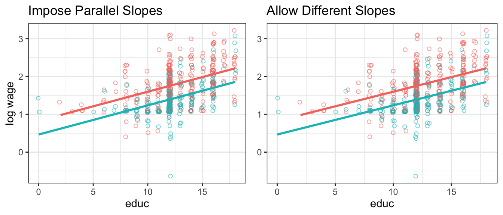

# Categorial Variables {#categorical-vars} 


Up until now, we have encountered only examples with *continuous* variables $x$ and $y$, that is, $x,y \in \mathbb{R}$, so that a typical observation could have been $(y_i,x_i) = (1.5,5.62)$. There are many situations where it makes sense to think about the data in terms of *categories*, rather than continuous numbers. For example, whether an observation $i$ is *male* or *female*, whether a pixel on a screen is *black* or *white*, and whether a good was produced in *France*, *Germany*, *Italy*, *China* or *Spain* are all categorical classifications of data. 

Probably the simplest type of categorical variable is the *binary*, *boolean*, or just *dummy* variable. As the name suggests, it can take on only two values, `0` and `1`, or `TRUE` and `FALSE`. 

## The Binary Regressor Case

Even though this is an extremely parsimonious way of encoding that, it is a very powerful tool that allows us to represent that a certain observation $i$ **is a member** of a certain category $j$. For example, let's imagine we have income data on males and females, and we would create a variable called `is.male` that is `TRUE` whenever $i$ is male, `FALSE` otherwise, and similarly for women. For example, to encode whether subject $i$ is male, one could do this:

\begin{align*}
\text{is.male}_i &=  \begin{cases}
                    1 & \text{if }i\text{ is male} \\
                    0 & \text{if }i\text{ is not male}. \\
                 \end{cases}, \\
\end{align*}

and similarly for females, we'd have

\begin{align*}
\text{is.female}_i &=  \begin{cases}
                    1 & \text{if }i\text{ is female} \\
                    0 & \text{if }i\text{ is not female}. \\
                 \end{cases} \\
\end{align*}

By definition, we have just introduced a linear dependence into our dataset. It will always be true that $\text{is.male}_i + \text{is.female}_i = 1$. This is because dummy variables are based on data being mutually exclusively categorized - here, you are either male or female.^[There are [transgender](https://en.wikipedia.org/wiki/Transgender) individuals where this example will not apply.] This should immediately remind you of section \@ref(multicol) where we introduced *multicolinearity*. A regression of income on both of our variables like this

$$
y_i = b_0 + b_1 \text{is.female}_i + b_2 \text{is.male}_i + e_i
$$
would be invalid because of perfect colinearity between $\text{is.female}_i$ and $\text{is.male}_i$. The solution to this is pragmatic and simple: 

<div class="tip">
<p>In dummy variable regressions, we remove one category from the regression (for example here: <code>is.male</code>) and call it the <em>reference category</em>. The effect of being <em>male</em> is absorbed in the intercept. The coefficient on the remaining categories measures the <em>difference</em> in mean outcome with respect to the reference category.</p>
</div>
<br>

Now let's try this out. We start by creating the female indicator as above,

$$
\text{is.female}_i = \begin{cases}
          1 & \text{if }i\text{ is female} \\
            0 & \text{if }i\text{ is not female}. \\
   \end{cases}
$$
and let's suppose that $y_i$ is a measure of $i$'s annual labor income. Our model is

\begin{equation}
y_i = b_0 + b_1 \text{is.female}_i + e_i (\#eq:dummy-reg)
\end{equation}

and here is how we estimate this in `R`:


```r
# x = sample(x = c(0, 1), size = n, replace = T)
dta$is.female = factor(x)  # convert x to factor
dummy_reg = lm(y~is.female,dta)
summary(dummy_reg)
```

```
## 
## Call:
## lm(formula = y ~ is.female, data = dta)
## 
## Residuals:
##     Min      1Q  Median      3Q     Max 
## -2.4253 -0.6551  0.1321  0.7217  2.8129 
## 
## Coefficients:
##             Estimate Std. Error t value Pr(>|t|)    
## (Intercept)   2.0568     0.2125   9.680 7.27e-13 ***
## is.female1   -3.0169     0.3203  -9.418 1.74e-12 ***
## ---
## Signif. codes:  0 '***' 0.001 '**' 0.01 '*' 0.05 '.' 0.1 ' ' 1
## 
## Residual standard error: 1.124 on 48 degrees of freedom
## Multiple R-squared:  0.6489,	Adjusted R-squared:  0.6416 
## F-statistic:  88.7 on 1 and 48 DF,  p-value: 1.737e-12
```

Notice that `R` displays the *level* of the factor to which coefficient $b_1$ belongs here, i.e. `is.female1` means this coefficient is on level `is.female = 1` - the reference level is `is.female = 0`, and it has no separate coefficient. Also interesting is that $b_1$ is equal to the difference in conditional means between male and female

$$b_1 = E[y|\text{is.female}=1] - E[y|\text{is.female}=0]=-3.0169.$$ 

<div class="note">
<p>A dummy variable measures the difference or the <em>offset</em> in the mean of the response variable, <span class="math inline">\(E[y]\)</span>, <strong>conditional</strong> on <span class="math inline">\(x\)</span> belonging to some category - relative to a baseline category. In our artificial example, the coefficient <span class="math inline">\(b_1\)</span> informs us that women earn on average 3.756 units less than men.</p>
</div>
<br>

It is instructive to reconsider this example graphically:

<div class="figure" style="text-align: center">

<p class="caption">(\#fig:x-zero-one)regressing $y \in \mathbb{R}$ on $\text{is.female}_i \in \{0,1\}$. The blue line is $E[y]$, the red arrow is the size of $b_1$. Which is the same as the slope of the regression line in this case and the difference in conditional means!</p>
</div>

In figure \@ref(fig:x-zero-one) we see that this regression simplifies to the straight line connecting the mean, or the *expected value* of $y$ when $\text{is.female}_i = 0$, i.e. $E[y|\text{is.female}_i=0]$, to the mean when $\text{is.female}_i=1$, i.e.  $E[y|\text{is.female}_i=1]$. It is useful to remember that the *unconditional mean* of $y$, i.e. $E[y]$, is going to be the result of regressing $y$ only on an intercept, illustrated by the blue line. This line will always lie in between both conditional means. As indicated by the red arrow, the estimate of the coefficient on the dummy, $b_1$, is equal to the difference in conditional means for both groups. You should look at our app now to deepen your understanding of what's going on here:


```r
library(ScPoApps)
launchApp("reg_dummy")
```


## Dummy and Continuous Variables

What happens if there are more predictors than just the dummy variable in a regression? For example, what if instead we had

\begin{equation}
y_i = b_0 + b_1 \text{is.female}_i + b_2 \text{exper}_i + e_i (\#eq:dummy-reg2)
\end{equation}

where $\text{exper}_i$ would measure years of experience in the labor market? As above, the dummy variable acts as an intercept shifter. We have

\begin{equation}
y_i =  \begin{cases}
b_0 + b_1 + b_2 \times \text{exper}_i + e_i & \text{if is.female=1} \\
b_0  + \hphantom{b_1} +b_2 \times \text{exper}_i + e_i & \text{if is.female=0}
\end{cases}
\end{equation}

so that the intercept is $b_0 + b_1$ for women but $b_0$ for men. We will see this in the real-world example below, but for now let's see the effect of switching the dummy *on* and *off* in this app:


```r
library(ScPoApps)
launchApp("reg_dummy_example")
```


## Categorical Variables in `R`: `factor` 

`R` has extensive support for categorical variables built-in. The relevant data type representing a categorical variable is called `factor`. We encountered them as basic data types in section \@ref(data-types) already, but it is worth repeating this here. We have seen that a factor *categorizes* a usually small number of numeric values by *labels*, as in this example which is similar to what I used to create regressor `is.female` for the above regression:


```r
is.female = factor(x = c(0,1,1,0), labels = c(FALSE,TRUE))
is.female
```

```
## [1] FALSE TRUE  TRUE  FALSE
## Levels: FALSE TRUE
```

You can see the result is a vector object of type `factor` with 4 entries, whereby `0` is represented as `FALSE` and `1` as `TRUE`. An other example could be if we wanted to record a variable *sex* instead, and we could do 


```r
sex = factor(x = c(0,1,1,0), labels = c("male","female"))
sex
```

```
## [1] male   female female male  
## Levels: male female
```

You can see that this is almost identical, just the *labels* are different.


### More Levels

We can go beyond *binary* categorical variables such as `TRUE` vs `FALSE`. For example, suppose that $x$ measures educational attainment, i.e. it is now something like $x_i \in \{\text{high school,some college,BA,MSc}\}$. In `R` parlance, *high school, some college, BA, MSc* are the **levels of factor $x$**. A straightforward extension of the above would dictate to create one dummy variable for each category (or level), like 

\begin{align*}
\text{has.HS}_i &= \mathbf{1}[x_i==\text{high school}] \\
\text{has.someCol}_i &= \mathbf{1}[x_i==\text{some college}] \\
\text{has.BA}_i &= \mathbf{1}[x_i==\text{BA}] \\
\text{has.MSc}_i &= \mathbf{1}[x_i==\text{MSc}] 
\end{align*}

but you can see that this is cumbersome. There is a better solution for us available:


```r
factor(x = c(1,1,2,4,3,4),labels = c("HS","someCol","BA","MSc"))
```

```
## [1] HS      HS      someCol MSc     BA      MSc    
## Levels: HS someCol BA MSc
```

Notice here that `R` will apply the labels in increasing order the way you supplied it (i.e. a numerical value `4` will correspond to "MSc", no matter the ordering in `x`.)

### Log Wages and Dummies {#factors}

The above developed `factor` terminology fits neatly into `R`'s linear model fitting framework. Let us illustrate the simplest use by way of example.

Going back to our wage example, let's say that a worker's wage depends on their education as well as their sex:

\begin{equation}
\ln w_i = b_0 + b_1 educ_i + b_2 female_i + e_i (\#eq:wage-sex)
\end{equation}


```r
data("wage1", package = "wooldridge")
wage1$female = as.factor(wage1$female)  # convert 0-1 to factor
lm_w = lm(lwage ~ educ, data = wage1)
lm_w_sex = lm(lwage ~ educ + female, data = wage1)
stargazer::stargazer(lm_w,lm_w_sex,type = if (knitr:::is_latex_output()) "latex" else "html")
```


<table style="text-align:center"><tr><td colspan="3" style="border-bottom: 1px solid black"></td></tr><tr><td style="text-align:left"></td><td colspan="2"><em>Dependent variable:</em></td></tr>
<tr><td></td><td colspan="2" style="border-bottom: 1px solid black"></td></tr>
<tr><td style="text-align:left"></td><td colspan="2">lwage</td></tr>
<tr><td style="text-align:left"></td><td>(1)</td><td>(2)</td></tr>
<tr><td colspan="3" style="border-bottom: 1px solid black"></td></tr><tr><td style="text-align:left">educ</td><td>0.083<sup>***</sup></td><td>0.077<sup>***</sup></td></tr>
<tr><td style="text-align:left"></td><td>(0.008)</td><td>(0.007)</td></tr>
<tr><td style="text-align:left"></td><td></td><td></td></tr>
<tr><td style="text-align:left">female1</td><td></td><td>-0.361<sup>***</sup></td></tr>
<tr><td style="text-align:left"></td><td></td><td>(0.039)</td></tr>
<tr><td style="text-align:left"></td><td></td><td></td></tr>
<tr><td style="text-align:left">Constant</td><td>0.584<sup>***</sup></td><td>0.826<sup>***</sup></td></tr>
<tr><td style="text-align:left"></td><td>(0.097)</td><td>(0.094)</td></tr>
<tr><td style="text-align:left"></td><td></td><td></td></tr>
<tr><td colspan="3" style="border-bottom: 1px solid black"></td></tr><tr><td style="text-align:left">Observations</td><td>526</td><td>526</td></tr>
<tr><td style="text-align:left">R<sup>2</sup></td><td>0.186</td><td>0.300</td></tr>
<tr><td style="text-align:left">Adjusted R<sup>2</sup></td><td>0.184</td><td>0.298</td></tr>
<tr><td style="text-align:left">Residual Std. Error</td><td>0.480 (df = 524)</td><td>0.445 (df = 523)</td></tr>
<tr><td style="text-align:left">F Statistic</td><td>119.582<sup>***</sup> (df = 1; 524)</td><td>112.189<sup>***</sup> (df = 2; 523)</td></tr>
<tr><td colspan="3" style="border-bottom: 1px solid black"></td></tr><tr><td style="text-align:left"><em>Note:</em></td><td colspan="2" style="text-align:right"><sup>*</sup>p<0.1; <sup>**</sup>p<0.05; <sup>***</sup>p<0.01</td></tr>
</table>

We know the results from column (1) very well by now. How does the relationship change if we include the `female` indicator? Remember from above that `female` is a `factor` with two levels, *0* and *1*, where *1* means *that's a female*. We see in the above output that `R` included a regressor called `female1`. This is a combination of the variable name `female` and the level which was included in the regression. In other words, `R` chooses a *reference category* (by default the first of all levels by order of appearance), which is excluded - here this is `female==0`. The interpretation is that $b_2$ measures the effect of being female *relative* to being male. `R` automatically creates a dummy variable for each potential level, excluding the first category.

<div class="figure" style="text-align: center">

<p class="caption">(\#fig:wage-plot)log wage vs educ. Right panel with female dummy.</p>
</div>

Figure \@ref(fig:wage-plot) illustrates this. The left panel is our previous model. The right panel adds the `female` dummy. You can see that both male and female have the same upward sloping regression line. But you can also see that there is a parallel downward shift from male to female line. The estimate of $b_2 = -0.36$ is the size of the downward shift. 


## Interactions

Sometimes it is useful to let the slope of a certain variable to be dependent on the value of *another* regressor. For example consider a model for the sales prices of houses, where `area` is the livable surface of the property, and `age` is its age:

\begin{equation}
\log(price) = b_0 + b_1 \text{area} + b_2 \text{age} + b_3 (\text{area} \times \text{age}) + e  (\#eq:price-interact)
\end{equation}

In that model, the partial effect of `area` on `log(price)`, keeping all other variables fixed, is

\begin{equation}
\frac{\partial \log(price)}{\partial \text{area}} = b_1 + b_3 (\text{age}) 
\end{equation}

If we find that $b_3 > 0$ in a regression, we conclude that the size of a house values more in older houses. We call $b_3$ the **interaction effect** between area and age. Let's look at that regression model now.


```r
data(hprice3, package = "wooldridge")
summary(lm(lprice ~ area*age, data = hprice3))
```

```
## 
## Call:
## lm(formula = lprice ~ area * age, data = hprice3)
## 
## Residuals:
##      Min       1Q   Median       3Q      Max 
## -1.27226 -0.16538 -0.00298  0.20673  0.83985 
## 
## Coefficients:
##               Estimate Std. Error t value Pr(>|t|)    
## (Intercept)  1.071e+01  6.633e-02 161.448  < 2e-16 ***
## area         3.647e-04  2.875e-05  12.686  < 2e-16 ***
## age         -7.377e-03  1.358e-03  -5.434  1.1e-07 ***
## area:age     9.168e-07  4.898e-07   1.872   0.0622 .  
## ---
## Signif. codes:  0 '***' 0.001 '**' 0.01 '*' 0.05 '.' 0.1 ' ' 1
## 
## Residual standard error: 0.2925 on 317 degrees of freedom
## Multiple R-squared:  0.5586,	Adjusted R-squared:  0.5545 
## F-statistic: 133.7 on 3 and 317 DF,  p-value: < 2.2e-16
```

In this instance, we see that indeed there is a small positive interaction between `area` and `age` on the sales price: even though `age` in isolation decreases the sales value, bigger houses command a small premium if they are older.

### Interactions with Dummies: Differential Slopes

It is straightforward to extend the interactions logic to allow not only for different *intercepts*, but also different *slopes* for each subgroup in a dataset. Let's go back to our dataset of wages from section \@ref(factors) above. Now that we know how to create and interaction between two variables, we can easily modify equation \@ref(eq:wage-sex) like this:

\begin{equation}
\ln w = b_0 + b_1 \text{female} + b_2 \text{educ} + b_3 (\text{female} \times \text{educ}) + e (\#eq:wage-sex2)
\end{equation}

The only peculiarity here is that `female` is a factor with levels `0` and `1`: i.e. the interaction term $b_3$ will be zero for all men. Similarly to above, we can test whether there are indeed different returns to education or men and women by looking at the estimated value $b_3$:


```r
lm_w_interact <- lm(lwage ~ educ * female , data = wage1)  # R expands to full interactions model
summary(lm_w_interact)
```

```
## 
## Call:
## lm(formula = lwage ~ educ * female, data = wage1)
## 
## Residuals:
##      Min       1Q   Median       3Q      Max 
## -2.02673 -0.27468 -0.03721  0.26221  1.34740 
## 
## Coefficients:
##                Estimate Std. Error t value Pr(>|t|)    
## (Intercept)   8.260e-01  1.181e-01   6.997 8.08e-12 ***
## educ          7.723e-02  8.988e-03   8.593  < 2e-16 ***
## female1      -3.601e-01  1.854e-01  -1.942   0.0527 .  
## educ:female1 -6.408e-05  1.450e-02  -0.004   0.9965    
## ---
## Signif. codes:  0 '***' 0.001 '**' 0.01 '*' 0.05 '.' 0.1 ' ' 1
## 
## Residual standard error: 0.4459 on 522 degrees of freedom
## Multiple R-squared:  0.3002,	Adjusted R-squared:  0.2962 
## F-statistic: 74.65 on 3 and 522 DF,  p-value: < 2.2e-16
```

We will in the next chapter learn that the estimate for $b_3$ on the interaction `educ:female1` is difficult for us to distinguish from zero in a statistical sense; Hence for now we conclude that there are *no* significantly different returns in education for men and women in this data. This is easy to verify visually in this plot, where we are unable to detect a difference in slopes in the right panel.

<div class="figure" style="text-align: center">

<p class="caption">(\#fig:wage-plot2)log wage vs educ. Right panel allows slopes to be different - turns out they are not!</p>
</div>


## (Unobserved) Individual Heterogeneity

Finally, dummary variables are sometimes very important to account for spurious relationships in that data. Consider the following (artificial example):

1. Suppose we collected data on hourly wage data together with a the number of hours worked for a set of individuals.
1. We plot want to investigate labour supply behaviour of those individuals, hence we run regression `hours_worked ~ wage`.
1. We expect to get a positive coefficient on `wage`: the higher the wage, the more hours worked.
1. You know that individuals are members of either group `g=0` or `g=1`.


```
## `geom_smooth()` using formula 'y ~ x'
## `geom_smooth()` using formula 'y ~ x'
## `geom_smooth()` using formula 'y ~ x'
```


Here we observe a slightly negative relationship: higher wages are associated with fewer hours worked? Maybe. But what is this, there is a group identifier in this data! Let's use this and include `g` as a dummy in the regression - suppose `g` encodes male and female. 

<div class="figure" style="text-align: center">

<p class="caption">(\#fig:unnamed-chunk-12)Left and right panel exhibit the same data. The right panel controls for group composition.</p>
</div>

This is an artificial example; yet it shows that you can be severly misled if you don't account for group-specific effects in your data. The problem is particularly accute if we *don't know group membership* - we can then resort to advanced methods that are beyond the scope of this course to *estimate* which group each individual belongs to. If we *do know* group membership, however, it is good practice to include a group dummy so as to control for group effects.
