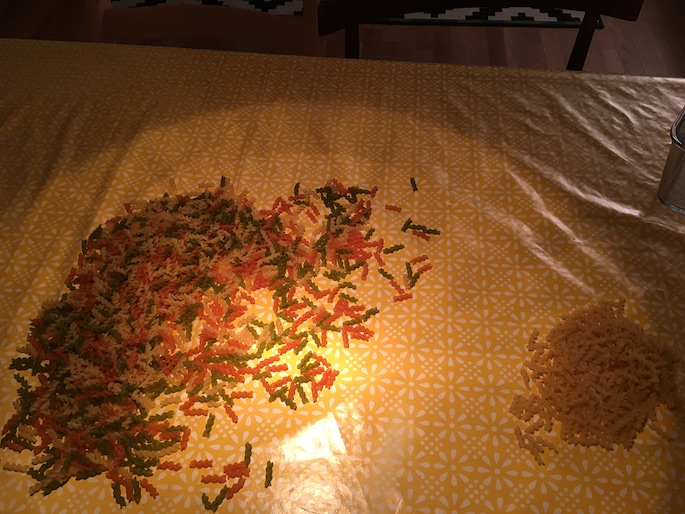
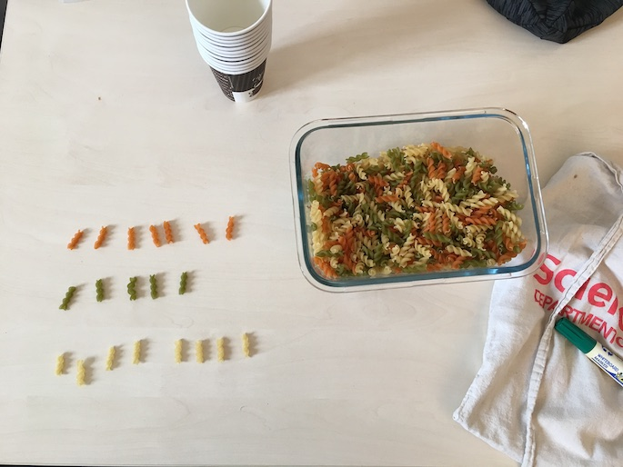
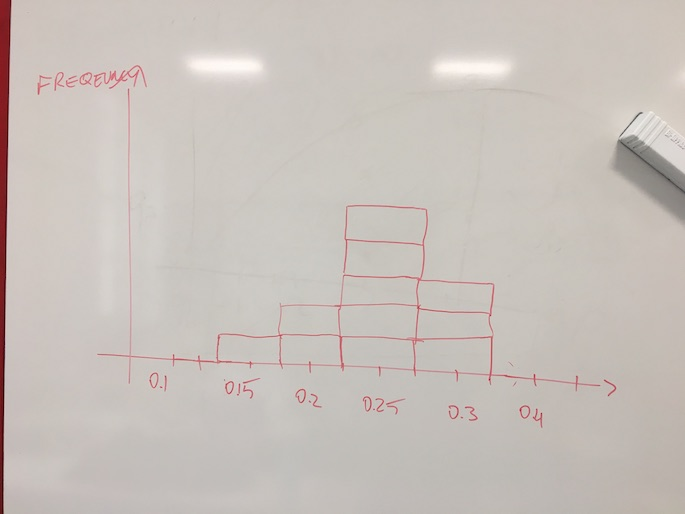

# Standard Errors {#std-errors}

In this chapter we want to investigate uncertainty in regression estimates. We want to understand what the precise meaning of the `Std. Error` column in a typical regression table is telling us. In terms of a picture, we want to understand better the meaning of the shaded area as in this one here:

```{r confint,fig.align="center",message=FALSE,warning=FALSE,echo=FALSE,fig.cap="Confidence bands around a regression line."}
library(ggplot2)
data("wage1", package = "wooldridge")
p <- ggplot(mapping = aes(x = educ, y = lwage), data = subset(wage1,educ > 5)) # base plot
p <- p + geom_point() # add points
p <- p + geom_smooth(method = "lm", size=1, color="red") # add regression line
p <- p + scale_y_continuous(name = "log hourly wage") + 
         scale_x_continuous(name = "years of education")
p + theme_bw() + ggtitle("Log Wages vs Education")
```

In order to fully understand this, we need to go back and make sure we have a good grasp of *sampling*. Let's do this first.

## Sampling

In class we were confronted with a jar of Tricolore Fusilli pasta as picture in figure \@ref(fig:pasta1).^[This part is largely based on [moderndive](https://moderndive.com/7-sampling.html), to which I am giving full credit hereby. Thanks for this great idea.] We asked ourselves a question which, secretly, many of you had asked themselves at one point in their lives, namely:

```{block type = "tip"}
What is the proportion of **green** Fusilli in a pack of Tricolore Fusilli?
```
<br>

Well, it's time to find out.

```{r pasta1, fig.cap="A glass jar filled with Fusilli pasta in three different colors.",echo = FALSE, out.width = "700px"}

```


Let's call the fusilly in this jar our *study population*, i.e. the set of units about which we want to learn something. There are several approaches to address the question of how big a proportion in the population the green Fusilli make up. One obvious solution is to enumerate all Fusilli according to their color, and compute their proportion in the entire population. It works perfectly well as a solution, but is a long and arduous process, see figures \@ref(fig:pasta2) and  \@ref(fig:pasta3). 

```{r pasta2, fig.cap="Manually separating Fusilli by their color is very costly in terms of effort and cost.",echo = FALSE,fig.width = 8, out.width = "700px"}

```

Additionally, you may draw worried looks from the people around you, while you are doing it. Maybe this is not the right way to approach this task?^[Regardless of the worried onlookers, I did what I had to do and I carried on to count the green pile. I know exactly how many greens are in there now! I then computed the weight of 20 Fusilli (5g), and backed out the number of Fusilli in the other piles. I will declare those numbers as the *true numbers*. (Sceptics are free to recount.)]

```{r pasta3, fig.cap="Heaps of Fusilli pasta ready to be counted.",echo = FALSE, out.width = "700px"}

```

### Taking One Sample From the Population

We started by randomly grabbing a handful of Fusilli from the jar and by letting drop exactly $N=20$ into a paper coffee cup, pictured in \@ref(fig:pasta5). We call $N$ the *sample size*. The count and corresponding proportions of each color in this first sample are shown in the following table:

Color | Count | Proportion
:------:|:------:|:--------:
Red   |  7        |  0.35
Green   |  5     |   0.25
White   |  8    |     0.4

So far, so good. We have our first *estimate of the population proportion of green Fusilli in the overall population*: 0.25. Notice that taking a sample of $N=20$ was *much* quicker and *much less painful* than performing the full count (i.e. the *census*) of Fusilli performed above. 

```{r pasta5, fig.cap="Taking one sample of 20 Fusilli from the jar.",echo = FALSE, out.width = "700px"}

```

Then, we put my sample back into the jar, and we reshuffled the Fusilli. Had we taken *another* sample, again of $N=20$, would we again have gotten 7 Red, 5 Green, and 8 White, just as in the first sample? Maybe, but maybe not. Suppose we had carried on for several times drawing samples of 20 and counting the colors: Would we also have observed 5 green Fusilli? Definitely not. We would have noted some degree of *variability* in the proportions computed from our samples. The *sample proportions* in this case are an example of a *sample statistic*.

```{block type = "note"}
**Sampling Variation** refers to the fact that if we *randomly* take samples from a wider population, the *random* composition of each sample will imply that we obtain statistics that vary - they take on potentially different values in each sample.
```


Let's see how this story evolved as we started taking more samples at a time. 

## Taking Eleven Samples From The Population

We formed teams of two students in class who would each in turn take samples from the jar (the population) of size $N=20$, as before. Each team computed the proportion of green Fusilli they had in their sample, and we wrote this data down in a table on the board. Then, we drew a histogram which showed how many samples had fallen into which bins. 

```{r pasta6, fig.cap="Taking eleven samples of 20 Fusilli each from the jar, and plotting the histogram of obtained sample proportions of Green Fusilli.",echo = FALSE, out.width = "700px"}

```

We looked at the histogram in figure \@ref(fig:pasta6) and we noted several things:

1. The largest proportions where 0.3 green
1. The smallest proportion was 0.15 green.
1. Most samples found a proportion of 0.25 green fusilli.
1. We did think that this looked *suspiciouly* like a **normal distribution**. 

We collected the sample data into a data.frame:

```{r sample-data}
pasta_samples <- data.frame(group = 1:11, replicate = 1:11, prop_green = c(0.3,0.25,0.25,0.3,0.15,0.3,0.25,0.25,0.2,0.25,0.2))
pasta_samples
```

This produces an associated histogram like

```{r pasta-hist,echo = FALSE}
hist(pasta_samples$prop_green,breaks = c(0.125,0.175,0.225,0.275,0.325),main = "Histogram of 11 Pasta Samples", xlab = "Proportion of Green Fusilli")
```

### Recap

## Inference in Theory

```{r testing,echo=FALSE}
s = 10
n = 50
mu = 167
xbar = 168.5
set.seed(2)
height = rnorm(n,mean=xbar,sd=s)
tstat = round((xbar - mu)/(s/sqrt(n)),3)
ctval = qt(0.95,df=n)
cxbar = ctval * (s/sqrt(n)) + mu
```

Imagine we were tasked by the Director of our school to provide him with our best guess of the *mean body height* $\mu$ amongst all SciencesPo students in order to assess which height the new desks should have. Of course, we are econometricians and don't *guess* things: we **estimate** them! How would we go about this task and estimate $\mu$?

You may want to ask: Why bother with this estimation business at all, and not just measure all students' height, compute $\mu$, and that's it? That's a good question! In most cases, we cannot do this, either because we do not have access to the entire population (think of computing the mean height of all Europeans!), or it's too costly to measure everyone, or it's impractical. That's why we take *samples* from the wider population, to make inference. In our example, suppose we'd randomly measure students coming out of the SciencesPo building at 27 Rue Saint Guillaume until we have $`r n`$ measurements on any given Monday. Suppose further that we found a sample mean height $\bar{x} = `r xbar`$, and that the sample standard deviation was $s=`r s`$. In short, we found the data summarized in figure \@ref(fig:heightdata)

```{r heightdata,echo=FALSE,fig.cap="Our ficitious sample of SciencesPo students' body height. The small ticks indicate the location of each measurement.",fig.align='center'}
hist(height)
rug(height)
```

What are we going to tell *Monsieur le Directeur* now, with those two numbers and figure \@ref(fig:heightdata) in hand? Before we address this issue, we need to make a short detour into *test statistics*.


### Test Statistics

We have encountered many statistics already: think of the sample mean, or the standard deviation. Statistics are just functions of data. *Test* statistics are used to perform statistical tests.

Many test statistics rely on some notion of *standardizing* the sample data so that it becomes comparable to a theoretical distribution. We encountered this idea already in section \@ref(reg-standard), where we talked about a standardized regression. The most common standardization is the so-called *z-score*, which says that

\begin{equation}
\frac{x - \mu}{\sigma}\equiv z\sim \mathcal{N}(0,1), (\#eq:zscore)
\end{equation}

in other words, substracting the population mean from random variable $x$ and dividing by it's population standard deviation yields a standard normally distributed random variable, commonly called $z$.

A very similar idea applies if we *don't know* the population  variance (which is our case here!). The corresponding standardization gives rise to the *t-statistic*, and it looks very similar to \@ref(eq:zscore):

\begin{equation}
\sqrt{n} \frac{\bar{x} - \mu}{s} \equiv T \sim t_{n-1} (\#eq:tscore)
\end{equation}

Several things to note:

* We observe the same standardization as above: dividing by the sample standard deviation $s$ brings $\bar{x} - \mu$ to a *unit free* scale.
* We use $\bar{x}$ and $s$ instead of $x$ and $\sigma$
* We multiply by $\sqrt{n}$ because we expect $\bar{x} - \mu$ to be a small number: we need to *rescale* it again to make it compatible with the $t_{n-1}$ distribution.
* $t_{n-1}$ is the [Student's T](https://en.wikipedia.org/wiki/Student's_t-distribution) distribution with $n-1$ degrees of freedom. We don't have $n$ degrees of freedom because we already had to estimate one statistic ($\bar{x}$) in order to construct $T$. 


### Confidence Intervals {#CI}

Back to our example now! We are clearly in need of some measure of *confidence* about our sample statistic $\bar{x} = `r xbar`$ before we communicate our result. It seems reasonable to inform the Director about $\bar{x}$, but surely we also need to tell him that there was considerable *dispersion* in the data: Some people were as short as `r round(min(height),2)`cm, while others were as tall as `r round(max(height),2)`cm! 

The way to proceed is to construct a *confidence interval* about the true population mean $\mu$, based on $\bar{x}$, which will take this uncertainty into account. We will use the *t* statistic from above. We want to have a *symmetric interval* around $\bar{x}$ which contains the true value $\mu$ with probability $1-\alpha$. One very popular choice of $\alpha$ is $0.05$, hence we cover $\mu$ with 95% probability. After computing our statistic $T$ as defind in \@ref(eq:tscore), this interval is defined as follows:

\begin{align}
\Pr \left(-c \leq T \leq c \right) = 1-\alpha (\#eq:ci)
\end{align}

where $c$ stands for *critical value*, which we need to choose. This is illustrated in figure \@ref(fig:cifig).

```{r cifig, echo=FALSE, engine='tikz', out.width='90%', fig.ext=if (knitr:::is_latex_output()) 'pdf' else 'png', fig.cap='Confidence Interval Construction. The blue area is called *coverage region* which contains the true $\\mu$ with probability $1-\\alpha$.',fig.align='center'}
\begin{tikzpicture}[scale=2, y=5cm]
\draw[domain=-3.15:-2] (-3.15,0) plot[id=gauss1,samples=50]
(\x,{1/sqrt(2*pi)*exp(-0.5*(\x)^2)}) -- (-2,0);   
\draw[domain=-2:2,fill=blue,opacity=0.4] (-2,0) -- plot[id=gauss1, samples=100] (\x,{1/sqrt(2*pi)*exp(-0.5*(\x)^2)}) -- (2,0);   
\draw[domain=2:3.2] (2,0) --
plot[id=gauss3, samples=50] (\x,{1/sqrt(2*pi)*exp(-0.5*(\x)^2)});
\draw (2,-0.01) -- (2,0.01);    % ticks
\draw (-2,-0.01) -- (-2,0.01);
% ciritcal estimator values
\node at (2,-0.04) {$c$};
\node at (-2,-0.04) {$-c$};

% x-axis 1
\draw[->, semithick] (-3.2,0) -- (3.4,0) node[right] {$T$};  

% x-axis 2
%\draw[->, semithick] (-3.2,-0.1) -- (3.4,-0.1) node[right]
%{$T=\sqrt{n}\frac{\bar{x}-\bar{x}}{s}$}; 
% ticks on t
%\draw[-,semithick] (2,-0.11) -- (2,-0.09);
%\node at (2,-0.13)  {$c=2$};
%\draw[-,semithick] (-2,-0.11) -- (-2,-0.09);
%\node at (-2,-0.13)  {$-c=-2$};

%y-axis
\draw[->, semithick] (-3.15,-0.02) node[left] {$0$} -- (-3.15,0.45)
node[above] {$t_{n-1}$}; 

\draw[-,semithick] (0,-0.01) -- (0,0.01); % zero tick on x
% \draw[-,semithick] (0,-0.11) -- (0,0.-0.09); % zero tick on t
\node at (0,-0.03) {$0$};
% \node at (0,-0.13) {$0$};

% annotate alphas
\node at (0,0.15) {$1 - \alpha = 0.95$};
\draw (2.2,0.02) -- (2.4,0.1) node[above] {$\frac{\alpha}{2} = 0.025$};
\draw (-2.2,0.02) -- (-2.4,0.1) node[above] {$\frac{\alpha}{2} = 0.025$};
\end{tikzpicture} 
```

Given the symmetry of the *t* distribution it's enough to find $c$ at the upper tail: the point above which $\frac{\alpha}{2}$ of all probability mass of the $t_{df}$ distribution comes to lie. In other words, if $\mathcal{T}_{df}$ is the CDF of the *t* distribution with *df* degrees of freedom, we find $c$ as

\begin{align}
\mathcal{T}_{df}(c)\equiv& \Pr \left( T < c \right)  = 1-\frac{\alpha}{2} = 0.975 \\(\#eq:ci1)
c =& \mathcal{T}_{df}^{-1}(\mathcal{T}_{df}(c)) = \mathcal{T}_{df}^{-1}(0.975)
\end{align}

Here $\mathcal{T}_{df}^{-1}$ stands for the *quantile function*, i.e. the inverse of the CDF. In our example with $df = `r n-1`$, you can find thus that $c = `r round(qt(0.975,df=n-1),3)`$ by typing `qt(0.975,df=49)` into your `R` session.^[You often will see $c=1.96$, which comes from the fact that one relies on the *t* distribution converging to the normal distribution with large $n$. Type `qnorm(0.975)` to confirm!] Now we only have to expand the definition of the *T* statistic from \@ref(eq:tscore) inside \@ref(eq:ci) to obtain

\begin{align}
0.95 = 1-\alpha &= \Pr \left(-c \leq T \leq c \right) \\(\#eq:ci2)
                &= \Pr \left(-`r round(qt(0.975,df=n-1),3)` \leq \sqrt{n} \frac{\bar{x} - \mu}{s} \leq `r round(qt(0.975,df=n-1),3)` \right) \\
                 &= \Pr \left(\bar{x} -`r round(qt(0.975,df=n-1),3)` \frac{s}{\sqrt{n}} \leq \mu \leq \bar{x} + `r round(qt(0.975,df=n-1),3)` \frac{s}{\sqrt{n}} \right) 
\end{align}

Finally, filling in our numbers for $s$ etc, this implies that a 95% confidence interval about the location of the true average height of all SciencesPo students, $\mu$, is given by:

\begin{equation}
CI = \left[`r round(xbar - qt(0.975,df=n-1)* s/sqrt(n),3)` , `r round(xbar + qt(0.975,df=n-1)* s/sqrt(n),3)` \right]
\end{equation}

We would tell the director that with 95% probability, the true average height of all students comes to lie within those two bounds.


### Hypothesis Testing

Now know by now how the standard errors of an OLS estimate are computed, and what they stand for. We can now briefly^[We will not go into great detail here. Please refer back to your statistics course from last spring semester (chapters 8 and 9), or the short note I [wrote while ago](images/hypothesis.pdf) ] discuss a very common usage of this information, in relation to which variables we should include in our regression. There is a statistical proceedure called *hypothesis testing* which helps us to make such decisions.
In [hypothesis testing](https://en.wikipedia.org/wiki/Statistical_hypothesis_testing), we have a baseline, or *null* hypothesis $H_0$, which we want to confront with a competing *alternative* hypthesis $H_1$. Continuing with our example of the mean height of SciencesPo students ($\mu$), one potential hypothesis could be

\begin{align}
H_0:& \mu = `r mu`\\
H_1:& \mu \neq `r mu`
\end{align}

Here we state that under the null hypthesis, $\mu = `r mu`$, and under the alternative, it's not equal to that value. This would be called a *two-sided* test, because it tests deviations from $H_0$ below as well as above. An alternative formulation could use the *one-sided* test that

\begin{align}
H_0:& \mu = `r mu`\\
H_1:& \mu > `r mu`.
\end{align}

which would mean: under the null hypothesis, the average of all ScPo students' body height is `r mu`cm. Under the alternative, it is larger. You can immediately see that this is very similar to confidence interval construction. 

Suppose as above that we found $\bar{x} = `r  xbar`$, and that the sample standard deviation is still $s=`r s`$. Would you regard this as strong or weak evidence against $H_0$ and in favor of $H_1$?

You should now remember what you saw when you did `launchApp("estimate")`. Look again at this app and set the slider to a sample size of $`r n`$, just as in our running example. You can see that the app draws one hundred (100) samples for you, locates their sample mean on the x-axis, and estimates the red density. 

```{block type='note'}
The crucial thing to note here is that, given we are working with a **random sample** from a population with a certain distribution of *height*, our sample statistic $\bar{x}$ is **also a random variable**. Every new set of randomly drawn students would yield a different $\bar{x}$, and all of them together would follow the red density in the app. In reality we often only get to draw one single sample, and we can use knowledge about the sampling distribution to make inference.
```
<br>

Our task is now to decide if given that particular sampling distribution, given our estimate $\bar{x}$ and given an observed sample variance $s^2$, whether  $\bar{x} = `r xbar`$ is *far away* from  $\bar{x} = `r mu`$, or not. The way to proceed is by computing a *test statistic*, which is to be compared to a *critical value*: if the test statistic exceeds that value, we reject $H_0$, otherwise we cannot. The critical value depends on the sampling distribution, and the size of the test. We talk about this next. 

### Making Errors

There are two types of error one can make when deploying such a test:

1. We might reject $H_0$, when in fact it is true! Here, upon observing  $\bar{x} = `r xbar`$ we might conclude that indeed $\mu > `r mu`$ and thus we'd reject. But we might have gotten unlucky and by chance have obtained an unusually tall sample of students. This is called **type one error**.
2. We might *fail* to reject $H_0$ when in fact $H_1$ is true. This is called the **type two error**.

We design a test with a certain probability of *type one error* $\alpha$ in mind. In other words, we choose with which probability $\alpha$ we are willing to make a type one error. (Notice that the best tests also avoid making type two errors! The number $1-\Pr(\text{type 2 error})$ is called *power*, hence we prefer tests with *high power*). A typical choice for $\alpha$ is 0.05, i.e. we are willing to make a type one error with probability 5%. $\alpha$ is commonly called the **level of significance** or the **size** of a test.


### Performing the Test

We can stick to the following cookbook procedure, which is illustrated in figure \@ref(fig:testfig). 

1. Set up hypothesis and significance level:
    1. $H_0: \mu = `r mu`$
    2. $H_1: \mu > `r mu`$
    3. $\alpha = 0.05$
2. Test Statistic and test distribution:
    * We don't know the true population variance $\sigma^2$, hence we estimate it via $s^2$ from our sample. 
    * The corresponding test statistic is the *t-statistic*, which follows the [Student's T](https://en.wikipedia.org/wiki/Student's_t-distribution) distribution.
    * That is, our statistic is $T=\frac{\bar{x} - \mu}{s/\sqrt{n}} \sim t_{`r n-1`}$, where `r n-1` is equal to the *degrees of freedom* in this case.
3. Rejection Region:
    We perform a one-sided test. We said we are happy with a 5% significance level, i.e. we are looking for the $t$ value which corresponds *just* to $1-0.05 = 0.95$ mass under the pdf of the $t$ distribution. More precisely, we are looking for the $1-0.05 = 0.95$ quantile of the $t_{`r n`}$ distribution.^[See the previous footnote for an explanation of this!] This implies a critical value $c = `r round(qt(0.95,df=n),3)`$, which you can verify by typing `qt(0.95,df=50)` in `R`.
4. Calculate our test statistic:
    $\frac{\bar{x} - \mu}{s/\sqrt{n}} = \frac{168.5 - 167}{`r s`/\sqrt{`r n`}} = `r tstat`$
5. Decide:
    We find that $`r tstat` < `r round(ctval,3)`$. Hence, we cannot reject $H_0$, because we only found weak evidence against it in our sample of data.


```{r testfig, echo=FALSE, engine='tikz', out.width='90%', fig.ext=if (knitr:::is_latex_output()) 'pdf' else 'png', fig.cap='Cookbook Testing Proceedure. Subscripts $c$ indicate *critical value*. There are two x-axis: one for values of $\\bar{x}$, and one for the corresponding $t$ statistic. The red area is the rejection area. If we observe a test statistic such that $t>t_c$, we feel reassured that our $\\bar{x}$ is *sufficiently far away* from the hypothesized value $\\mu$, such that we feel comfortable with rejecting $H_0$. And vice versa: If our test statistic falls below $t_c$, we will not reject $H_0$',fig.align='center'}
\begin{tikzpicture}[scale=2, y=5cm]
\draw[domain=-3:1.645] plot[id=gauss1, samples=100] (\x,{1/sqrt(2*pi)*exp(-0.5*(\x)^2)});   
\draw[domain=1.645:3.2,fill=red,opacity=0.4] (1.645,0) --
plot[id=gauss3, samples=25] (\x,{1/sqrt(2*pi)*exp(-0.5*(\x)^2)});
\draw (1.645,-0.01) -- (1.645,0.01);    % tick
\node at (1.645,-0.03) {$\bar{x}_c = 171.74$};
\draw[->, semithick] (-3.2,0) -- (3.4,0) node[right]
{$\bar{x}$}; % x-axis 1  
\draw[->, semithick] (-3.2,-0.1) -- (3.4,-0.1) node[right] {$t=\sqrt{n} \frac{\bar{x}-\mu}{s}$}; % x-axis 2

%y-axis
\draw[->, semithick] (-3.15,-0.02) node[left] {$0$} -- (-3.15,0.45)
node[above] {$f(\bar{x}|\mu=167)$}; % y-axis

\draw[-,semithick] (0,-0.01) -- (0,0.01); % zero tick on x
\draw[-,semithick] (0,-0.11) -- (0,0.-0.09); % zero tick on z
\node at (0,-0.03) {$\mu = 167$};
\node at (0,-0.13) {$0$};
\draw[-,semithick] (1.645,-0.11) -- (1.645,-0.09);
\node at (1.645,-0.13)  {$t_c = 1.676$};
% annotate alphas
\node at (0,0.15) {$1 - \alpha = 0.95$};
\draw (2,0.02) -- (2.4,0.1) node[above] {$\alpha = 0.05$};
\end{tikzpicture} 
```

You can see from this that whether or not our test statistic is far way from the critical value, or just below does not change our decision: it's either accept or reject. We never know if we *narrowly* rejected a $H_0$, or not. P-values are an improvement over this stark dichotomy. The p-value is defined as the particular level of significance $\alpha^*$, up to which *all* $H_0$'s would be rejected. If this is a very small number, we have overwhelming support to reject the null. If, on the contrary, $\alpha^*$ turns out to be rather large, we only found weak evidence against $H_0$.

We define the p-value as the sum of rejection areas for a given test statistic $T^*$. Notice that the symmetry of the $t$ distribution implies that we would multiply by two each of the two tail probabilities in the case of a two-sided test.

\begin{align}
\alpha^* = \Pr(t > |T^*|) 
\end{align}

## Inference via Bootstrap

We will now take the ideas from the previous section and illustrate them using one single powerful idea. Instead of relying on some *population distribution* from which our samples of data have been drawn, we can regard the sampling distribution itself as the population distribution, and take samples *from* it. Our discussion in the previous section *relied* on a tight connection between sampling and population distribution - how else could we have inferred anything about the population from looking at our sample? We will take this idea to its extreme now and look *only* at the sampling distribution. This idea is a *resampling* technique, commonly referred to as the *Bootstrap*.

```{block type = "warning"}
**Bootstrapping** is a test or metric that relies on *resampling with replacement*. It allows estimation of the sampling distribution of almost any statistic using random sampling methods.
```

### How does the Bootstrap work?

This best to show with an example. Suppose we had stored our `R n` measurements of students heights from figure \@ref(fig:heightdata) above in the variable `height`

```{r}
head(height)
```

and let's suppose we want to figure out the distribution of the sample mean $\bar{height}$ here. We will now compute the mean of `height` repeatedly, each time collecting the result in a vector:

```{r}
r = c()
R = 200
for (ib in 1:R){
  bs = sample(height,size = 10,replace = TRUE)  # bootstrap sample
  r = c(r,mean(bs))  # add to results vector
}
```

How are `r R` means we have computed distributed? Do they all have the same value? Different? How?

```{r hists-x,echo = FALSE,fig.cap="The Distribution of 200 means of `height`, where each version was obtained by resampling from `height` with replacement. The red line indicates the *true* mean from the original sample of `height`."}
hist(r,main = "Histogram of Means of Height",xlab = "Mean of Height")
abline(v = mean(height),col = "red",lw=2)
```

Well, this is very similar to a normal distribution, isn't it?^[In particular, notice that is *not* the same histogram as the one in figure \@ref(fig:heightdata) above. Here we see the *means* of height, whereas above we plotted the raw data values.] You should remember that above, for example in figure \@ref(fig:cifig), we had derived a *theoretical* sampling distribution. Relying on statistical theory, we learned that a certain test statistic will be distributed according to a certain distribution (students's t, or normal, for instance), and that we could use that knowledge to construct confidence intervals and hypothesis tests. Well, what you are seeing in figure \@ref(fig:hists-x) is the bootstrapped counterpart to that theoretical distribution. It's the *simulated proof* that the sampling distribution of the mean is indeed the normal distribution. The advantage here is that we did not need to rely on *any* theory at all, just simple resampling.

### Bootstrapped Confidence Intervals

Let's redo what we did above with the bootstrap. We will use the brilliant [infer](https://github.com/tidymodels/infer) package to have some fun with this.

```{r}
library(infer)
hdf = data.frame(height)   # needs a data.frame
boot <- hdf %>%
   specify(response = height) %>%   # specify repsonse
   generate(reps = 1000, type = "bootstrap") %>%   # generate BS samples
   calculate(stat = "mean")   # calculate statistic of interest
( percentile_ci <- get_ci(boot) )   # get CI
```

You note that this is reasonably close to the confidence interval about our sample mean we obtained above, which was $$\left[`r round(xbar - qt(0.975,df=n-1)* s/sqrt(n),3)` , `r round(xbar + qt(0.975,df=n-1)* s/sqrt(n),3)` \right]$$

What is really cool is the visualization:

```{r boot-ci, fig.cap="Simulate Distribution under Null Hypothesis together with a 95% confidence region"}
visualize(boot) +
  shade_confidence_interval(endpoints = percentile_ci) + theme_bw()
```


In figure \@ref(fig:boot-ci) we see that each value of a sample mean within the green shaded area would lie within a 95% confidence region about the location of the true *population* mean. 

We can also repeat our hypothesis test from above with the help of the bootstrap. The hypothesis were

\begin{align}
H_0:& \mu = `r mu`\\
H_1:& \mu > `r mu`.
\end{align}


```{r H0-height, fig.cap = "One sided hypothesis test with bootstrap."}
H0_height <- hdf %>%
   specify(response = height) %>%   # specify repsonse
   hypothesize(null = "point", mu = 167) %>%  # spell out H0
   generate(reps = 1000, type = "bootstrap") %>%   # generate BS samples
   calculate(stat = "mean")   # calculate statistic of interest

visualize(H0_height) +
  shade_p_value(obs_stat = xbar, direction = "right") + theme_bw()
```

In figure \@ref(fig:H0-height) we see the simulated distribution under the Null, i.e. the one where indeed $\mu = `r mu`$. The red vertical line is the value of our calculated test statistic, which was `r xbar`. The shaded area shows is the corresponding level of significance that we would have to adopt, would we want to reject H0 on the grounds of having observed `\bar{x} = r xbar`. The size of the red-shaded area is *p-value* of this test. It's easy to compute from this object via

```{r}
pval = H0_height %>%
  get_p_value(obs_stat = xbar, direction = "right")
pval
```

This means that had we adopt a significance level of $\alpha = `r pval`$, we would (just!) been able to reject the Null hypthesis. Now you remember that $\alpha$ is the probability of a Type 1 Error. So, we would have to be happy to make a wrong decision (i.e. to reject when in fact we should not) in about `r round(pval,2)`% of all cases. So, as above, we probably conclude that this is pretty weak evidence against H0, and we cannot reject it based on this evidence.

It's illustrative to reason about how this picture changes as we change the hypothesized value. Suppose we change our hypothesis to 

\begin{align}
H_0:& \mu = 164\\
H_1:& \mu > 164.
\end{align}

```{r H0-height2, fig.cap = "One sided hypothesis test with bootstrap and different hypothesis."}
H0_height <- hdf %>%
   specify(response = height) %>%   # specify repsonse
   hypothesize(null = "point", mu = 164) %>%  # spell out H0
   generate(reps = 1000, type = "bootstrap") %>%   # generate BS samples
   calculate(stat = "mean")   # calculate statistic of interest

visualize(H0_height) +
  shade_p_value(obs_stat = xbar, direction = "right") + theme_bw()
```


The concept is astonishingly simple. It's best to illustrate with an example from the [ungeviz](https://github.com/wilkelab/ungeviz) package.^[this is based on `help(bootstrapper,package = "ungeviz")`] Here is a dataset:

```{r}
set.seed(1)
n = 10  # data points
x = rnorm(n)
df <- data.frame(x,y = x + 0.5*rnorm(n))
plot(y~x,data=df)
grid()
```

Now we are going to randomly choose rows of this dataframe, `n` at a time, but with replacement. One way to achieve this is via

```{r, eval = FALSE}
dplyr::sample_n(df, size = n, replace = TRUE)
```

which would generate one reshuffled sample of `df`. We repeat this for $R$ draws, and each time we calculate the statistic we are interested in. The mean of `x`, mean of `y`, whatever. Let's compute the OLS slope coefficient instead, just another statistic, and let's just take a small number of draws, $R=9$:

```{r ungeviz-demo,echo = FALSE,fig.height = 8}
library(ungeviz)
bs <- bootstrapper(9)
p <- ggplot(df, aes(x, y)) +
geom_point(shape = 21, size = 6, fill = "white") +
geom_text(label = "0", hjust = 0.5, vjust = 0.5, size = 10/.pt) +
geom_point(data = bs, aes(group = .row), shape = 21, size = 6, fill = "blue") +
geom_text(
data = bs, aes(label = .copies, group = .row),
hjust = 0.5, vjust = 0.5, size = 10/.pt, color = "white"
) +
geom_smooth(data = bs, method = "lm", se = FALSE, color = "red") +
ggtitle("Bootstrap demonstration") +
theme_bw()
p + facet_wrap(~.draw)
```
 
 
## Uncertainty in Regression Estimates

In the previous chapters we have seen how the OLS method can produce estimates about intercept and slope coefficients from data. You have seen this method at work in `R` by using the `lm` function as well. It is now time to introduce the notion that given that $b_0$, $b_1$ and $b_2$ are *estimates* of some unkown *population parameters*, there is some degree of **uncertainty** about their values. An other way to say this is that we want some indication about the *precision* of those estimates. The underlying issue that the data we have at hand are usually *samples* from a larger population.

```{block,type="note"}
<center>
How *confident* should we be about the estimated values $b$?
</center>
```
<br>

## What is *true*? What are Statistical Models?

A **statistical model** is simply a set of assumptions about how some data have been generated. As such, it models the  data-generating process (DGP), as we have it in mind. Once we define a DGP, we could simulate data from it and see how this compares to the data we observe in the real world. Or, we could change the parameters of the DGP so as to understand how the real world data *would* change, could we (or some policy) change the corresponding parameters in reality. Let us now consider one particular statistical model, which in fact we have seen so many times already.

 

## The Classical Regression Model (CRM) {#class-reg}

Let's bring back our simple model \@ref(eq:abline) to explain this concept.

\begin{equation}
y_i = \beta_0 + \beta_1 x_i + \varepsilon_i (\#eq:abline-5)
\end{equation}

The smallest set of assumptions used to define the *classical regression model* as in \@ref(eq:abline-5) are the following:

1. The data are **not linearly dependent**: Each variable provides new information for the outcome, and it cannot be replicated as a linear combination of other variables. We have seen this in section \@ref(multicol). In the particular case of one regressor, as here, we require that $x$ exhibit some variation in the data, i.e. $Var(x)\neq 0$.
1. The mean of the residuals conditional on $x$ should be zero, $E[\varepsilon|x] = 0$. Notice that this also means that $Cov(\varepsilon,x) = 0$, i.e. that the errors and our explanatory variable(s) should be *uncorrelated*. It is said that $x$ should be **strictly exogenous** to the model.

These assumptions are necessary to successfully (and correctly!) run an OLS regression. They are often supplemented with an additional set of assumptions, which help with certain aspects of the exposition, but are not strictly necessary:

3. The data are drawn from a **random sample** of size $n$: observation $(x_i,y_i)$ comes from the exact same distribution, and is independent of observation $(x_j,y_j)$, for all $i\neq j$.
4. The variance of the error term $\varepsilon$ is the same for each value of $x$: $Var(\varepsilon|x) = \sigma^2$. This property is called **homoskedasticity**.
5. The error is normally distributed, i.e. $\varepsilon \sim \mathcal{N}(0,\sigma^2)$

Invoking assumption 5. in particular defines what is commonly called the *normal* linear regression model.


### $b$ is not $\beta$!

Let's talk about the small but important modifications we applied to  model \@ref(eq:abline) to end up at \@ref(eq:abline-5) above:

* $\beta_0$ and $\beta_1$ and intercept and slope parameters
* $\varepsilon$ is the error term.

First, we *assumed* that \@ref(eq:abline-5) is the correct represenation of the DGP. With that assumption in place, the values $\beta_0$ and $\beta_1$ are the *true parameter values* which generated the data. Notice that $\beta_0$ and $\beta_1$ are potentially different from $b_0$ and $b_1$ in \@ref(eq:abline) for a given sample of data - they could in practice be very close to each other, but $b_0$ and $b_1$ are *estimates* of $\beta_0$ and $\beta_1$. And, crucially, those estimates are generated from a sample of data. Now, the fact that our data $\{y_i,x_i\}_{i=1}^N$ are a sample from a larger population, means that there will be *sampling variation* in our estimates - exactly like in the case of the sample mean estimating the population average as mentioned above. One particular sample of data will generate one particular set of estimates $b_0$ and $b_1$, whereas another sample of data will generate estimates which will in general be different - by *how much* those estimates differ across samples is the question in this chapter. In general, the more observations we have the greater the precision of our estimates, hence, the closer the estimates from different samples will lie together.


### Violating the Assumptions of the CRM

It's interesting to consider in which circumstances we might violate those assumptions. Let's give an example for each of them:

1. No Perfect Collinearity. We have seen that a perfect collinearity makes it impossible to compute to OLS coefficients. Remember the example about adding `wtplus = wt + 1` to the `mtcars` dataset? Here it is:
    ```{r,warning = FALSE, message = FALSE}
    library(dplyr)
    mtcars %>%
    mutate(wtplus = wt + 1) %>%
    lm(mpg ~ wt + wtplus, data = .)
    ```
    That the coefficient on `wtplus` is `NA` is the result of the direct linear dependence. (Notice that creating `wtplus2 = (wt + 1)^2`) would work, since that is not linear!)
1. Conditional Mean of errors is zero, $E[\varepsilon|x] = 0$. Going back to our running example in figure \@ref(fig:confint) about wages and education: Suppose that each individual $i$ in our data  something like *innate ability*, something we might wish to measure with an IQ-test, however imperfecty. Let's call it $a_i$. It seems reasonable to think that high $a_i$ will go together with high wages. At the same time, people with high $a_i$ will find studying for exams and school work much less burdensome than others, hence they might select into obtaining more years of schooling. The problem? Well, there is no $a_i$ in our regression equation - most of time we don't have a good measure of it to start with. So it's an *unobserved variable*, and as such, it is part of the error term $\varepsilon$ in our model. We will attribute to `educ` part of the effect on wages that is actually *caused* by ability $a_i$! Sometimes we may be able to reason about whether our estimate on `educ` is too high or too low, but we will never know it's true value. We don't get the *ceteris paribus* effect (the true partial derivative of `educ` on `lwage`). Technically, the assumption $E[\varepsilon|x] = 0$ implies that $Cov(\varepsilon,x) = 0$, so that's the part that is violated.
1. Data from Random Sample. One common concern here is that the observations in the data could have been *selected* in a particular fashion, which would make it less representative of the underlying population. Suppose we had ended up with individuals only from the richest neighborhood of town; Our interpretation the impact of education on wages might not be valid for other areas.
1. Homoskedasticity. For correct inference (below!), we want to know whether the variance of $\varepsilon$ varies with our regressor $x$ or not. Here is a typical example where it does:
    ```{r,echo = FALSE}
    data("engel",package = "quantreg")
    plot(foodexp ~ log(income) ,data = engel,main = "Food Expenditure vs Log(income)")
    ```
    As income increases, not all people increase their food consumption in an equal way. So $Var(\varepsilon|x)$ will vary with the value of $x$, hence it won't be equal to the constant $\sigma^2$. 
1. If the distribution of $\varepsilon$ is not normal, it is more cumbersome to derive theoretical results about inference. 


## Standard Errors in Theory {#se-theory}

The standard deviation of the OLS parameters is generally called *standard error*. As such, it is just the square root of the parameter's variance.
Under assumptions 1. through 4. above we can define the formula for the variance of our slope coefficient in the context of our single regressor model \@ref(eq:abline-5) as follows: 

\begin{equation}
Var(b_1|x_i) = \frac{\sigma^2}{\sum_i^N (x_i - \bar{x})^2}  (\#eq:var-ols)
\end{equation}

In pratice, we don't know the theoretical variance of $\varepsilon$, i.e. $\sigma^2$, but we form an estimate about it from our sample of data. A widely used estimate uses the already encountered SSR (sum of squared residuals), and is denoted $s^2$:

$$
s^2 = \frac{SSR}{n-p} = \frac{\sum_{i=1}^n (y_i - b_0 - b_1 x_i)^2}{n-p} =  \frac{\sum_{i=1}^n e_i^2}{n-p}
$$
where $n-p$ are the *degrees of freedom* available in this estimation. $p$ is the number of parameters we wish to estimate (here: 1). So, the variance formula would become

\begin{equation}
Var(b_1|x_i) = \frac{SSR}{(n-p)\sum_i^N (x_i - \bar{x})^2}  (\#eq:var-ols2)
\end{equation}

We most of the time work directly with the *standard error* of a coefficient, hence we define

\begin{equation}
SE(b_1) = \sqrt{Var(b_1|x_i)} = \sqrt{\frac{SSR}{(n-p)\sum_i^N (x_i - \bar{x})^2}}  (\#eq:SE-ols2)
\end{equation}

You can clearly see that, as $n$ increases, the denominator increases, and therefore variance and standard error of the estimate will decrease.

### Standard Errors in Practice

We would like to further make this point in an experiential way, i.e. we want you to experience what is going on. We invite you to spend some time with the following apps. In particular, make sure you have a thorough understanding of `launchApp("estimate")`.

```{r,eval=FALSE}
library(ScPoEconometrics)
launchApp("estimate")
launchApp("sampling")  
launchApp("standard_errors_simple") 
launchApp("standard_errors_changeN") 
```


### Testing Regression Coefficients

In Regression Analysis, we often want to test a very specific alternative hypothesis: We want to have a quick way to tell us whether a certain variable $x_k$ is *relevant* in our statistical model or not. In hypothesis testing language, that would be

\begin{align}
H_0:& \beta_k = 0\\
H_1:& \beta_k \neq 0.(\#eq:H0)
\end{align}

Clearly, if in the **true** regression model we find $\beta_k=0$, this means that $x_k$ has a zero partial effect on the outcome, hence it should be excluded from the regression. Notice that we are interested in $\beta_k$, not in $b_k$, which is the estimator that we compute from our sample (similarly to $\bar{x}$, which estimates $\mu$ above).

As such, this is a *two-sided test*. We can again illustrate this in figure \@ref(fig:testfig2). Notice how we now have two rejection areas. 

```{r testfig2, echo=FALSE, engine='tikz', out.width='90%', fig.ext=if (knitr:::is_latex_output()) 'pdf' else 'png', fig.cap='Testing whether coefficient $b_k$ is *statistically significantly different* from zero. Now we have two red rejection areas. We relabel critical values with a superscript here. If we observe a test statistic falling in either red region, we reject, else we do not. Notice that the true value under $H_0$ is $\\beta_k=0$. ',fig.align='center'}
\begin{tikzpicture}[scale=2, y=5cm]
\draw[domain=-3.15:-1.96,fill=red,opacity=0.4] (-3.15,0) plot[id=gauss1,samples=50]
(\x,{1/sqrt(2*pi)*exp(-0.5*(\x)^2)}) -- (-1.96,0);   
\draw[domain=-1.96:1.96] plot[id=gauss1, samples=100] (\x,{1/sqrt(2*pi)*exp(-0.5*(\x)^2)});   
\draw[domain=1.96:3.2,fill=red,opacity=0.4] (1.96,0) --
plot[id=gauss3, samples=50] (\x,{1/sqrt(2*pi)*exp(-0.5*(\x)^2)});
\draw (1.96,-0.01) -- (1.96,0.01);    % ticks
\draw (-1.96,-0.01) -- (-1.96,0.01);
% ciritcal estimator values
\node at (1.96,-0.03) {$b_k^c$};
\node at (-1.96,-0.03) {$-b_k^c$};

% ticks on t
\draw[-,semithick] (1.96,-0.11) -- (1.96,-0.09);
\node at (1.96,-0.13)  {$t_{up}=1.96$};
\draw[-,semithick] (-1.96,-0.11) -- (-1.96,-0.09);
\node at (-1.96,-0.13)  {$t_{down}=-1.96$};
% x-axis 1
\draw[->, semithick] (-3.2,0) -- (3.4,0) node[right] {$b_k$};  
\draw[->, semithick] (-3.2,-0.1) -- (3.4,-0.1) node[right]
{$t=\frac{b_k-0}{s_k}$}; % x-axis 2
%y-axis
\draw[->, semithick] (-3.15,-0.02) node[left] {$0$} -- (-3.15,0.45)
node[above] {$f(b_k|\beta_k=0)$}; 

\draw[-,semithick] (0,-0.01) -- (0,0.01); % zero tick on x
\draw[-,semithick] (0,-0.11) -- (0,0.-0.09); % zero tick on t
\node at (0,-0.03) {$\beta_k = 0$};
\node at (0,-0.13) {$0$};

% annotate alphas
\node at (0,0.15) {$1 - \alpha = 0.95$};
\draw (2.2,0.02) -- (2.4,0.1) node[above] {$\frac{\alpha}{2} = 0.025$};
\draw (-2.2,0.02) -- (-2.4,0.1) node[above] {$\frac{\alpha}{2} = 0.025$};
\end{tikzpicture} 
```


The relevant test statistic for a regression coefficient is again the *t* distribution. In fact, this particular test is so important that all statistical packages report the  *t* statistic corresponding to \@ref(eq:H0) automatically. Let's look at an example:

```{r,echo=FALSE}
lm1=lm(mpg ~ wt +  hp + drat, mtcars)
summary(lm1)
```

The column `t value` is just `Estimate` divided by `Std. Error`. That is, `R` reports in the column `t value` the following number for us:

\begin{equation}
\text{t value} = \frac{b_k-0}{s_k}  (\#eq:tstat)
\end{equation}

where $s_k$ is the estimated standard error as introduced in \@ref(se-theory), and where we test $H_0:\beta_k = 0$. Notice that this particular *t* statistic is different from our previous formulation in \@ref(eq:tscore): we don't have to scale by $\sqrt{n}$! This is so because `R` and other statistical software assumes the *normal* linear regression model (see \@ref(class-reg)). Normality of the regression error $\varepsilon$ implies that the *t* statistic looks like in \@ref(eq:tstat).

We have to choose a critical value for this test. Many people automatically choose the 0.975 quantile of the standard normal distribution, `qnorm(0.975)`, `r round(qnorm(0.975),2)` in this case. This is fine for sample sizes greater than 100, say. In this regression, we only have 28 degrees of freedom, so we better choose the critical value from the *t* distribution as above. We get $t_{down} = `r round(qt(0.025,df=28),3)`$ and $t_{up} = `r round(qt(0.975,df=28),3)`$ as critical values. Let's test whether the coefficient on `wt` is statistically different from zero:

\begin{align}
H_0:& \beta_{wt} = 0\\
H_1:& \beta_{wt} \neq 0 (\#eq:mtcarswt)
\end{align}

We just take the `t value` entry, and see whether it lies above or below either critical value: Indeed, we see that $-4.053 < `r round(qt(0.025,df=28),3)`$, and we are happy to reject $H_0$.

On the other hand, when testing for statistical significance of `drat` that does not seem to be the case:

\begin{align}
H_0:& \beta_{drat} = 0\\
H_1:& \beta_{drat} \neq 0 (\#eq:mtcarsdrat)
\end{align}

Here we find that $1.316 \in [`r round(qt(0.025,df=28),3)`,`r round(qt(0.975,df=28),3)`]$, hence it does not lie in any rejection region, and we can *not* reject $H_0$. We would say that *coefficient $\beta_{drat}$ is not statistically significant at the 5% level*. As such, we should not include it in our regression.

### P-Values and Stars

`R` also reports two additional columns in its regression output. The so-called *p-value* in column `Pr(>|t|)` and a column with stars. P-values are an improvement over the dichotomy introduced in the standard reject/accept framework above. We never know if we *narrowly* rejected a $H_0$, or not. The p-value is defined as the particular level of significance $\alpha^*$, up to which *all* $H_0$'s would be rejected. If this is a very small number, we have overwhelming support to reject the null. If, on the contrary, $\alpha^*$ turns out to be rather large, we only found weak evidence against $H_0$.

We define the p-value as the sum of rejection areas for a given test statistic $T^*$. Notice that the symmetry of the $t$ distribution implies that we multiply by two each of the two tail probabilities:

\begin{align}
\alpha^* = 2 \Pr(t > |T^*|) 
\end{align}

The stars in the final column are a visualization of this information. They show a quick summary of the magnitude of each p-value. Commonly, `***` means an extremely small reference significance level $\alpha^*=0$ (almost zero), `**` means $\alpha^*=0.001$, etc. In that case, up to a significance level of 0.1%, all $H_0$ would be rejected. You clearly see that all columns `Std. Error`, `t value` and `Pr(>|t|)` give a different type of the same information.


## What's in my model? (And what is not?)

We want to revisit the underlying assumptions of the classical model outlined in \@ref(class-reg). Right now we to talk a bit more about assumption number 2 of the above definition in \@ref(class-reg). It said this:

```{block type='warning'}
The mean of the residuals conditional on $x$ should be zero, $E[\varepsilon|x] = 0$. This means that $Cov(\varepsilon,x) = 0$, i.e. that the errors and our explanatory variable(s) should be *uncorrelated*. We want $x$ to be **strictly exogenous** to the model.
```
<br>
Great. But what does this *mean*? How could $x$ be correlated with something we don't even observe?! Good questions - let's try with an example.

Imagine that we assume that 

\begin{equation}
y_i = \beta_0 + \beta_1 x_i + \varepsilon_i (\#eq:DGP-h)
\end{equation}

represents the DGP of  impact  the sales price of houses ($y$) as a function of number of bathrooms ($x$). We run OLS as

$$
y_i = b_0 + b_1 x_i + e_i 
$$ 
You find a positive impact of bathrooms on houses:

```{r housing,echo=TRUE}
data(Housing, package="Ecdat")
hlm = lm(price ~ bathrms, data = Housing)
summary(hlm)
```

In fact, from this you conclude that each additional bathroom increases the sales price of a house by `r options(scipen=999);round(coef(hlm)[2],1)` dollars. Let's see if our assumption $E[\varepsilon|x] = 0$ is satisfied:

```{r,warning=FALSE,message=FALSE}
library(dplyr)
# add residuals to the data
Housing$resid <- resid(hlm)
Housing %>%
  group_by(bathrms) %>%
  summarise(mean_of_resid=mean(resid))
```

Oh, that doesn't look good. Even though the unconditional mean $E[e] = 0$ is *very* close to zero (type `mean(resid(hlm))`!), this doesn't seem to hold at all by categories of $x$. This indicates that there is something in the error term $e$ which is *correlated* with `bathrms`. Going back to our discussion about *ceteris paribus* in section \@ref(ceteris), we stated that the interpretation of our OLS slope estimate is that 

```{block,type="tip"}
Keeping everything else fixed at the current value, what is the impact of $x$ on $y$? *Everything* also includes things in $\varepsilon$ (and, hence, $e$)!
```
<br>
It looks like our DGP in \@ref(eq:DGP-h) is the *wrong model*. Suppose instead, that in reality sales prices are generated like this:

\begin{equation}
y_i = \beta_0 + \beta_1 x_i + \beta_2 z_i + \varepsilon_i (\#eq:DGP-h2)
\end{equation}

This would now mean that by running our regression, informed by the wrong DGP, what we estimate is in fact this:
$$
y_i = b_0 + b_1 x_i + (b_2 z_i + e_i)  = b_0 + b_1 x_i + u_i.
$$ 
This is to say that by *omitting* variable $z$, we relegate it to a new error term, here called $u_i = b_2 z_i + e_i$. Our assumption above states that *all regressors need to be uncorrelated with the error term* - so, if $Corr(x,z)\neq 0$, we have a problem. Let's take this idea to our running example.


### Omitted Variable Bias

What we are discussing here is called *Omitted Variable Bias*. There is a variable which we omitted from our regression, i.e. we forgot to include it. It is often difficult to find out what that variable could be, and you can go a long way by just reasoning about the data-generating process. In other words, do you think it's *reasonable* that price be determined by the number of bathrooms only? Or could there be another variable, omitted from our model, that is important to explain prices, and at the same time correlated with `bathrms`? 

Let's try with `lotsize`, i.e. the size of the area on which the house stands. Intuitively, larger lots should command a higher price; At the same time, however, larger lots imply more space, hence, you can also have more bathrooms! Let's check this out:


```{r,echo=FALSE}
options(scipen=0)
hlm2 = update(hlm, . ~ . + lotsize)
summary(hlm2)
options(scipen=999)
```

Here we see that the estimate for the effect of an additional bathroom *decreased* from `r round(coef(hlm)[2],1)` to `r round(coef(hlm2)[2],1)` by almost 5000 dollars! Well that's the problem then. `r options(scipen=999)`We said above that one more bathroom is worth `r round(coef(hlm)[2],1)` dollars - if **nothing else changes**! But that doesn't seem to hold, because we have seen that as we increase `bathrms` from `1` to `2`, the mean of the resulting residuals changes quite a bit. So there **is something in $\varepsilon$ which does change**, hence, our conclusion that one more bathroom is worth `r round(coef(hlm)[2],1)` dollars is in fact *invalid*! 

The way in which `bathrms` and `lotsize` are correlated is important here, so let's investigate that:


```{r, fig.align='center', fig.cap='Distribution of `lotsize` by `bathrms`',echo=FALSE}
options(scipen=0)
h = subset(Housing,lotsize<13000 & bathrms<4)
h$bathrms = factor(h$bathrms)
ggplot(data=h,aes(x=lotsize,color=bathrms,fill=bathrms)) + geom_density(alpha=0.2,size=1) + theme_bw()
```

This shows that lotsize and the number of bathrooms is indeed positively related. Larger lot of the house, more bathrooms. This leads to a general result:

```{block type='note'}
**Direction of Omitted Variable Bias**

If there is an omitted variable $z$ that is *positively* correlated with our explanatory variable $x$, then our estimate of effect of $x$ on $y$ will be too large (or, *biased upwards*). The correlation between $x$ and $z$ means that we attribute part of the impact of $z$ on $y$ mistakenly to $x$! And, of course, vice versa for *negatively* correlated omitted variables.
```
<br>


