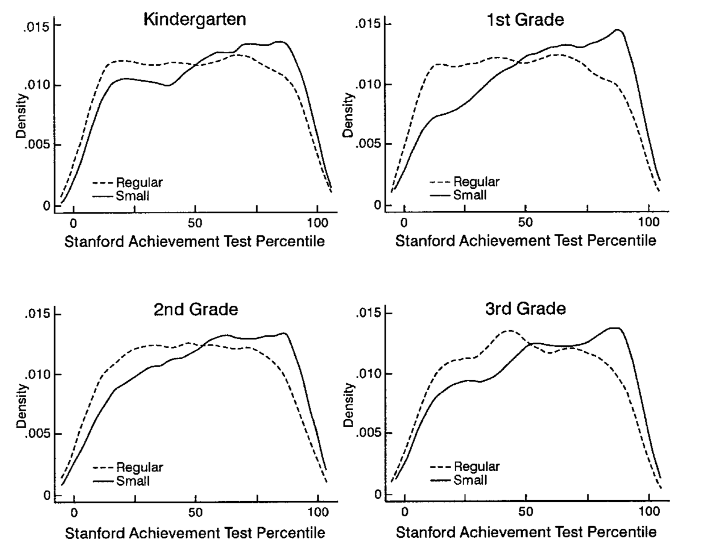

# STAR Experiment {#STAR}

How to best allocate spending on schooling is an important question. What's the impact of spending money to finance smaller classrooms on student performance and outcomes, both in the short and in the long run? A vast literature in economics is concerned with this question, and for a long time there was no consensus.

The big underlying problem in answering this question is that we do not really know how student outcomes are *produced*. In other words, what makes a successful student? Is it the quality of their teacher? Surely matters. is it quality of the school building? Could be. Is it that the other pupils are of high quality and this somehow *rubs off* to weaker pupils? Also possible. What about parental background? Sure. You see that there are many potential channels that could determine student outcomes. What is more, there could be several interdependencies amongst those factors. Here's a DAG!

```{r star1,echo = FALSE,warning = FALSE,message = FALSE,fig.align = "center",fig.cap = "Possible Channels determining student outcomes. Dashed arrows represent potentially unobserved links."}
library(ggdag)
library(dplyr)
p1 = dagify(outcome ~ teacher,
            size ~ building,
            outcome ~ building,
            outcome ~ peers,
            outcome ~ size,
            peers ~ size,
            outcome ~ parents,
       labels = c("teacher" = "teacher quality", 
                  "building" = "building quality",
                  "size" = "class size",
                  "peers" = "quality of peers",
                  "parents" = "parental background",
                  "outcome" = "student outcome"
                  ),
       outcome = "outcome") %>%
    tidy_dagitty() %>% 
    mutate(linetype = if_else(name %in% c("peers","parents","teacher"), "dashed","solid")) %>% 
    ggplot(aes(x = x, y = y, xend = xend, yend = yend)) + 
    geom_dag_point() + 
    geom_dag_edges(aes(edge_linetype = linetype), show.legend = FALSE) +
    geom_dag_label_repel(aes(label=label)) + theme_dag()
p1
```

We will look at an important paper in this literature now, which used a randomized experiment to make some substantial progress in answering the question *what is the production function for student outcomes*. We will study Krueger (1999), which analyses the Tennessee Student/Teacher Achievement Ratio Experiment, STAR in short.

## The STAR Experiment

Starting in 1985-1986 and lasting for four years, young pupils starting Kindergarden  *and their teachers* where randomly allocated to to several possible groups:

1. small classes with 13-17 students
2. regular classes with 22-25 students
3. regular classes with 22-25 students but with an additional full-time teaching aide.

The experiment involved about 6000 students per year, for a total of 11,600 students from 80 schools. Each school was required to have at least on class of each size-type above, and random assignment happened *at the school level*. At the end of each school grade (kindergarden and grades 1 thru 3) the pupils were given a standardized test. Now, looking back at figure \@ref(fig:star1), what are the complications when we'd like to assess the impact of *class size* on student outcome? Put differently, why can't we just look at observational data of all schools (absent any experiment!), group classes by their size, and compute the mean outcomes for each group? Here is a short list:

1. There is selection into schools with different sized classes. Suppose parents have a prior that smaller classes are better - they will try to get their kids into those schools.
1. Relatedly, who ends up being in the classroom with a child could matter (peer effects). So, if high quality kids are sorting into schools with small classes, and if peer effects are strong, we could concluded that small classes improved student outcomes when in reality this was due to the high quality of peers in class.
1. Also related, teachers could sort towards schools with smaller classes because it's easier to teach a small rather than a large class, and if there is competition for those places, higher quality teachers will have an advantage.

Now, what can STAR do for us here? There will still be selection into schools, however, once selected a school it is random whether one ends up in a small or a large class. So, the quality of peers present in the school (determined before the experiment through school choice) will be similar across small and big groups. In figure \@ref(fig:star1), you see that some factors are drawn as unobserved (dashed arrow), and some are observed (solid). In any observational dataset, the dashed arrows would be really troubling. Here, given randomisation into class sizes, *we don't care* whether those factors are unobserved or not: It's reasonable to assume that across randomly assigned groups, the distributions of each of those factors is roughly constant! If we *can* in fact proxy some of those factors (suppose we had data on teacher qualifications), even better, but not necessary to identify the causal effect of class size.

## PO as Regression

Before we start replicating the findings in Krueger (1999), let's augment our potential outcomes (PO) notation from the previous chapter. To remind you, we had defined the PO model in equation \@ref(eq:rubin-model):

\begin{equation*}
Y_i = D_i Y_i^1 + (1-D_i)Y_i^0 
\end{equation*}

and we had defined the treatment effect of individual $i$ as in \@ref(eq:TE):

\begin{equation*}
\delta_i = Y_i^1 - Y_i^0. 
\end{equation*}

Now, as a start, let's assume that the treatment effect of *small class* is identical for all $i$: in that case we have

\begin{equation*}
\delta_i = \delta ,\forall i
\end{equation*}

Next, let's distribute the $Y_i^0$ in \@ref(eq:rubin-model) as follows:

\begin{align*}
Y_i &= Y_i^0  D_i (Y_i^1 - Y_i^0 )\\
    &= Y_i^0  D_i \delta  
\end{align*}

finally, let's add $E[Y_i^0] - E[Y_i^0]=0$ to the RHS of that last equation to get

\begin{equation*}
Y_i = E[Y_i^0] + D_i \delta + Y_i^0 - E[Y_i^0]  
\end{equation*}

which we can rewrite in our well-known regression format 

\begin{equation}
Y_i = b_0 + \delta D_i  + u_i  (\#eq:PO-reg)
\end{equation}

In that formulation, the random deviation $Y_i^0 - E[Y_i^0]$ is the residual $u$. Under only very specific circumstances will the OLS estimator $\hat{\delta}$ identify the true Average Treatment Effect $\delta^{ATE}$. Random assignment ensures that the crucial assumption $E[u|D] = E[Y_i^0 - E[Y_i^0]|D] = E[Y_i^0|D] - E[Y_i^0] = 0$, in other words, there is no difference in nontreatment outcomes across treatment groups. Additionally, we could easily include regressors $X_i$ in equation \@ref(eq:PO-reg) to account for additional variation in the outcome.

With that out of the way, let's write down the regression that Kruger (1999) wants to estimate. Equation (2) in his paper reads like this:

\begin{equation}
Y_{ics} = \beta_0 + \beta_1 \text{small}_{cs} + \beta_2 \text{REG/A}_{cs} + \beta_3 X_{ics} + \alpha_s + \varepsilon_{ics} (\#eq:krueger2)
\end{equation}

where $i$ indexes pupil, $c$ is class id and $s$ is the school id. $\text{small}_{cs}$ and $\text{REG/A}_{cs}$ are both dummy variables equal to one if class $c$ in school $s$ is either *small*, or *regular with aide*. $X_{ics}$ contains student specific controls (like gender). Importantly, given that randomization was at the school level, we control for the identify of the school with a school fixed effect $\alpha_s$. 

Before we proceed to run this regression, we need to define the outcome variable $Y_{ics}$. Krueger (1999) combines the various SAT test scores in an average score for each student in each grade. However, given that the SAT scores are on different scales, he first computes a ranking of all scores for each subject (reading or math), and then assigns to each student their percentile in the rank distribution. The highest score is 100, the lowest score is 0.

## Implementing STAR

Let's start with computing the ranking of grades. Let's load the data and the `data.table` package:

```{r,message = FALSE}
data("STAR", package = "AER")
library(data.table)
x = as.data.table(STAR)
x
```

It's a bit unfortunate to switch to data.table, but I haven't been able to do what I wanted in dplyr :-( . Ok, here goes. First thing, you can see that this data set is *wide*. First thing we want to do is to make it *long*, i.e. reshape it so that if has 4 ID columns, and several measurements columns thereafter. First, let's add a studend ID:

```{r}
x[, ID := 1:nrow(x)]
mx = melt.data.table(x, id = c("ID","gender","ethnicity","birth"), measure.vars = patterns("star*","read*","math*", "schoolid*", "degree*","experience*","tethnicity*","lunch*"), variable.name = "grade", value.name = c("classtype","read","math","schoolid","degree","experience","tethniticy","lunch"))
levels(mx$grade) <- c("stark","star1","star2","star3")  # reassign levels to grade factor
mx
```

You can see here that for example pupil `ID=1` was not present in kindergarden, but joined later. We will only keep complete records, hence we drop those NAs:

```{r}
mx = mx[complete.cases(mx)]
mx[ID==2]  # here is pupile number 2
```

Ok, now on to standardizing those `read` and `math` scores. you can see they are on their kind of arbitrary SAT scales

```{r}
mx[,range(read)]
mx[,range(math)]
```

First thing to do is to create an empirical cdf of each of those scores within a certain grade. That is the *ranking* of scores from 0 to 1:

```{r,message = FALSE, results='hide'}
setkey(mx, classtype)  # key mx by class type
ecdfs = mx[classtype != "small",        # subset data.table to this
    list(readcdf = list(ecdf(read)),    # create cols readcdf and mathcdf
         mathcdf = list(ecdf(math))
         ),
         by = grade]    # by grade

# let's look at those cdf!
om = par("mar")
par(mfcol=c(4,2),mar = c(2,om[2],2.5,om[4]))
ecdfs[,.SD[,plot(mathcdf[[1]],main = paste("math ecdf grade",.BY))],by = grade]
ecdfs[,.SD[,plot(readcdf[[1]],main = paste("read ecdf grade",.BY))],by = grade]
par(mfcol=c(1,1),mar = om)
```         

You can see here how the cdf maps SAT scores (650, for example), into the interval $[0,1]$. Now, in the `ecdfs` `data.table` object, the `readcdf` column contains a *function* (a cdf) for each grade. We can evaluate the observed test scores for each student in that function to get their ranking in $[0,1]$, by grade:

```{r gradedens, fig.cap = "Reproducing Figure I in Krueger (1999)",fig.align="center"}
setkey(ecdfs, grade)  # key ecdfs according to `grade`
setkey(mx,grade)

z = mx[ , list(ID,perc_read = ecdfs[(.BY),readcdf][[1]](read),
               perc_math = ecdfs[(.BY),mathcdf][[1]](math)),
        by=grade]   # stick `grade` into `ecdfs` as `.BY`

z[,score := rowMeans(.SD)*100, .SDcols = c("perc_read","perc_math")]  # take average of scores
# and multiply by 100, so it's comparable to Krueger

# merge back into main data
mxz = merge(mx,z,by = c("grade","ID"))

# make a plot
ggplot(data = mxz, mapping = aes(x = score,color=classtype)) + geom_density() + facet_wrap(~grade) + theme_bw()
```

You can compare figure \@ref(fig:gradedens) to Krueger (1999) figure 1: 

```{r,echo=FALSE}

```

So far, so good! Now we can move to run a regression and estimate \@ref(eq:krueger2).

```{r}
# create Krueger's dummy variables
mxz =  as_tibble(mxz) %>%
    mutate(small = classtype == "small",
           rega  = classtype == "regular+aide",
           girl  = gender == "female",
           freelunch = lunch == "free")

# reproduce columns 1-3
m1 = mxz %>% 
    group_by(grade) %>%
    do(model = lm(score ~ small + rega, data = .))
m2 = mxz %>% 
    group_by(grade) %>%
    do(model = lm(score ~ small + rega + schoolid, data = .))
m3 = mxz %>% 
    group_by(grade) %>%
    do(model = lm(score ~ small + rega + schoolid + girl + freelunch, data = .))

# get school id names to omit from regression tables
school_co = grep(names(coef(m2[1,]$model[[1]])),pattern = "schoolid*",value=T)
school_co = c(unique(school_co,grep(names(coef(m3[1,]$model[[1]])),pattern = "schoolid*",value=T)),"schoolid77")
```


Now let's look at each grade's models. 

```{r,results="asis"}
h = list()
for (g in unique(mxz$grade)) {
    h[[g]] <- huxtable::huxreg(subset(m1,grade == g)$model[[1]],
                 subset(m2,grade == g)$model[[1]],
                 subset(m3,grade == g)$model[[1]],
                 omit_coefs = school_co,  
                 statistics = c(N = "nobs", R2 = "r.squared"),
                 number_format = 2
        ) %>% 
    huxtable::insert_row(c("School FE","No","Yes","Yes"),after = 11) %>%
    huxtable::theme_article() %>%
    huxtable::set_caption(paste("Estimates for grade",g)) %>%
    huxtable::set_top_border(12, 1:4, 2)
}
h$stark
h$star1
h$star2
h$star3
```

You should compare those to table 5 in Krueger (1999), where it says *OLS: actual class size*. For the most part, we come quite close to his esimates! We did not follow his more sophisticated error structure (by allowing errors to be correlated at the classroom level), and we seem to have different number of individuals in each year.
