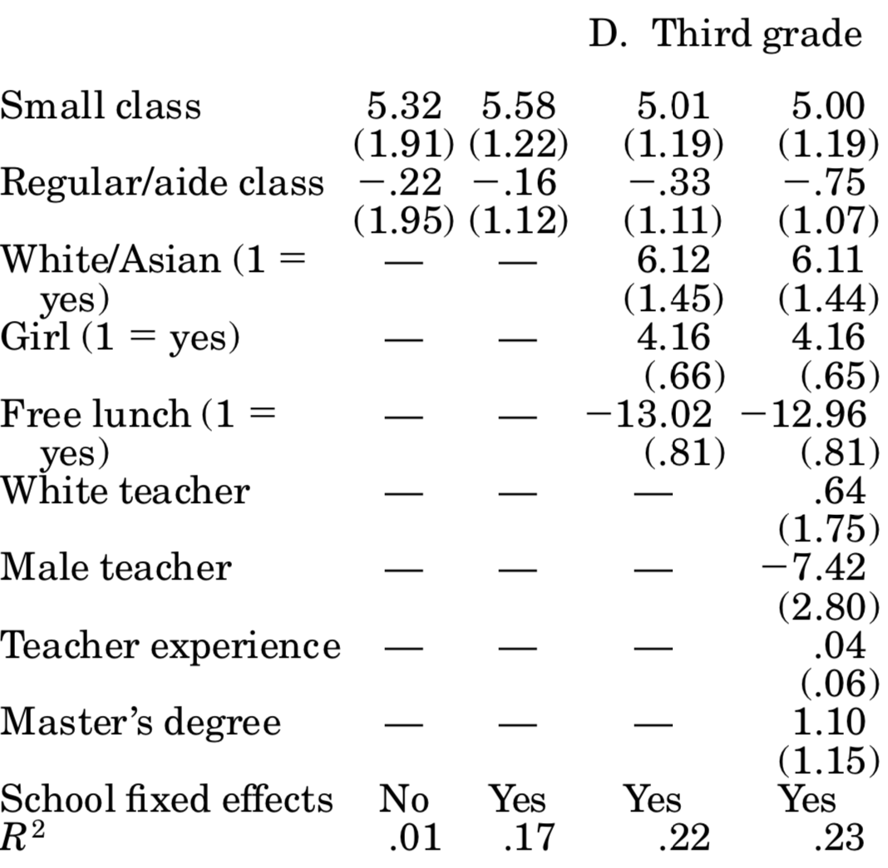

# STAR Experiment {#STAR}

How to best allocate spending on schooling is an important question. What's the impact of spending money to finance smaller classrooms on student performance and outcomes, both in the short and in the long run? A vast literature in economics is concerned with this question, and for a long time there was no consensus.

The big underlying problem in answering this question is that we do not really know how student outcomes are *produced*. In other words, what makes a successful student? Is it the quality of their teacher? Surely matters. is it quality of the school building? Could be. Is it that the other pupils are of high quality and this somehow *rubs off* to weaker pupils? Also possible. What about parental background? Sure. You see that there are many potential channels that could determine student outcomes. What is more, there could be several interdependencies amongst those factors. Here's a DAG!

<div class="figure" style="text-align: center">

<p class="caption">(\#fig:star1)Possible Channels determining student outcomes. Dashed arrows represent potentially unobserved links.</p>
</div>

We will look at an important paper in this literature now, which used a randomized experiment to make some substantial progress in answering the question *what is the production function for student outcomes*. We will study @krueger1999, which analyses the Tennessee Student/Teacher Achievement Ratio Experiment, STAR in short.

## The STAR Experiment

Starting in 1985-1986 and lasting for four years, young pupils starting Kindergarden  *and their teachers* where randomly allocated to to several possible groups:

1. small classes with 13-17 students
2. regular classes with 22-25 students
3. regular classes with 22-25 students but with an additional full-time teaching aide.

The experiment involved about 6000 students per year, for a total of 11,600 students from 80 schools. Each school was required to have at least on class of each size-type above, and random assignment happened *at the school level*. At the end of each school grade (kindergarden and grades 1 thru 3) the pupils were given a standardized test. Now, looking back at figure \@ref(fig:star1), what are the complications when we'd like to assess the impact of *class size* on student outcome? Put differently, why can't we just look at observational data of all schools (absent any experiment!), group classes by their size, and compute the mean outcomes for each group? Here is a short list:

1. There is selection into schools with different sized classes. Suppose parents have a prior that smaller classes are better - they will try to get their kids into those schools.
1. Relatedly, who ends up being in the classroom with a child could matter (peer effects). So, if high quality kids are sorting into schools with small classes, and if peer effects are strong, we could concluded that small classes improved student outcomes when in reality this was due to the high quality of peers in class.
1. Also related, teachers could sort towards schools with smaller classes because it's easier to teach a small rather than a large class, and if there is competition for those places, higher quality teachers will have an advantage.

Now, what can STAR do for us here? There will still be selection into schools, however, once selected a school it is random whether one ends up in a small or a large class. So, the quality of peers present in the school (determined before the experiment through school choice) will be similar across small and big groups. In figure \@ref(fig:star1), you see that some factors are drawn as unobserved (dashed arrow), and some are observed (solid). In any observational dataset, the dashed arrows would be really troubling. Here, given randomisation into class sizes, *we don't care* whether those factors are unobserved or not: It's reasonable to assume that across randomly assigned groups, the distributions of each of those factors is roughly constant! If we *can* in fact proxy some of those factors (suppose we had data on teacher qualifications), even better, but not necessary to identify the causal effect of class size.

## PO as Regression

Before we start replicating the findings in @krueger1999, let's augment our potential outcomes (PO) notation from the previous chapter. To remind you, we had defined the PO model in equation \@ref(eq:rubin-model):

\begin{equation*}
Y_i = D_i Y_i^1 + (1-D_i)Y_i^0 
\end{equation*}

and we had defined the treatment effect of individual $i$ as in \@ref(eq:TE):

\begin{equation*}
\delta_i = Y_i^1 - Y_i^0. 
\end{equation*}

Now, as a start, let's assume that the treatment effect of *small class* is identical for all $i$: in that case we have

\begin{equation*}
\delta_i = \delta ,\forall i
\end{equation*}

Next, let's distribute the $Y_i^0$ in \@ref(eq:rubin-model) as follows:

\begin{align*}
Y_i &= Y_i^0 + D_i (Y_i^1 - Y_i^0 )\\
    &= Y_i^0 + D_i \delta  
\end{align*}

finally, let's add $E[Y_i^0] - E[Y_i^0]=0$ to the RHS of that last equation to get

\begin{equation*}
Y_i = E[Y_i^0] + D_i \delta + Y_i^0 - E[Y_i^0]  
\end{equation*}

which we can rewrite in our well-known regression format 

\begin{equation}
Y_i = b_0 + \delta D_i  + u_i  (\#eq:PO-reg)
\end{equation}

In that formulation, the first $E[Y_i^0]$ is the average non-treatment outcome, which we could regard as some sort of baseline - i.e. our intercept. $\delta$ is the coefficient on the binary treatment indicator. The random deviation $Y_i^0 - E[Y_i^0]$ is the residual $u$. Under only very specific circumstances will the OLS estimator $\hat{\delta}$ identify the true Average Treatment Effect $\delta^{ATE}$. Random assignment ensures that the crucial assumption $E[u|D] = E[Y_i^0 - E[Y_i^0]|D] = E[Y_i^0|D] - E[Y_i^0] = 0$, in other words, there is no difference in nontreatment outcomes across treatment groups. Additionally, we could easily include regressors $X_i$ in equation \@ref(eq:PO-reg) to account for additional variation in the outcome.

With that out of the way, let's write down the regression that @krueger1999 wants to estimate. Equation (2) in his paper reads like this:

\begin{equation}
Y_{ics} = \beta_0 + \beta_1 \text{small}_{cs} + \beta_2 \text{REG/A}_{cs} + \beta_3 X_{ics} + \alpha_s + \varepsilon_{ics} (\#eq:krueger2)
\end{equation}

where $i$ indexes pupil, $c$ is class id and $s$ is the school id. $\text{small}_{cs}$ and $\text{REG/A}_{cs}$ are both dummy variables equal to one if class $c$ in school $s$ is either *small*, or *regular with aide*. $X_{ics}$ contains student specific controls (like gender). Importantly, given that randomization was at the school level, we control for the identify of the school with a school fixed effect $\alpha_s$. 

Before we proceed to run this regression, we need to define the outcome variable $Y_{ics}$. @krueger1999 combines the various SAT test scores in an average score for each student in each grade. However, given that the SAT scores are on different scales, he first computes a ranking of all scores for each subject (reading or math), and then assigns to each student their percentile in the rank distribution. The highest score is 100, the lowest score is 0.

## Implementing STAR

Let's start with computing the ranking of grades. Let's load the data and the `data.table` package:


```r
data("STAR", package = "AER")
x = setDT(STAR)
x
```

```
##        gender ethnicity   birth        stark        star1        star2
##     1: female      afam 1979.50         <NA>         <NA>         <NA>
##     2: female      cauc 1980.00        small        small        small
##     3: female      afam 1979.75        small        small regular+aide
##     4:   male      cauc 1979.75         <NA>         <NA>         <NA>
##     5:   male      afam 1980.00 regular+aide         <NA>         <NA>
##    ---                                                                
## 11594:   male      cauc 1979.50        small        small        small
## 11595: female      cauc 1980.50      regular      regular      regular
## 11596:   male      cauc 1980.00         <NA>      regular      regular
## 11597: female      afam 1980.00      regular regular+aide      regular
## 11598:   male      afam 1980.25 regular+aide regular+aide regular+aide
##               star3 readk read1 read2 read3 mathk math1 math2 math3   lunchk
##     1:      regular    NA    NA    NA   580    NA    NA    NA   564     <NA>
##     2:        small   447   507   568   587   473   538   579   593 non-free
##     3: regular+aide   450   579   588   644   536   592   579   639 non-free
##     4:        small    NA    NA    NA   686    NA    NA    NA   667     <NA>
##     5:         <NA>   439    NA    NA    NA   463    NA    NA    NA     free
##    ---                                                                      
## 11594:        small   483   590   650   675   559   584   648   678 non-free
## 11595:      regular   437   533   586   654   513   557   611   651     free
## 11596:      regular    NA   571   604   595    NA   557   620   672     <NA>
## 11597: regular+aide   431   475   542   624   478   486   541   610     free
## 11598: regular+aide   421   468   571   580   449   486   568   577 non-free
##          lunch1   lunch2   lunch3    schoolk    school1    school2    school3
##     1:     <NA>     <NA>     free       <NA>       <NA>       <NA>   suburban
##     2:     free non-free     free      rural      rural      rural      rural
##     3:     <NA> non-free non-free   suburban   suburban   suburban   suburban
##     4:     <NA>     <NA> non-free       <NA>       <NA>       <NA>      rural
##     5:     <NA>     <NA>     <NA> inner-city       <NA>       <NA>       <NA>
##    ---                                                                       
## 11594: non-free non-free non-free      rural      rural      rural      rural
## 11595:     free     free     free      rural      rural      rural      rural
## 11596: non-free non-free non-free       <NA>   suburban   suburban   suburban
## 11597:     free     free     free inner-city inner-city inner-city inner-city
## 11598:     free     free non-free inner-city inner-city inner-city inner-city
##         degreek  degree1  degree2  degree3   ladderk   ladder1    ladder2
##     1:     <NA>     <NA>     <NA> bachelor      <NA>      <NA>       <NA>
##     2: bachelor bachelor bachelor bachelor    level1    level1 apprentice
##     3: bachelor   master bachelor bachelor    level1 probation     level1
##     4:     <NA>     <NA>     <NA> bachelor      <NA>      <NA>       <NA>
##     5: bachelor     <NA>     <NA>     <NA> probation      <NA>       <NA>
##    ---                                                                   
## 11594: bachelor   master   master   master    level1    level1     level3
## 11595: bachelor bachelor bachelor bachelor probation    level1 apprentice
## 11596:     <NA> bachelor bachelor bachelor      <NA> probation     level1
## 11597: bachelor bachelor bachelor   master    level1    level1     level1
## 11598: bachelor bachelor bachelor   master      <NA>    level1     level1
##           ladder3 experiencek experience1 experience2 experience3 tethnicityk
##     1:     level1          NA          NA          NA          30        <NA>
##     2: apprentice           7           7           3           1        cauc
##     3:     level1          21          32           4           4        cauc
##     4:     level1          NA          NA          NA          10        <NA>
##     5:       <NA>           0          NA          NA          NA        cauc
##    ---                                                                       
## 11594:     level1           8          13          15          17        cauc
## 11595:  notladder           0           7           1           7        cauc
## 11596:     level1          NA           0           8          22        <NA>
## 11597:  probation          24          27           7          12        afam
## 11598:     level1           2          10          14          33        cauc
##        tethnicity1 tethnicity2 tethnicity3 systemk system1 system2 system3
##     1:        <NA>        <NA>        cauc    <NA>    <NA>    <NA>      22
##     2:        cauc        cauc        cauc      30      30      30      30
##     3:        afam        afam        cauc      11      11      11      11
##     4:        <NA>        <NA>        cauc    <NA>    <NA>    <NA>       6
##     5:        <NA>        <NA>        <NA>      11    <NA>    <NA>    <NA>
##    ---                                                                    
## 11594:        cauc        cauc        cauc      21      21      21      21
## 11595:        cauc        cauc        cauc      33      33      33      33
## 11596:        cauc        cauc        cauc    <NA>      25      25      25
## 11597:        afam        afam        cauc      11      11      11      11
## 11598:        cauc        cauc        afam      11      11      11      11
##        schoolidk schoolid1 schoolid2 schoolid3
##     1:      <NA>      <NA>      <NA>        54
##     2:        63        63        63        63
##     3:        20        20        20        20
##     4:      <NA>      <NA>      <NA>         8
##     5:        19      <NA>      <NA>      <NA>
##    ---                                        
## 11594:        49        49        49        49
## 11595:        67        67        67        67
## 11596:      <NA>        58        58        58
## 11597:        22        22        22        22
## 11598:        32        32        32        32
```

It's a bit unfortunate to switch to data.table, but I haven't been able to do what I wanted in dplyr :-( . Ok, here goes. First thing, you can see that this data set is *wide*. First thing we want to do is to make it *long*, i.e. reshape it so that if has 4 ID columns, and several measurements columns thereafter. First, let's add a studend ID:


```r
x[ , ID := 1:nrow(x)]  # add a column called `ID`

# `melt` a data.table means to dissolve it and reassamble for some ID variables
```


```r
mx = melt.data.table(x, 
                     id = c("ID","gender","ethnicity","birth"), 
                     measure.vars = patterns("star*","read*","math*", "schoolid*",
                                             "degree*","experience*","tethnicity*","lunch*"), 
                     value.name = c("classtype","read","math","schoolid","degree",
                                    "experience","tethniticy","lunch"),
                     variable.name = "grade")

levels(mx$grade) <- c("stark","star1","star2","star3")  # reassign levels to grade factor
mx[,1:8]  # show first 8 cols
```

```
##           ID gender ethnicity   birth grade    classtype read math
##     1:     1 female      afam 1979.50 stark         <NA>   NA   NA
##     2:     2 female      cauc 1980.00 stark        small  447  473
##     3:     3 female      afam 1979.75 stark        small  450  536
##     4:     4   male      cauc 1979.75 stark         <NA>   NA   NA
##     5:     5   male      afam 1980.00 stark regular+aide  439  463
##    ---                                                            
## 46388: 11594   male      cauc 1979.50 star3        small  675  678
## 46389: 11595 female      cauc 1980.50 star3      regular  654  651
## 46390: 11596   male      cauc 1980.00 star3      regular  595  672
## 46391: 11597 female      afam 1980.00 star3 regular+aide  624  610
## 46392: 11598   male      afam 1980.25 star3 regular+aide  580  577
```

You can see here that for example pupil `ID=1` was not present in kindergarden, but joined later. We will only keep complete records, hence we drop those NAs:


```r
mx = mx[complete.cases(mx),]
mx[ID==2]  # here is pupil number 2
```

```
##    ID gender ethnicity birth grade classtype read math schoolid   degree
## 1:  2 female      cauc  1980 stark     small  447  473       63 bachelor
## 2:  2 female      cauc  1980 star1     small  507  538       63 bachelor
## 3:  2 female      cauc  1980 star2     small  568  579       63 bachelor
## 4:  2 female      cauc  1980 star3     small  587  593       63 bachelor
##    experience tethniticy    lunch
## 1:          7       cauc non-free
## 2:          7       cauc     free
## 3:          3       cauc non-free
## 4:          1       cauc     free
```

Ok, now on to standardizing those `read` and `math` scores. you can see they are on their kind of arbitrary SAT scales


```r
mx[,range(read)]
```

```
## [1] 315 775
```

First thing to do is to create an empirical cdf of each of those scores within a certain grade. That is the *ranking* of scores from 0 to 1:


```r
setkey(mx, classtype)  # key mx by class type
ecdfs = mx[classtype != "small",        # subset data.table to this
    list(readcdf = list(ecdf(read)),    # create cols readcdf and mathcdf
         mathcdf = list(ecdf(math))
         ),
         by = grade]    # by grade

# let's look at those cdf!
om = par("mar")
par(mfcol=c(4,2),mar = c(2,om[2],2.5,om[4]))
ecdfs[,.SD[,plot(mathcdf[[1]],main = paste("math ecdf grade",.BY))],by = grade]
ecdfs[,.SD[,plot(readcdf[[1]],main = paste("read ecdf grade",.BY))],by = grade]
```

<!-- -->

```r
par(mfcol=c(1,1),mar = om)
```

You can see here how the cdf maps SAT scores (650, for example), into the interval $[0,1]$. Now, in the `ecdfs` `data.table` object, the `readcdf` column contains a *function* (a cdf) for each grade. We can evaluate the observed test scores for each student in that function to get their ranking in $[0,1]$, by grade:


```r
setkey(ecdfs, grade)  # key ecdfs according to `grade`
setkey(mx,grade)

z = mx[ , list(ID,perc_read = ecdfs[(.BY),readcdf][[1]](read),
               perc_math = ecdfs[(.BY),mathcdf][[1]](math)),
        by=grade]   # stick `grade` into `ecdfs` as `.BY`

z[,score := rowMeans(.SD)*100, .SDcols = c("perc_read","perc_math")]  # take average of scores
# and multiply by 100, so it's comparable to Krueger

# merge back into main data
mxz = merge(mx,z,by = c("grade","ID"))

# make a plot
ggplot(data = mxz, mapping = aes(x = score,color=classtype)) + geom_density() + facet_wrap(~grade) + theme_bw()
```

<div class="figure" style="text-align: center">

<p class="caption">(\#fig:gradedens)Reproducing Figure I in @krueger1999</p>
</div>

You can compare figure \@ref(fig:gradedens) to @krueger1999 figure 1. You can see that the density estimates are almost identical, the discrepancy comes mainly from the fact that we split the regular classes also by with/without aide.

<div class="figure">

<p class="caption">(\#fig:kruegerdens)Outcome densities, @krueger1999 figure 1.</p>
</div>

So far, so good! Now we can move to run a regression and estimate \@ref(eq:krueger2).


```r
# create Krueger's dummy variables
mxz =  as_tibble(mxz) %>%
    mutate(small = classtype == "small",
           rega  = classtype == "regular+aide",
           girl  = gender == "female",
           freelunch = lunch == "free")

# reproduce columns 1-3
m1 = mxz %>% 
    group_by(grade) %>%
    do(model = lm(score ~ small + rega, data = .))
m2 = mxz %>% 
    group_by(grade) %>%
    do(model = lm(score ~ small + rega + schoolid, data = .))
m3 = mxz %>% 
    group_by(grade) %>%
    do(model = lm(score ~ small + rega + schoolid + girl + freelunch, data = .))

# get school id names to omit from regression tables
school_co = grep(names(coef(m2[1,]$model[[1]])),pattern = "schoolid*",value=T)
school_co = c(unique(school_co,grep(names(coef(m3[1,]$model[[1]])),pattern = "schoolid*",value=T)),"schoolid77")
```


Now let's look at each grade's models. 


```r
h = list()
for (g in unique(mxz$grade)) {
    h[[g]] <- huxtable::huxreg(subset(m1,grade == g)$model[[1]],
                 subset(m2,grade == g)$model[[1]],
                 subset(m3,grade == g)$model[[1]],
                 omit_coefs = school_co,  
                 statistics = c(N = "nobs", R2 = "r.squared"),
                 number_format = 2
        ) %>% 
    huxtable::insert_row(c("School FE","No","Yes","Yes"),after = 11) %>%
    huxtable::theme_article() %>%
    huxtable::set_caption(paste("Estimates for grade",g)) %>%
    huxtable::set_top_border(12, 1:4, 2)
}
h$stark
```

```
## Warning in knit_print.huxtable(x, ...): Unrecognized output format "epub3". Using `to_screen` to print huxtables.
## Set options("huxtable.knitr_output_format") manually to "latex", "html", "rtf", "docx", "pptx", "md" or "screen".
```

                           Estimates for grade stark                            
          ───────────────────────────────────────────────────────────
                                    (1)           (2)           (3)  
          ───────────────────────────────────────────────────────────
            (Intercept)       51.44 ***     58.49 ***     60.20 ***  
                              (0.61)        (2.92)        (2.83)     
            smallTRUE          4.84 ***      5.59 ***      5.53 ***  
                              (0.89)        (0.79)        (0.76)     
            regaTRUE          -0.19          0.29          0.41      
                              (0.86)        (0.76)        (0.73)     
            girlTRUE                                       4.77 ***  
                                                          (0.60)     
            freelunchTRUE                                -14.29 ***  
                                                          (0.72)     
          ───────────────────────────────────────────────────────────
            School FE         No           Yes           Yes         
            N               5723          5723          5723         
            R2                 0.01          0.25          0.31      
            *** p < 0.001; ** p < 0.01; * p < 0.05.                  
          ───────────────────────────────────────────────────────────

Column names: names, model1, model2, model3

```r
h$star1
```

```
## Warning in knit_print.huxtable(x, ...): Unrecognized output format "epub3". Using `to_screen` to print huxtables.
## Set options("huxtable.knitr_output_format") manually to "latex", "html", "rtf", "docx", "pptx", "md" or "screen".
```

                           Estimates for grade star1                            
          ───────────────────────────────────────────────────────────
                                    (1)           (2)           (3)  
          ───────────────────────────────────────────────────────────
            (Intercept)       49.43 ***     53.84 ***     56.95 ***  
                              (0.56)        (2.45)        (2.39)     
            smallTRUE          8.37 ***      8.31 ***      7.87 ***  
                              (0.85)        (0.75)        (0.72)     
            regaTRUE           3.38 ***      2.00 **       2.07 **   
                              (0.82)        (0.73)        (0.71)     
            girlTRUE                                       3.07 ***  
                                                          (0.58)     
            freelunchTRUE                                -14.45 ***  
                                                          (0.68)     
          ───────────────────────────────────────────────────────────
            School FE         No           Yes           Yes         
            N               6225          6225          6225         
            R2                 0.02          0.26          0.32      
            *** p < 0.001; ** p < 0.01; * p < 0.05.                  
          ───────────────────────────────────────────────────────────

Column names: names, model1, model2, model3

```r
h$star2
```

```
## Warning in knit_print.huxtable(x, ...): Unrecognized output format "epub3". Using `to_screen` to print huxtables.
## Set options("huxtable.knitr_output_format") manually to "latex", "html", "rtf", "docx", "pptx", "md" or "screen".
```

                           Estimates for grade star2                            
          ───────────────────────────────────────────────────────────
                                    (1)           (2)           (3)  
          ───────────────────────────────────────────────────────────
            (Intercept)       49.75 ***     65.02 ***     66.68 ***  
                              (0.61)        (2.79)        (2.72)     
            smallTRUE          6.19 ***      6.68 ***      6.23 ***  
                              (0.89)        (0.81)        (0.78)     
            regaTRUE           2.22 **       2.02 **       1.85 *    
                              (0.85)        (0.77)        (0.74)     
            girlTRUE                                       3.44 ***  
                                                          (0.61)     
            freelunchTRUE                                -14.49 ***  
                                                          (0.73)     
          ───────────────────────────────────────────────────────────
            School FE         No           Yes           Yes         
            N               5704          5704          5704         
            R2                 0.01          0.23          0.29      
            *** p < 0.001; ** p < 0.01; * p < 0.05.                  
          ───────────────────────────────────────────────────────────

Column names: names, model1, model2, model3

```r
h$star3
```

```
## Warning in knit_print.huxtable(x, ...): Unrecognized output format "epub3". Using `to_screen` to print huxtables.
## Set options("huxtable.knitr_output_format") manually to "latex", "html", "rtf", "docx", "pptx", "md" or "screen".
```

                           Estimates for grade star3                            
          ───────────────────────────────────────────────────────────
                                    (1)           (2)           (3)  
          ───────────────────────────────────────────────────────────
            (Intercept)       50.87 ***     45.90 ***     49.15 ***  
                              (0.66)        (2.66)        (2.63)     
            smallTRUE          4.96 ***      5.19 ***      4.61 ***  
                              (0.91)        (0.86)        (0.83)     
            regaTRUE          -0.08          0.03         -0.21      
                              (0.88)        (0.82)        (0.80)     
            girlTRUE                                       3.19 ***  
                                                          (0.64)     
            freelunchTRUE                                -13.30 ***  
                                                          (0.76)     
          ───────────────────────────────────────────────────────────
            School FE         No           Yes           Yes         
            N               5715          5715          5715         
            R2                 0.01          0.19          0.23      
            *** p < 0.001; ** p < 0.01; * p < 0.05.                  
          ───────────────────────────────────────────────────────────

Column names: names, model1, model2, model3

You should compare those to table 5 in @krueger1999, where it says *OLS: actual class size*. For the most part, we come quite close to his esimates! We did not follow his more sophisticated error structure (by allowing errors to be correlated at the classroom level), and we seem to have different number of individuals in each year. Here is his table 5:



So, based on those results we can say that attending a small class raises student's test scores by about 5 percentage points. Unfortunately, says @krueger1999, is it hard to gauge whether those are big or small effects: how important is it to score 5% more or less? Well, you might say, it depends how close you are to an important cutoff value (maybe entrance to the next school level requires a score of `x`, and the 5% boost would have made that school feasible). Be that as it may, now you know more about one of the most influential papers in education economics, and why using an experimental setup allowed it to achieve credible causal estimates.

