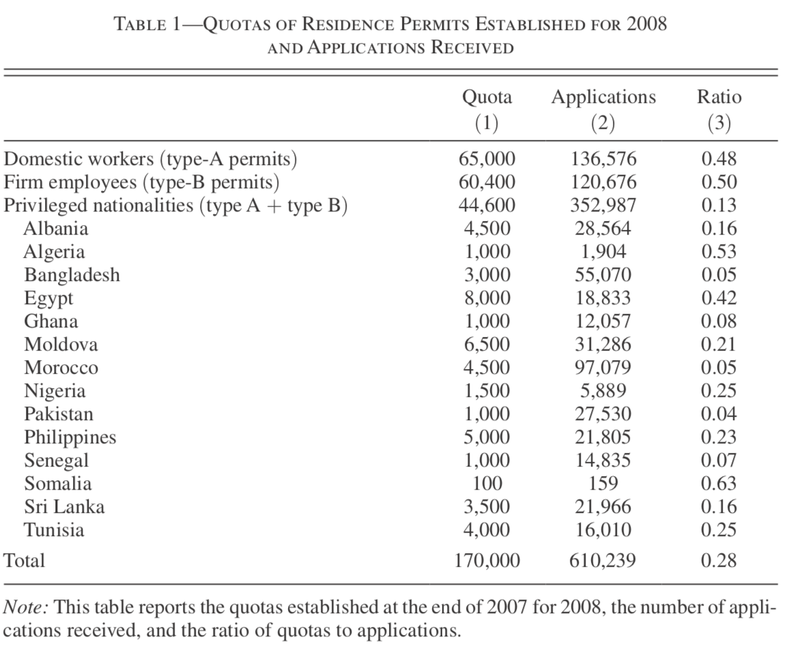

# Regression Discontinuity Design {#RDD}

In the previous chapter we have seen how an experimental setup can be useful to recover causal effects from an OLS regression. In this chapter we will look at a similar approach where we don't randomly allocate subjects to either treatment or control (maybe because that's impossible to do in that particular situation), but where we can *zoom in* on a group of individuals where having been allocated to treatment is **as good as random** - hence not influenced by selection bias. The idea is called Regression Discontinuity Design, short RDD.

## RDD Setup

Let's again start with a DAG for the main idea. Remember the numerical example in the set of slides on randomization, where we showed that if we know the allocating mechanism, we can recover the true ATE. RDD plays along those lines, in that we *know* how individuals got assigned to treatment. As is the case in many real-life situations, people are eligible for some treatment if some value **crosses a threshold**:

* You are eligible to obtain a driving license as your age crosses the 18-year threshold.
* You will receive pension benefits as your age crosses the 65-year threshold.
* You are liable to criminal charges if you are caught with more than 3g of Marihuana in your pocket.
* You are considered a subprime mortgage borrower if your loan-to-value ratio is above 95%.

In RDD parlance, we call that particular variable we are looking at the *running variable* (age, quantity of Marihuana, LTV ratio etc). If we know the applicable threshold (18 years of age, say), and we know an individual's age, then it's trivial to figure out whether they were eligible to get a driving license. Let's formalize this a bit.

Let's call the running variable $x$, the outcome $y$ as usual, let $D$ be the treament indicator and let us define a *threshold* value $c$. Treatment for individual $i$ will be such that

\begin{equation*}
D_i = \begin{cases}\begin{array}{c}1\text{ if }x_i > c \\
                  0\text{ if }x_i \leq c. \end{array}
                  \end{cases}
\end{equation*}

Here's the obligatory DAG!

```{r rdd1,echo = FALSE,warning = FALSE,message = FALSE,fig.align = "center",fig.cap = "DAG for a simple RDD design: $x$ determines treatment via the cutoff $c$"}
library(ggdag)
dagify(y ~ x,
       c ~ x,
       D ~ c,
       y ~ D) %>% 
    ggdag(layout = "circle") + theme_dag()
```

The key idea can be glanced from figure \@ref(fig:rdd1): if we can *know* who ends up in treatment $D$, this can be useful for us to recover the true ATE. In particular, the idea is going to be to compare individuals who are *close* to the threshold $c$: Those with an $x$ *just above* the threshold should be comparable (in terms of their $x$!) to the ones *just below* $c$. Someone who has their 18th birthday next week is almost identical to someone how had their 18th birthday last week - in terms of age! So, computing our naive difference in mean outcomes for those narrowly defined groups should be a good approximation to a random allocation. Notice that there are two important things to keep in mind:

1. None of the other variables in the model should exhibit any discontinuity at $c$, other than $D$!
2. We obtain only *locally* valid identification of the ATE: as we move further and further away from the threshold, our individuals will cease to be really comparable.

In our DAG, point 1 above is not currently visible. Let's augment this:

```{r rdd2,echo = FALSE,warning = FALSE,message = FALSE,fig.align = "center",fig.cap = "Augmented DAG for a simple RDD design: $x$ determines treatment via the cutoff $c$"}
library(ggdag)
dagify(y ~ x,
       c ~ x,
       D ~ c,
       y ~ z,
       y ~ D) %>% 
    ggdag(layout = "circle") + theme_dag()
```

So, the condition we want is that additional explanatory variable $z$ does **not** suddenly jump as $x$ crosses $c$. Because we will be comparing the mean outcomes of people slightly to the left and right of $c$, we need to make sure that there is nothing that would *confound* our estimate of the size of the effect $\delta$. Let's look at an example of a recent RDD study now.

## Clicking on Heaven's Door

In a recent paper title [Clicking on Heaven's Door](https://www.aeaweb.org/articles?id=10.1257/aer.20150355), U Bocconi economist [Paolo Pinotti](https://sites.google.com/view/paolo-pinotti/home) uses an RDD to show the effects of legal status of immigrants on criminal behaviour. The question of whether immigrants commit more or less crime than others (natives, for example) is a first order policy question. The question of that paper is what causal impact the *legal status* we confer upon an immigrant has on their propensity to commit a crime one year later. The study is based in Italy, where the legal status refers to an official permission to work. The key detail is that the residence permit needs to be sponsored by the immigrant's employer.

### Institutional Details

In the Italian context, immigrants often enter illegally first, and then hope to obtain a residence permit through an employer later on. There is a quota system in place, which establishes how many permits are to be granted to how many people from each nationality, and to which Italian industries (construction, services, etc). See table \@ref(fig:pin1) for an overview of those quotas.

```{r pin1,echo=FALSE,fig.cap="Table 1 from @pinotti.",fig.align="center"}

```

<!-- There are type A and type B permits. Type A permits are mainly used by families and individuals to obtain permits for domestic employment, but those are open to fraudulent behaviour - i.e. it's easy to get a friend with a permit to say that they would be ones employer. Type B permits are for actual firms. -->
Almost all of the estimated 650,000 illegal immigrants participate in the click days. @pinotti is able to link each immigrant to official interior ministry crime records, and is thus able to precisely identify whether an immigrant with a certain legal status is showing up in crime records in the year(s) after click days.

### Discontinuity Feature

The principal feature of the Italian setting which makes this almost perfect for an RDD is the following: The quotas illustrated in \@ref(fig:pin1) are defined for a total of 1751 employer groups (varying by industry and location). Applications for a permit must be submitted online by employers, **starting at 8:00 AM on specific click days**, and will be given out on a first come first served basis. This implies that thousands of applicants are denied their permit each year not because they were not eligible (they had an employer sponsoring them!), but because they got late online (some seconds) when all permits for their specific quota were gone already. Here we formalize as $c$ the *exact* time the quota for a certain group was full, and the running variable $x$ is the *exact* time that the sponsoring employer clicked on the *submit* button on the website. This is measured at the level of milliseconds.

The key observation is now that the exact timing when a certain quota is full, $c$, is impossible to foresee. Even if it is the case the employers of highly-skilled individuals are the first ones to log on, there is sufficient random variation (slow internet connection today...) in arrival times of employers on the platform such that we distribution of immigrant and employer types both sides of the cutoff $c$ are almost identical. So, it's very hard to *manipulate* the assignment rule. 

@pinotti experiments with several definitions of *close by the cutoff*, from 1 minute up to 30 minutes. The results are stable regardless of the definition chosen.

### Findings

* In the year before click days, the crime rate for the individuals in the study is 1.1% in both treatment and control groups. 
* In the year after click days, crime rates decline to 0.8% for people who clicked before time $c$, and it stayed at 1.1% for people who came late.
* The effect is mainly driven by so-called type A permits, which are given out to domestic employers (nannies, cleaning aides etc), while type B is for formal firms. Type A permits are easy to manipulate. Being granted legal status has a particularly large impact on reducing crime for type A permits. 
* There is no effect for type B permits.
* Firm-sponsored applicants (type B) have a higher opportunity cost of crime already before click days - in the end they already are (informally) employed somewhere! Undocumented immigrants in domestic (fictitious) employment have a lower opportunity cost of crime.
* At the same time, and crucially, that latter group seems to be particularly responsive to legalization, most likely because because a residence permit allows to search for work in the official labor market. 
* For people at the margin between persuing illegal activities or not, this is an important effect.
* Figure \@ref(fig:pin2) illustrates this finding graphically with a typical RD plot. The vertical difference in red and green lines at the cutoff $T=0$ in the *2008: type-A applicants* is the estimate of the local average treatment effect (LATE), i.e. $0.5 - 1.8 = -1.3$.  

```{r pin2,echo=FALSE,fig.cap="Table 3 from @pinotti.",fig.align="center"}
knitr::include_graphics("images/pinotti2.png")
```
