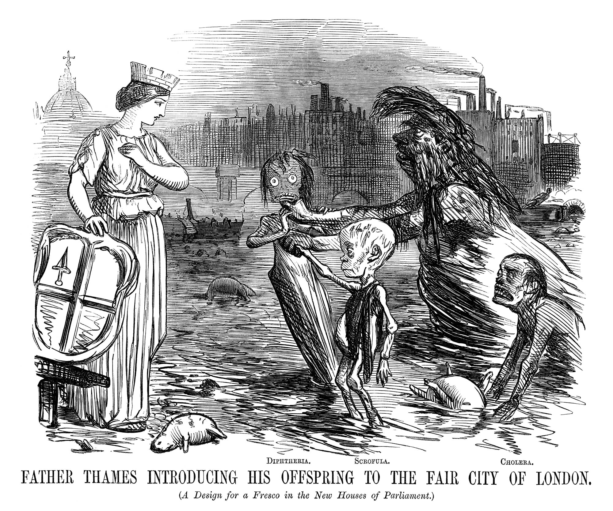

# Instrumental Variables (IV) {#IV}

```{r, echo = FALSE}
library(modelsummary)
gm = modelsummary::gof_map
gm$omit <- TRUE
gm$omit[gm$clean == "R2"] <- FALSE
gm$omit[gm$clean == "Num.Obs."] <- FALSE
gom = "p.value.|se_type|statistic.end|statistic.overid|statistic.weakinst"
```

In the previous chapters we have seen how to get credible causal estimates for the effect of some intervention via randomization techniques. Randomly allocating a subject to treatment or control groups makes sure that *everything else is equal*, hence we are really comparing apples with apples. Unfortunately, oftentimes we cannot perform a randomized control trial (RCT), out of technological, ethical, or other constraints. (We mentioned that forcing people to smoke via lottery draw is impossible to justify.)

So, that's it, no RCT, no causal estimates?

No! Methods like instrumental variables can help us to establish causality if we only have *observational data* (i.e. data generated not via experiment). That's reassuring, because in many settings this kind of data is the only thing we have.


## John Snow and the London Cholera Epidemic


```{r father-thames, fig.cap="Father Thames Introducing his Offspring to the Fair City of London, [Punch (1858)](https://www.bl.uk/collection-items/father-thames-introducing-his-offspring-to-the-fair-city-of-london-from-punch)",echo = FALSE}

```

The 1853-1854 Cholera outbreak in London killed 616 people. Physician [John Snow](https://en.wikipedia.org/wiki/John_Snow) was able to use data collected during this period to demonstrate that the illness was water-borne, and not transmitted via air, as was widely believed at the time. In order to better appreciate this section, let's imagine the world of John Snow in 1853^[The following is based on @freedman1991]:

```{block, type='notel'}
* It is not yet known that germs can cause disease (or indeed, that they exist).
* Microscopes exist, but work at rather poor resolution.
* Most human pathogens are not visible to the naked eye, and the isolation of such microbes is still several decades away.
* The so-called *infection theory* (i.e. infection via *germs*) has some supporters, but the dominant idea is that disease, in general, results from [*miasmas*](https://en.wikipedia.org/wiki/Miasma_theory): very small, non-living poisonous particles that float in the air - basically rotting organic matter would emanate foul air, that caused disease. The figure below shows an illustration.
```
<br>
```{r miasma, fig.cap="Miasma in the Air. Robert Seymour - A Short History of the National Institutes of Health National Library of Medicine photographic archive.",echo = FALSE}
knitr::include_graphics("images/Cholera_art.jpg",dpi = 75)
```


Snow hypothesized that the pathogen causing cholera was taken into the body via food or drink, multiplied and generated a poisonous substance causing the body to expel water, i.e. an extreme form of diarrhea. The active agent then would leave the human body via those excrements, and find their way back into the water supply, infecting the next victim. So, the question at the time was: is cholera a result of *miasmas* (foul, poisonous air), or a pathogen that was water-borne and infected new victims via excrements of former victims (the *infection theory*)?

Snow conducted some impressive detective work tracking down exceptional cases that would refute the miasma theory. For example he documented that two adjacent appartment buildings, one hit by cholera and the other not, had different water supplies: the first building's supply was contaminated by runoffs from privies (toilets), while the second one had arguably cleaner water. He studied the wider water supply system of London, finding that several water providers took their water from the heavily polluted River Thames.

During 1853-1854, John Snow drew a map (see figure \@ref(fig:snow-map)) that showed where the fatalities had occured. It became obvious that the cases clustered around the Broad Street pump. 

```{r snow-map, fig.cap="John Snow's original map of the Broad Street pump. https://commons.wikimedia.org/wiki/File:Snow-cholera-map-1.jpg",echo = FALSE}
knitr::include_graphics("images/snow-map.jpg")
```

The history goes that after observing the map and insisting with the local council, the handle of the water pump was removed, and the outbreak was ended. Alas, Snow himself showed that the epidemic was stopping anyway and the that removal of the pump handle was close to irrelevant. This can be seen in figure \@ref(fig:snow-TS).

```{r snow-TS,fig.cap="Time series of cholera deaths and timing of pump removal",warning=FALSE,echo = FALSE}
plot(cholera::timeSeries())
```

What seemed much more interesting to him were other observations, like for example:

1. He found that a large poorhouse in the Broad Street area had very few cholera cases. He observed that the poorhouse had its own well (no need for the inmates to go the public Broad Street pump).
1. There was a large brewery in the vicinity of the pump, whose workers did not die of cholera. The workers drank beer, and there was a private well on the premises.

### Mapping London's Water Supply

A few years before the outbreak, Lambeth water company had decided to move its water intake point upstream along the Thames, beyond the main sewage discharge points. Two other companies, the Southwark and Vauxhall water companies, however, left their intake points where they were, i.e. downstream from the sewage discharges. Snows analysis of the data showed that cholera was more prevalent in the Southwark and Vauxhall serviced areas and largely had spared Lambeth. He was able to compile the data in table \@ref(tab:snow-tab9):

```{r snow-tab9,echo = FALSE}
st9 <- data.frame(numhouses = c(40046,26107,256423), 
                  deaths = c(1263,98,1422),
                  death1000 = c(315,37,59))
```

Table: (\#tab:snow-tab9) John Snow's table IX

|    | Number of houses | Deaths from Cholera | Deaths per 1000 Houses |
|----|:----------------:| :----------------: | :----------------: |
|Southwark and Vauxhall | 40,046 | 1,263 | 315 |
|Lambeth | 26,107 | 98 | 37 |
|Rest of London | 256,423 | 1,422 | 59 |

With table \@ref(tab:snow-tab9) in hand, Snow concluded that *if* Southwark and Vauxhall water companies had moved their water intakes upstream to where Lambeth water was taking in their supply, roughly 1,000 lives could have been saved. For proponents of the miasma theory, this was still not evidence enough, because there were also many factors that led to poor air quality in those areas.

Of course Snow was proven right later on, when in 1884 Koch first isolated the cholera *vibrio*, basically confirming Snow's version of the story. But what is really interesting for us is how he was able to use his **non-experimental** data set to make his point.

### Snow's Model of Cholera Transmission

Even though he never formally wrote it down in this way, we can formulate Snow's way of thinking about the issue in the following terms:

* Suppose that $c_i$ takes the value 1 if individiual $i$ dies of cholera, 0 else.
* Let $w_i = 1$ mean that $i$'s water supply is impure and $w_i = 0$ vice versa. Water purity is assessed with a technology that cannot detect small microbes.
* Collect in $u_i$ all unobservable factors that impact $i$'s likelihood of dying from the disease: whether $i$ is poor, where exactly they reside, whether there is bad air quality in $i$'s surrounding, and other invidivual characteristics which impact the outcome (like genetic setup of $i$).

With this, can write model \@ref(eq:snow-mod1):

\begin{equation}
c_i = \alpha + \delta w_i + u_i (\#eq:snow-mod1)
\end{equation}

John Snow could have used his data and assess the correlation between drinking pure water and cholera incidence, i.e. try to measure $Cor(c_i,w_i)$, or, which is similar, just run model \@ref(eq:snow-mod1) as a linear regression. There is a problem with this, however. As @deaton1997 says, 

> The people who drank impure water were also more likely to be poor, and to live in an environment contaminated in many ways, not least by the ‘poison miasmas’ that were then thought to be the cause of cholera.

In other words, it does not make sense to compare someone who drinks pure water with someone with impure water, as model \@ref(eq:snow-mod1) proposes to do, because *all else is not equal*: pure water is correlated with being poor, living in bad area, bad air quality and so on - all factors that we encounter in $u_i$. This violates the crucial orthogonality assumption for valid OLS estimates, $E[u_i | w_i]=0$ in this context. Another way to say this, is that $Cov(w_i, u_i) \neq 0$, implying that $w_i$ is *endogenous* in equation \@ref(eq:snow-mod1): There are factors in $u_i$ that affect both $w_i$ and $c_i$, so we cannot reasonably say that *the effect of $w$ is that...*, because things in $u_i$ move at the same time as $w_i$ moves (and we can't see those things). So, the *miasma* theorists actually had a point.

Let us condition equation \@ref(eq:snow-mod1) on either value $w$ might take:


\begin{align}
E[c_i | w_i = 1] &= \alpha + \delta + E[u_i | w_i = 1] \\
E[c_i | w_i = 0] &= \alpha + \phantom{\delta} + E[u_i | w_i = 0]
\end{align}


Simply differencing those two lines thus yields

\begin{equation}
E[c_i | w_i = 1] - E[c_i | w_i = 0] = \delta + \left\{ E[u_i | w_i = 1] - E[u_i | w_i = 0]\right\}
\end{equation}

and we said that it stands to reason that this last term $\left\{ E[u_i | w_i = 1] - E[u_i | w_i = 0]\right\}$ is not equal to zero, hence our regression estimate for $\delta$ would be biased by that quantity.


## Defining the IV Estimator

John Snow did not know what an IV estimator was because it had not been described yet.^[In @angristkruegerIV you can read that Philipp (or his son Sewal, or both) Wright  are widely attributed with this discovery in 1928] However, we can use the above setup to develop the idea. To get at this, it is useful to hear what John Snow has to say after he shows us his table IX, displayed in table \@ref(tab:snow-tab9) above:

> [...] the mixing of the supply is of the most intimate kind. The pipes of each Company go down all the streets, and into nearly all the courts and alleys. [...] The experiment, too, is on the grandest scale. No fewer than three hundred thousand people of both sexes, of every age and occupation, and of every rank and station, from gentlefolks down to the very poor, were divided into two groups without their choice, and in most cases, without their knowledge; one group supplied with water containing the sewage of London, and amongst it, whatever might have come from the cholera patients, the other group having water quite free from such impurity.

To back this up, he produced the following map showing which areas were served by which water company. As you can see from the legend, the purple areas denote those with mixed water supply.

```{r snow-supply,fig.cap="Snow's map of water supply in London",echo=FALSE}
knitr::include_graphics("images/snow-supply.jpg",dpi = 100)
```

So, without knowing, Snow is proposing an **instrumental variable** $z_i$, the *identity of the water supplying company* to household $i$, which is highly correlated with the water purity $w_i$. However, following his remarks above, it seems to be uncorrelated with all the other factors in $u_i$, which worried us before: people in most cases didn't even know who supplied their water, as those decisions were taken years before. Very similar households, on either side of a street, may have had different water purity in their homes as a result of a different supplier.^[The formulation as an IV has been taken from [W. Greene's website](http://people.stern.nyu.edu/wgreene/Econometrics/Cholera-IV-Study.pdf)] Let's visualize this setup in a DAG to start with:

```{r IV-dag,warning = FALSE,message = FALSE,echo = FALSE,fig.cap="DAG for IV setup in Snow's study setting. $u$ affects both explanatory variable $w$ and outcome $c$ at the same time. $z$ affects the outcome *only through* its impact on $w$. Solid arrows are measurable with data, dashed arrows are not.",fig.height = 3 }
library(ggdag)
library(dplyr)
coords <- list(
    x = c(z = 1, w = 3, u = 4, c = 5),
    y = c(z = 0, w = 0, u = 0.5, c = 0)
    )

dag <- dagify(c ~ w + u,
              w ~ z + u, coords = coords)

dag %>% 
  tidy_dagitty() %>% 
  mutate(linetype = ifelse(name == "u", "dashed", "solid")) %>% 
  ggplot(aes(x = x, y = y, xend = xend, yend = yend)) + 
  geom_dag_point() + 
  geom_dag_text() + 
  geom_dag_edges(aes(edge_linetype = linetype), show.legend = FALSE) + 
  theme_void()

```

You can see that outcome $c$ is affected by water purity $w$ and other factors $u$. The point of the DAG in figure \@ref(fig:IV-dag) is to show that $u$ affects both the outcome $c$ *and* the explanatory variable $w$ at the same time, and the conditional mean assumption $E[u_i | w_i]=0$ is violated (this is an implication of the arrow from $u$ to $w$). Now, $z$ affects *only* $w$ (it is *relevant* for $w$) and, furthermore, it is *not affected* by $u$ (it is *exogenous* to the outcome equation). 

Now, if you change the value of $z_i$ in this DAG, this will change $w_i$ (follow the solid arrow!), which will then change the outcome $c_i$. The key insight is that we can be sure that this change in $c_i$ had nothing to do with other factors $u_i$ - that's what our model assumes (no arrow from $u$ to $z$!). So, we can measure the part of the correlation between $w$ and $c$ that is *due to* correlation between $w$ and $z$, and obtain a *causal* effect! Spoiler alert: The formula for a one variable, one IV setting like this here is

$$\frac{Cov(z,c)}{Cov(z,w)}.$$

The DAG is silent about the strength of each of the arrows. Whether any of the arrows is more or less important is a statistical question (i.e. we have to *measure* their strengths in data somehow). The usefulness of a DAG like this one is purely to think about and justify the model we have in mind, and for that purpose it is a very good tool. I would encourage you to draw one of those each time before you want to use IV analysis. In particular, your theory needs to spell out why there is no arrow from $u$ to $z$ - see Snow's argumentation above that water supply was close to randomly allocated to households in 1850 London.

More formally, let's define the instrument as follows:

\begin{align*}
z_i &=  \begin{cases}
                    1 & \text{if water supplied by Lambeth} \\
                    0 & \text{if water supplied by Southwark or Vauxhall.} \\
                 \end{cases} \\
\end{align*}

Here are the conditions for a valid instrument:

```{block, type="notel"}
1. **Relevance** or **First Stage**: Water purity is indeed a function of supplier identity. We want that $$E[w_i | z_i = 1] \neq E[w_i | z_i = 0]$$ i.e. the average water purity differs across suppliers. We can *verify* this condition with observational data. We want this effect to be reliably causal.
2. **Independence**: Whether a household has $z_i = 1$ or $z_i = 0$ is unrelated to $u$, hence *as good as random*. Whether we condition $u$ on certain values of $z$ does not change the result - we want $$E[u_i | z_i = 1] = E[u_i | z_i = 0].$$
3. **Excludability** the instrument should affect the outcome $c$ *only* through the specified channel (i.e. via water purity $w$), and nothing else.
```
<br>

Point 3. is the difficult part, because there is no real test for it: we have to reason and argue to make the case that is a reasonable assumption. This is where Snow's citation from above comes into play: He reasons that water supply varies **randomly** over households, irrespective their unobservables $u$. The statement is that whatever factors are present in $u$, they are present in equal proportion in households with different $z$, because assignment of $z$ was **random**. So it is hard to imagine that the identity of the water company could affect $c$ through other channels (like, whether you are poor or not is *not* a function of $z$). 


We are now ready to define a simple IV estimator. Notice that conditioning \@ref(eq:snow-mod1) on values of $z$ yields 

\begin{align}
E[c_i | z_i = 1] &= \alpha + \delta E[w_i | z_i = 1] + E[u_i | z_i = 1] \\
E[c_i | z_i = 0] &= \alpha + \delta E[w_i | z_i = 0] + E[u_i | z_i = 0]
\end{align}

which upon differencing both lines gives 

\begin{align}
E[c_i | z_i = 1] - E[c_i | z_i = 0] &= \delta  \left\{ E[w_i | z_i = 1] - E[w_i | z_i = 0]\right\} \\
&+ \underbrace{\left\{ E[u_i | z_i = 1] - E[u_i | z_i = 0] \right\}}_{=0 \text{ by Exogeneity Assumption}}
\end{align}

The IV estimator is then obtained by isolating $\delta$ and writing

\begin{equation}
\delta = \frac{E[c_i | z_i = 1] - E[c_i | z_i = 0]}{E[w_i | z_i = 1] - E[w_i | z_i = 0]} (\#eq:IV)
\end{equation}

Notice that this is only defined if the denominator is nonzero, i.e. the Relevance condition (point 1. above) holds.


### Computing the IV Estimate

You remember from earlier chapters that equation \@ref(eq:IV) refers to a *population* parameter, i.e. *the true* value in an infinite population. To learn about it's value, we need to *estimate* it from data. We can use a simple sample analog of the population expectations, i.e. sample means. With some abuse of notation let's say that *$x \mapsto y$ means that $x$ is an estimate for $y$*:

1. $\overline{c}_1 \mapsto E[c_i | z_i = 1]$: the proportion of households supplied by Lambeth with cholera.
1. $\overline{w}_1 \mapsto E[w_i | z_i = 1]$: the proportion of households supplied by Lambeth with bad water.
1. $\overline{c}_0 \mapsto E[c_i | z_i = 0]$: the proportion of households not supplied by Lambeth with cholera.
1. $\overline{w}_0 \mapsto E[w_i | z_i = 0]$: the proportion of households not supplied by Lambeth with bad water.

The estimator would then be

\begin{equation}
\hat{\delta} = \frac{\overline{c}_1 - \overline{c}_0}{\overline{w}_1 - \overline{w}_0} (\#eq:IVhat)
\end{equation}

In this special case where all involved variables $c,w,z$ are binary, the estimator is called the *Wald estimator*.

Unfortunately we do not know the values of the above numbers, or at least I did not find them in readily available format (I think they are in Snow's book). So let's make some numbers up just for the sake of it.

1. $\overline{c}_1 = 0.002$: the proportion of households supplied by Lambeth with cholera.
1. $\overline{w}_1 = 0.1$: the proportion of households supplied by Lambeth with bad water.
1. $\overline{c}_0 = 0.315$: the proportion of households not supplied by Lambeth with cholera.
1. $\overline{w}_0 = 0.5$: the proportion of households not supplied by Lambeth with bad water.

```{r}
delta = (0.002 - 0.315) / (0.1 - 0.5)
```
So, in this artificial dataset, we would have found an estimated **causal** effect of `r delta` of impure water on the likelihood of contracting cholera. We would write

\begin{equation}
\Delta \Pr(c = 1 | w ) = \alpha + \delta \times 1 - \alpha - \delta \times 0 = `r delta`
\end{equation}

so the probability of getting cholera is `r 100*round(delta,2)` percent higher, if you have impure water (i.e. if $w$ goes from 0 to 1).

```{block, type = "warningl"}
**Summary**: IVs are a powerful tool to establish causality in contexts with observational data only and where we are concerned that the conditional mean assumption $E[u_i | x_i]=0$ is violated, hence, we cannot say *all else equal, as $x$ changes, $y$ changes like this and that*. Then we say that $x$ is *endogenous*. The key features of IV $z$ are that 

1. $z$ is *relevant* for $x$. For example, in a simple regression of $z$ on $x$, we want $z$ to have considerable predictive power. We can *test* this condition in data.
2. We need a theory according to which is *reasonable* to assume that $z$ is *unrelated* to other unobservable factors that might impact the outcome. Hence, $z$ is *exogenous* to $u$, or $E[u | z] = 0$. This is an **assumption** (i.e. we can not test this with data).
```

