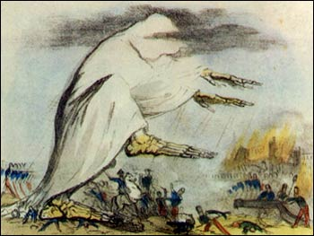

# Instrumental Variables (IV) {#IV}

In the previous chapters we have seen how to get credible causal estimates for the effect of some intervention via randomization techniques. Randomly allocating a subject to treatment or control groups makes sure that *everything else is equal*, hence we are really comparing apples with apples. Unfortunately, oftentimes we cannot perform a randomized control trial (RCT), out of technological, ethical, or other constraints. (We mentioned that forcing people to smoke via lottery draw is impossible to justify.)

So, that's it, no RCT, no causal estimates?

No! Methods like instrumental variables can help us to establish causality if we only have *observational data* (i.e. data generated not via experiment). That's reassuring, because in many settings this kind of data is the only thing we have.

(some examples of datasets)


## John Snow and the London Cholera Epidemic

(an old placard from the time)
The 1853-1854 Cholera outbreak in London killed 616 people. Physician [John Snow](https://en.wikipedia.org/wiki/John_Snow) was able to use data collected during this period to demonstrate that the illness was water-borne, and not transmitted via air, as was widely believed at the time. In order to better appreciate this section, let's imagine the world of John Snow in 1853:

(section based on freedman 1991)

```{block, type='notel'}
* It is not yet known that germs can cause disease (or indeed, that they exist).
* Microscopes exist, but work at rather poor resolution.
* Most human pathogens are not visible to the naked eye, and the isolation of such microbes is still several decades away.
* The so-called *infection theory* (i.e. infection via *germs*) has some supporters, but the dominant idea is that disease, in general, results from [*miasmas*](https://en.wikipedia.org/wiki/Miasma_theory): very small, non-living poisonous particles that float in the air - basically rotting organic matter would emanate foul air, that caused disease. Figure \@ref(fig:miasma) shows an illustration.
```
<br>
```{r miasma, fig.cap='Robert Seymour - A Short History of the National Institutes of Health National Library of Medicine photographic archive.'}

```


Snow hypothesized that the pathogen causing cholera was taken into the body via food or drink, multiplied and generated a poisonous substance causing the body to expel water, i.e. an extreme form of diarrhea. The active agent then would leave the human body via those excrements, and find their way back into the water supply, infecting the next victim. So, the question at the time was: is cholera a result of *miasmas* (foul, poisonous air), or a pathogen that was water-borne and infected new victims via excrements of former victims (the *infection theory*)?

Snow conducted some impressive detective work tracking down exceptional cases that would refute the miasma theory. For example he documented that two adjacent appartment buildings, one hit by cholera and the other not, had different water supplies: the first building's supply was contaminated by runoffs from privies (toilets), while the second one had arguably cleaner water. He studied the wider water supply system of London, finding that several water providers took their water from the heavily polluted River Thames.

During 1853-1854, John Snow drew a map (see figure \@ref(fig:snow-map)) that showed where the fatalities had occured. It became obvious that the cases clustered around the Broad Street pump. 

```{r snow-map, fig.cap="John Snow's original map of the Broad Street pump. https://commons.wikimedia.org/wiki/File:Snow-cholera-map-1.jpg"}
knitr::include_graphics("images/snow-map.jpg")
```

The history goes that after observing the map and insisting with the local council, the handle of the water pump was removed, and the outbreak was ended. Alas, Snow himself showed that the epidemic was stopping anyway and the that removal of the pump handle was close to irrelevant. This can be seen in figure \@ref(fig:snow-TS).

```{r snow-TS,fig.cap="Time series of cholera deaths and timing of pump removal",warning=FALSE,echo = FALSE}
plot(cholera::timeSeries())
```

What seemed much more interesting to him were other observations, like for example:

1. He found that a large poorhouse in the Broad Street area had very few cholera cases. He observed that the poorhouse had its own well (no need for the inmates to go the public Broad Street pump).
1. There was a large brewery in the vicinity of the pump, whose workers did not die of cholera. The workers drank beer, and there was a private well on the premises.

## Mapping London's Water Supply

A few years before the outbreak, Lambeth water company had decided to move its water intake point upstream along the Thames, beyond the main sewage discharge points. Two other companies, the Southwark and Vauxhall water companies, however, left their intake points where they were, i.e. downstream from the sewage discharges. Snows analysis of the data showed that cholera was more prevalent in the Southwark and Vauxhall serviced areas and largely had spared Lambeth. He was able to compile the data in table \@ref(tab:snow-tab9):

Table: (\#tab:snow-tab9) John Snow's table IX

|    | Number of houses | Deaths from Cholera | Deaths per 1000 Houses |
|----|:----------------:| :----------------: | :----------------: |
|Southwark and Vauxhall | 40,046 | 1,263 | 315 |
|Lambeth | 26,107 | 98 | 37 |
|Rest of London | 256,423 | 1,422 | 59 |

With table \@ref(tab:snow-tab9) in hand, Snow concluded that *if* Southwark and Vauxhall water companies had moved their water intakes upstream to where Lambeth water was taking in their supply, roughly 1,000 lives could have been saved.

Of course he was proven right later on, when in 1884 Koch first isolated the cholera *vibrio*, basically confirming Snow's version of the story. But what is really interesting for us is how he was able to us his **non-experimental** data set to make his point.

## Snow's Model of Cholera Transmission

Even though he never formally wrote it down in this way, we can formulate Snow's way of thinking about the issue in the following terms:

* Suppose that $c_i$ takes the value 1 if individiual $i$ dies of cholera, 0 else.
* Let $w_i = 1$ mean that $i$'s water supply is pure and $w_i = 0$ vice versa. Water purity is assessed with a technology that cannot detect small microbes.
* Collect in $u_i$ all unobservable factors that impact $i$'s likelihood of dying from the disease: whether $i$ is poor, where exactly they reside, whether there is bad air quality in $i$'s surrounding, and other invidivual characteristics which impact the outcome (like genetic setup of $i$).

With this, can write model \@ref(eq:snow-mod1):

\begin{equation}
c_i = \alpha + \delta w_i + u_i (\#eq:snow-mod1)
\end{equation}

John Snow could have used his data and assess the correlation between drinking pure water and cholera incidence, i.e. try to measure $Cov(c_i,w_i)$, or, which is the same, just run model \@ref(eq:snow-mod1) as a linear regression. There is a problem with this, however. As Deaton (1997) says, 

> The people who drank impure water were also more likely to be poor, and to live in an environment contaminated in many ways, not least by the ‘poison miasmas’ that were then thought to be the cause of cholera.

In other words, it does not make sense to compare someone who drinks pure water with someone with impure water, as model \@ref(eq:snow-mod1) proposes to do, because *all else is not equal*: pure water is correlated with being poor, living in bad area, bad air quality and so on - all factors that we encounter in $u_i$. This violates the crucial assumption for valid OLS estimates, $E[u_i | w_i]=0$ in this context. Another way to say this, is that $Cov(w_i, u_i) \neq 0$, implying that $w_i$ is *endogenous* in equation \@ref(eq:snow-mod1): There are factors in $u_i$ that affect both $w_i$ and $c_i$, so we cannot reasonably say that *the effect of $w$ is that...*, because things in $u_i$ move at the same time as $w_i$ moves (and we can't see those things).

Conditioning on the values of $w$, we can write


This means that if we want to have a causal estimate of the impact of pure water on cholera, $\delta$, we cannot simply do 

\begin{equation}
E[c_i | w_i = 1] - E[c_i | w_i = 0] = \gamma \neq \delta (\#eq:snow-mod2)
\end{equation}

where I've written $\gamma$ to mean that we *will* obtain some result from this calculation, but it is **not** what we were looking for.

## The IV Estimator


