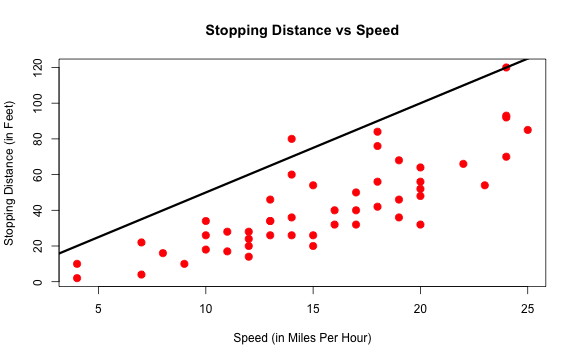
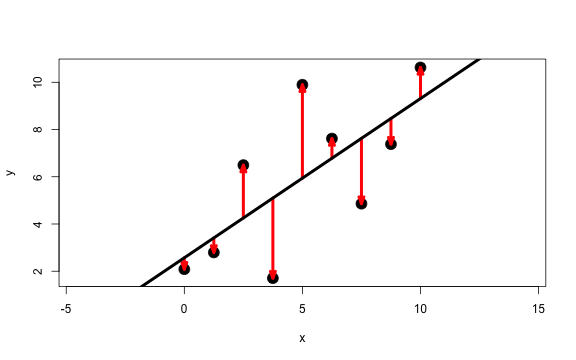
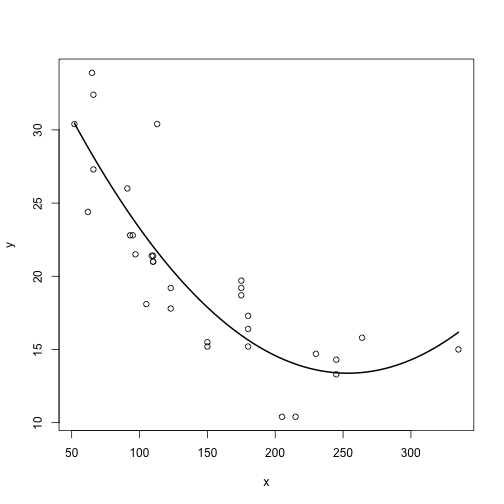

ScPoEconometrics 3
========================================================
author: Florian Oswald
date: 2018-09-28
autosize: true
css: ../style.css

Data On Cars
============

* Suppose we had data on car `speed` and stopping `dist` (ance):


```r
head(cars)
```

```
  speed dist
1     4    2
2     4   10
3     7    4
4     7   22
5     8   16
6     9   10
```

* How are `speed` and `dist` related?

Scatterplot of Cars
===================
incremental:true


* What's a reasonable **summary** of this relationship?

A Line throught the Scatterplot of Cars
===================
incremental:true


* *A line*. Great. But **which** line? This one?
* That's a *flat* line. But `dist` is increasing. :-(


A Line throught the Scatterplot of Cars
===================
incremental:true



* **That** one?
* Slightly better. Has a *slope* and an *intercept*.

Writing Down A Line
=============
incremental:true

* We observe $(y_i,x_i)$ in the data.
* Here is a formula that describes their relationship:
$$
y_i = b_0 + b_1 x_i + e_i
$$
* How to choose $b_0$ and $b_1$ s.t. this is **best** line?

Prediction and Errors
===============
incremental:true

* We need to denote the *output* of the line.
* We call the value $\widehat{y}_i$ the *predicted value*, after we choose values for $b_0,b_1$ and $x$.
$$
\widehat{y}_i = b_0 + b_1 x_i
$$
* In general, we **expect** to make errors!

Towards The Best Line
======================




* Red Arrows are *errors* or *residuals* (often $u$ or $e$)


App Time!
=========


```r
library(ScPoEconometrics) # load our library
launchApp('reg_simple_arrows')
aboutApp('reg_simple_arrows')
```

Writing Down The Best Line
=============
incremental:true

* choose $(b_0,b_1)$ s.t. the sum $e_1^2 + \dots + e_N^2$ is **as small as possible**
* $e_1^2 + \dots + e_N^2$ is the *sum of squared residuals*, or SSR.
* Wait a moment... Why *squared* residuals?!

Minimizing Squared Residuals
=============
incremental:true

* In previous plot, errors of different sign ($+/-$) cancel out!
* The line with minimal SSR need not be a *very good* summary of our data.
* Squaring each $e_i$ solves that issue as $e_i^2 \geq 0, \forall i$

Best Line and Squared Errors
=============
incremental:true


App Time!
=========


```r
launchApp('reg_simple')
aboutApp('reg_simple')
```

Ordinary Least Squares (OLS)
=================
incremental:true

* OLS estimates the best line for us.
* In our single regressor case, there is a simple formula for the slope:
  $$
  b_1 = \frac{cov(x,y)}{var(x)}
  $$
* and for the intercept
  $$
  b_0 = \bar{y} - b_1\bar{x}
  $$

App Time!
=========

How does OLS actually perform the minimization problem?


```r
launchApp('SSR_cone')
aboutApp('SSR_cone')  # after
```

App Time!
=========

Let's do some more OLS!


```r
launchApp('reg_full')
aboutApp('reg_full')  # after
```

Common Restrictions on OLS
==========
incremental:true

* There are some common *flavors* of OLS.
* We will go through some of them.
* E.g. what happens without an intercept?
* Or, what happens if we *demean* both $y$ and $x$?

OLS without any Regressor
===============
incremental: true

* Our line is flat at level $b_0$:
  $$
  y = b_0
  $$
* Our optimization problem is now
  $$
  b_0 = \arg\min_{\text{int}} \sum_{i=1}^N \left[y_i - \text{int}\right]^2,
  $$
* With solution
  $$
  b_0 = \frac{1}{N} \sum_{i=1}^N y_i = \overline{y}.
  $$


Regression without Intercept
=============
incremental: true

* Now we have a line anchored at the origin.
* The OLS slope estimate becomes
    $$
    \begin{align}
    b_1 &= \arg\min_{\text{slope}} \sum_{i=1}^N \left[y_i - \text{slope } x_i \right]^2\\
    \mapsto b_1 &= \frac{\frac{1}{N}\sum_{i=1}^N x_i y_i}{\frac{1}{N}\sum_{i=1}^N x_i^2} = \frac{\bar{x}     \bar{y}}{\overline{x^2}}
    \end{align}
    $$

App: Regressions w/o Slope or Intercept
=========


```r
launchApp('reg_constrained')
```

Centering a Regression
============
incremental: true

* *centering* or *demeaning* means to substract the mean.
* We get $\widetilde{y}_i = y_i - \bar{y}$.
* Let's run a regression *without* intercept as above using $\widetilde{y}_i,\widetilde{x}_i$
* We get
    $$
    \begin{align}
    b_1 &= \frac{\frac{1}{N}\sum_{i=1}^N \widetilde{x}_i \widetilde{y}_i}{\frac{1}{N}\sum_{i=1}^N \widetilde{x}_i^2}\\
        &= \frac{cov(x,y)}{var(x)}
    \end{align}
    $$

App: demeaned regression
=========


```r
launchApp('demeaned_reg')
```

Standardizing a Regression
============
incremental: true

* To standardize $z$ means to do $\breve{z}=\frac{z-\bar{z}}{sd(z)}$
* I.e. substract the variable's mean and divide by its standard deviation.
* Proceed as above, but with $\breve{y}_i,\breve{x}_i$
* We get
    $$
    \begin{align}
    b_1 &= \frac{\frac{1}{N}\sum_{i=1}^N \breve{x}_i \breve{y}_i}{\frac{1}{N}\sum_{i=1}^N \breve{x}_i^2}\\
        &= \frac{Cov(x,y)}{\sigma_x \sigma_y}=Corr(x,y)
    \end{align}
    $$

App: Standardized regression
=========


```r
launchApp('reg_standardized')
```


Predictions and Residuals
=====================
incremental: true

1. The error is $e_i = y_i - \widehat{y}_i$
1. The average of $\widehat{y}_i$ is equal to $\bar{y}$.
    $$
    \begin{align}
    \frac{1}{N} \sum_{i=1}^N \widehat{y}_i &= \frac{1}{N} \sum_{i=1}^N b_0 + b_1 x_i \\
    &= b_0 + b_1  \bar{x}  = \bar{y}\\
    \end{align}
    $$
1. Then,
    $$\frac{1}{N} \sum_{i=1}^N e_i = \bar{y} - \frac{1}{N} \sum_{i=1}^N \widehat{y}_i = 0$$
    i.e. the average of errors is zero.


Prediction and Errors are Orthogonal
======================================
class: small-code
incremental:true

* This is the data of the above plots (arrows and squares):

```
      x     y y_hat error
1  0.00  2.09  2.57 -0.48
2  1.25  2.79  3.41 -0.62
3  2.50  6.49  4.25  2.24
4  3.75  1.71  5.10 -3.39
5  5.00  9.89  5.94  3.95
6  6.25  7.62  6.78  0.83
7  7.50  4.86  7.63 -2.77
8  8.75  7.38  8.47 -1.09
9 10.00 10.63  9.31  1.32
```

1. The average of $\widehat{y}_i$ is the same as the mean of $y$.
2. The average of the errors should be zero.
3. Prediction and errors should be *uncorrelated* (i.e. orthogonal).

Prediction and Errors are Orthogonal
======================================
class: small-code
incremental:true


```r
# 1.
all.equal(mean(ss$error), 0)
```

```
[1] TRUE
```

```r
# 2.
all.equal(mean(ss$y_hat), mean(ss$y))
```

```
[1] TRUE
```

```r
# 3.
all.equal(cov(ss$error,ss$y_hat), 0)
```

```
[1] TRUE
```

Linear Statistics
=====================
incremental: true

* It's important to keep in mind that Var, Cov, Corr and Regression measure **linear relationships** between two variables.
* Two datasets with *identical* correlations could look *vastly* different.
* They would have the same regression line.
* Same correlation coefficient.
* Is that even possible?

Linear Statistics: Anscombe
=====================
incremental: true

* Francis Anscombe (1973) comes up with 4 datasets with identical stats. But look!

    

Dinosaurs in your Data?
=====================
incremental: true

* So, be wary of only looking a linear summary stats.
* Also look at plots.
* Dinosaurs?
    
    ```r
    launchApp("datasaurus")
    aboutApp("datasaurus")
    ```


Nonlinear Relationships in Data?
=====================
incremental: true

* We can accomodate non-linear relationships in regressions.
* We'd just add a higher order term like this:
    $$
    y_i = b_0 + b_1 x_i + b_2 x_i^2 + e_i
    $$
* This is *multiple regression* (next chapter!)

Nonlinear Relationships in Data?
=====================
incremental:true

* For example, suppose we had this data and fit the above regression:
    

Assessing the Goodness of Fit
=====================
incremental: true

* The $R^2$ measures how good the model fits the data.
* $R^2=1$ is very good, $R^2=0$ is very poorly.
* We compare the performance of our model vs a baseline without regressor:
    $$R^2 = 1 - \frac{\text{SSR our model}}{\text{SSR benchmark}}.$$
* The SSR being a measure of *how large* our errors are, you see that smaller SSR improves our $R^2$.

An Example - California Test Scores
=====================
incremental: true


Appendix: Rescaling Regressions
=====================
incremental: true

* Suppose outcome $y$ is *income in Euros*
* $x$ be years of schooling
  $$
  y_i = \beta_0 + \beta_1 x_i + \varepsilon_i
  $$
* Assume that $\beta_1 = 2000$, s.t. each additional year of schooling gives 2000 Euros more income.
* What is $\beta_1$ if we measure $y$ in *thousands of euros* instead?

App: Rescaling Regressors
=========


```r
library(ScPoEconometrics)
launchApp('rescale')
```


Tutorial: Rescaling Regressors
=========


```r
library(ScPoEconometrics)
runTutorial('rescaling')
```

