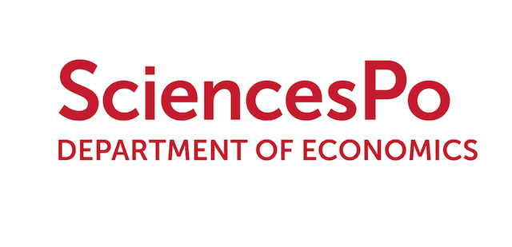

--- 
title: "Introduction to Econometrics with R"
author: "Florian Oswald and Jean-Marc Robin"
date: "`r Sys.Date()`"
site: bookdown::bookdown_site
output: bookdown::gitbook
documentclass: book
bibliography: [book.bib, packages.bib]
biblio-style: apalike
link-citations: yes
url: 'https\://scpoecon.github.io/ScPoEconometrics/'
favicon: "favicon.gif"
github-repo: ScPoEcon/ScPoEconometrics
description: "SciencesPo UG Econometrics online textbook. No Maths."
---


# Syllabus {-}



Welcome to Introductory Econometrics for 2nd year undergraduates at ScPo! On this page we outline the course and present the Syllabus. As of today, this is still **work in progress**!

### Objective {-}

This course aims to teach you the basics of data analysis needed in a Social Sciences oriented University like SciencesPo. We purposefully start at a level that assumes no prior knowledge about statistics whatsoever. Our objective is to have you understand and be able to interpret linear regression analysis. We will not rely on maths and statistics, but practical learning in order to teach the main concepts.

### Syllabus and Requirements {-}

You can find the topics we want to go over in the left panel of this page. The later chapters are optional and depend on the speed with which we will proceed eventually. Chapters 1-4 are the core material of the course.

The only requirement is that you bring *your own personal computer* to each session. We will be using the free statistical computing language [`R`](https://www.r-project.org) very intensively. Before coming to the first session, you should update computer code associated to the course by executing the following three commands in your `R` console:

```R
if (!require("devtools")) install.packages("devtools")
library(devtools)
install_github(repo = "ScPoEcon/ScPoEconometrics")
```

### Course Structure {-}

This course is taught in several different groups across various campuses of SciencesPo. All groups will go over the same material, do the same exercises, and will have the same assessments.

Groups meet once per week for 2 hours. The main purpose of the weekly meetings is to clarify any questions, and to work together through tutorials. The little theory we need will be covered in this book, and **you are expected to read through this in your own time** before coming to class. 

### This Book and Other Material {-}

What you are looking at is an online textbook. You can therefore look at it in your browser (as you are doing just now), on your mobile phone or tablet, but you can also download it as a `pdf` file or as an `epub` file for your ebook-reader. We don't have any ambition to actually produce and publish a *book* for now, so you should just see this as a way to disseminate our lecture notes to you. 
The second part of course material next to the book is an extensive suite of tutorials and interactive demonstrations, which are all contained in the `R` package that builds this book (and which you installed by issuing the above commands). 


### Open Source {-}

The book and all other content for this course are hosted under an open source license on github. You can contribute to the book by just clicking on the appropriate *edit* symbol in the top bar of this page. Other teachers who want to use our material can freely do so, observing the terms of the license on the [github repository](https://github.com/ScPoEcon/ScPoEconometrics).

### Assessments {-}

We will assess participation in class and conduct a final exam.

### Team {-}

tbc

### Communication {-}

We will communicate exclusively on our [`slack`](https://econometrics-scpo.slack.com) app. You will get an invitation email to join in due course.


